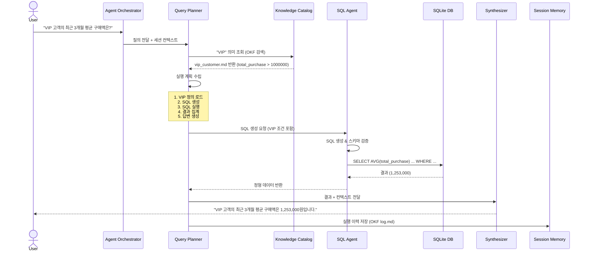
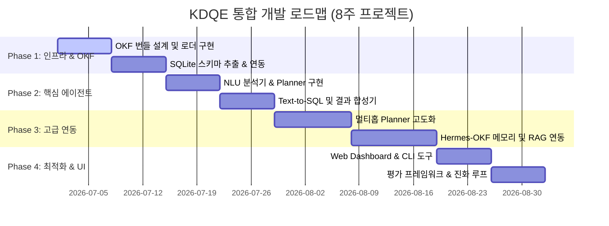

# KDQE (Knowledge and Data Query Engine) — Unified Project Definition

> A Semantic Knowledge Operating System for Structured Data, Documents, and Agentic Query Execution
> **OKF(Open Knowledge Format) 및 OpenKB 기반의 지식 계층을 활용한 지능형 데이터 조회 엔진**

---

## 1. 프로젝트 개요 (Project Overview)

### 1.1 비전 & 목표
KDQE는 사용자의 자연어 질문을 해석하여 **정형 데이터베이스(SQLite)**, **비정형 문서(RAG)**, **비즈니스 규칙 및 지식 카탈로그**를 통합적으로 조회하고, Agent 기반 Query Planning 과정을 통해 최적의 최종 답변을 생성하는 **Knowledge Operating System**입니다.

기존의 Text-to-SQL 및 RAG 시스템이 데이터베이스의 물리적 스키마에만 의존하여 비즈니스적 맥락(예: "VIP 고객"의 비즈니스적 정의)을 이해하지 못하는 한계를 극복하기 위해, **OKF(Open Knowledge Format)**를 의미 계층(Semantic Layer)으로 도입하여 비즈니스 용어와 물리적 데이터를 유기적으로 연결합니다.

```text
[User Question]
      ↓
[OKF Knowledge Catalog] (의미 매핑: "VIP 고객" ➔ "total_purchase > 1000000")
      ↓
[Query Planner] (의미적 계획 수립)
      ↓
[Execution Graph] (SQL 생성, RAG 검색)
      ↓
[Data Sources] (SQLite, Vector DB)
      ↓
[Synthesized Answer]
```

### 1.2 핵심 목표 (Core Objectives)
* **의미 기반 질의 변환**: 사용자가 "VIP 고객"과 같은 비즈니스 용어로 질문하면, 시스템이 지식 카탈로그를 참조하여 `total_purchase > 1000000`과 같은 물리적 조건으로 자동 해석 및 쿼리 생성합니다.
* **멀티-홉 추론 (Multi-Hop Reasoning)**: "올해 VIP 고객 성장률을 작년과 비교해줘"와 같이 여러 단계의 쿼리와 계산이 필요한 복합 질의를 에이전트가 단계적으로 계획하고 실행합니다.
* **벤더 중립성**: YAML Frontmatter와 Markdown으로 구성된 OKF 명세를 준수하여, 특정 벤더나 데이터베이스 종류에 종속되지 않는 고도의 이식성을 확보합니다.
* **자기 진화 메모리 (Self-Evolution)**: 에이전트가 질의를 수행하며 얻은 새로운 분석 패턴이나 유용한 실행 쿼리를 지식 베이스(`log.md` 및 `concepts`)에 피드백하여 지식 카탈로그가 스스로 진화하게 만듭니다.

---

## 2. 시스템 아키텍처 (System Architecture)

KDQE는 클라이언트 계층, 에이전트 코어 계층, 지식 계층, 데이터 검색 계층, 물리 저장소 계층의 5가지 레이어로 구분됩니다.

### 2.1 컴포넌트 구조
```
┌─────────────────────────────────────────────────────────────────┐
│                        Client Layer                            │
│  ┌──────────────┐  ┌──────────────┐  ┌──────────────────────┐  │
│  │ Web Dashboard │  │     CLI      │  │   REST API / MCP     │  │
│  └──────────────┘  └──────────────┘  └──────────────────────┘  │
└─────────────────────────────────────────────────────────────────┘
                               │
                               ▼
┌─────────────────────────────────────────────────────────────────┐
│                      Agent Core Layer                          │
│  ┌──────────────────────────────────────────────────────────┐  │
│  │              Agent Orchestrator                          │  │
│  │  - 질의 수신 및 라우팅  - 세션 관리  - 컨텍스트 관리     │  │
│  └──────────────────────────────────────────────────────────┘  │
│                              │                                  │
│  ┌──────────────────────────────────────────────────────────┐  │
│  │              Query Planner                               │  │
│  │  - 질문 NLU 분석  - 의도 분류  - 실행 계획 수립          │  │
│  │  - 멀티홉 추론  - Plan 유효성 검증                       │  │
│  └──────────────────────────────────────────────────────────┘  │
│                              │                                  │
│  ┌──────────────────────────────────────────────────────────┐  │
│  │           Response Synthesizer                           │  │
│  │  - 결과 병합  - 자연어 생성  - 인사이트 추출             │  │
│  └──────────────────────────────────────────────────────────┘  │
└─────────────────────────────────────────────────────────────────┘
                               │
                               ▼
┌─────────────────────────────────────────────────────────────────┐
│                    Knowledge Layer (OKF)                       │
│  ┌──────────────┐  ┌──────────────┐  ┌──────────────────────┐  │
│  │   Catalog    │  │    Metrics   │  │   Business Rules     │  │
│  │  (Entities)  │  │  (Formulas)  │  │   (Definitions)      │  │
│  └──────────────┘  └──────────────┘  └──────────────────────┘  │
│  ┌──────────────┐  ┌──────────────┐  ┌──────────────────────┐  │
│  │   Glossary   │  │   Prompts    │  │  Query Templates     │  │
│  │  (Terms)     │  │ (Templates)  │  │   (Patterns)         │  │
│  └──────────────┘  └──────────────┘  └──────────────────────┘  │
└─────────────────────────────────────────────────────────────────┘
                               │
                               ▼
┌─────────────────────────────────────────────────────────────────┐
│                    Retrieval Layer                             │
│  ┌──────────────────────┐  ┌──────────────────────────────┐    │
│  │    SQL Agent         │  │        RAG Agent             │    │
│  │  - SQL 생성/검증     │  │  - 문서 청킹/임베딩         │    │
│  │  - 쿼리 최적화       │  │  - 벡터 검색                │    │
│  │  - 결과 정형화       │  │  - 문서 요약                │    │
│  └──────────────────────┘  └──────────────────────────────┘    │
└─────────────────────────────────────────────────────────────────┘
                               │
                               ▼
┌─────────────────────────────────────────────────────────────────┐
│                    Storage Layer                               │
│  ┌──────────────┐  ┌──────────────┐  ┌──────────────────────┐  │
│  │   SQLite     │  │  Vector DB   │  │   OKF Repository     │  │
│  │  (ecommerce) │  │ (Chroma/PG)  │  │   (Git managed)      │  │
│  └──────────────┘  └──────────────┘  └──────────────────────┘  │
└─────────────────────────────────────────────────────────────────┘
```

### 2.2 엔드투엔드 질의 흐름 (Query Flow)
자연어 질문이 유입되면 지식 카탈로그 조회를 거쳐 쿼리 계획이 도출되고, 각 데이터 소스로부터 검색된 결과가 Synthesizer를 통해 자연어로 합성되는 흐름을 가집니다.



---

## 3. OKF 기반 Knowledge Catalog 설계

### 3.1 OKF 번들 구조
OpenKB로 컴파일되는 `wiki/` 디렉토리는 아래와 같은 구조화된 OKF 사양을 준수합니다.

```text
wiki/
├── index.md                        # 번들 루트 (진입점)
├── concepts/
│   ├── vip_customer.md             # type: BusinessRule (VIP 정의)
│   ├── active_customer.md          # type: BusinessRule
│   └── churn_risk.md               # type: BusinessRule
├── entities/
│   ├── customer.md                 # type: Entity (테이블 정보)
│   ├── order.md                    # type: Entity
│   └── product.md                  # type: Entity
├── metrics/
│   ├── monthly_sales.md            # type: Metric
│   └── retention_rate.md           # type: Metric
└── glossary.md                     # type: Glossary (도메인 용어집)
```

### 3.2 OKF 정의서 예시
**비즈니스 규칙 정의서: `concepts/vip_customer.md`**
```yaml
---
type: BusinessRule
title: VIP 고객 정의
description: 연간 총 구매 금액이 100만원을 초과하는 고객
tags: [segmentation, vip, kpi]
applies_to: [entities/customer]
sql_condition: "total_purchase > 1000000"
---
# VIP 고객

## 정의
`total_purchase > 1000000`

## SQL 매핑
```sql
WHERE total_purchase > 1000000
```

## 관련 엔티티
- [Customer](/entities/customer.md)
- [Order](/entities/order.md)
```

---

## 4. 질의 처리 파이프라인 (Query Pipeline)

KDQE는 자연어 질문을 에이전트 연쇄 과정을 통해 자연어 응답으로 변환합니다.

### 4.1 3단계 질의 변환
1. **NLU 분석 (자연어 ➔ 중간 수준 질의)**: LLM이 질문을 해석하여 의도(Intent), 대상 엔티티, 적용 필터를 구조화된 JSON 형태로 변환합니다.
2. **실행 계획 수립 (중간 수준 질의 ➔ 실행 및 SQL)**: Planner가 중간 질의를 작업 그래프로 변환하고, SQL Agent가 스키마에 맞춰 안전한 SQL을 생성 및 실행합니다.
3. **결과 합성 (실행 결과 ➔ 자연어 응답)**: Synthesizer가 정형 조회 결과와 관련 비즈니스 규칙의 메타데이터를 결합하여 사용자 친화적인 자연어 설명과 통계를 제시합니다.

### 4.2 멀티홉 질의 계획 예시
* **질문**: *"올해 VIP 고객 성장률을 작년과 비교해줘"*
* **실행 계획**:
  ```yaml
  plan:
    - action: load_okf_concept
      target: "concepts/vip_customer.md"
    - action: execute_sql
      query: "SELECT COUNT(*) FROM customers WHERE total_purchase > 1000000 AND strftime('%Y', created_at) = '2025'"
      result_key: "vip_count_2025"
    - action: execute_sql
      query: "SELECT COUNT(*) FROM customers WHERE total_purchase > 1000000 AND strftime('%Y', created_at) = '2026'"
      result_key: "vip_count_2026"
    - action: calculate
      formula: "(vip_count_2026 - vip_count_2025) / vip_count_2025 * 100"
      result_key: "growth_rate"
    - action: synthesize_answer
      template: "VIP 고객 수는 2025년 {vip_count_2025}명에서 2026년 {vip_count_2026}명으로 {growth_rate}% 성장했습니다."
  ```

---

## 5. 통일된 구현 로드맵 (Unified Roadmap)

기존 문서에서 파편화되어 기재되어 있던 일정을 통합하고 정제한 KDQE 마일스톤입니다.



### [Phase 1] 기반 인프라 및 OKF 통합 (1~2주)
* **OKF 번들 설계 및 구축**: `knowledge/` 디렉토리에 용어집, 비즈니스 규칙, 엔티티 스키마를 OKF 규격 마크다운으로 초기 구축합니다.
* **OKF Loader 구현 (`okf_loader.py`)**: 번들의 concepts 메타데이터 및 문서 간의 cross-link 관계 그래프를 자동 추출하는 파서를 구현합니다.
* **SQLite Connector 연동**: `D:\sqlite\output\ecommerce-ko.db`와의 연결을 수립하고, 테이블 메타데이터 및 스키마 구조를 추출하여 에이전트의 프롬프트 컨텍스트로 제공할 수 있게 합니다.

### [Phase 2] 핵심 에이전트 및 단일 홉 질의 파이프라인 (2~3주)
* **NLU 의도 분석기 구현**: 자연어 입력으로부터 의도(Intent), 메트릭, 시간 필터를 추출하는 분석 모듈을 구현합니다.
* **Text-to-SQL Agent 개발**: 스키마 구조를 주입받아 문법 및 보안(조회 외의 변경 구문 차단) 검증을 거친 SQLite 실행 가능 쿼리를 자동 생성합니다.
* **자연어 합성기 (Synthesizer)**: 쿼리 실행 결과(로우 데이터)와 OKF 비즈니스 정의를 병합하여 통계적 통찰이 담긴 가독성 높은 답변을 생성합니다.

### [Phase 3] 멀티홉 Planner 고도화 및 Hermes 연동 (3~4주)
* **멀티홉 실행 계획기 개발**: 2개 이상의 테이블 조인, 기간 대비 계산(성장률 등)이 포함된 복합 질의를 해결하는 비순환 작업 그래프(DAG) 생성 플래너를 구축합니다.
* **Hermes Memory Provider 연동**: 에이전트의 의사결정 기록, 쿼리 실행 이력 및 세션 정보를 `hermes-okf` 포맷으로 `log.md`에 영구 기록 및 조회 가능하도록 연계합니다.
* **비정형 RAG 에이전트 연동**: 정형 데이터뿐만 아니라 원본 비정형 설명 문서(raw/)를 벡터 검색 및 요약하여 답변의 근거를 보강합니다.

### [Phase 4] 완성, 최적화 및 자기 진화 (2~3주)
* **Web Dashboard (Streamlit)**: 실시간 쿼리 실행 계획(Visual Plan) 시각화 및 테이블 뷰를 지원하는 대시보드를 개발합니다.
* **CLI 인터페이스 개발**: 터미널 환경에서 `kdqe query "질문"` 명령어로 즉각적으로 질의하고 결과를 조회할 수 있는 CLI를 작성합니다.
* **평가 프레임워크 구축**: SQL 실행 정확도(Execution Accuracy), 실행 지연 시간(P95 Latency), 토큰 비용 등을 정량적으로 측정하는 테스트 파이프라인을 구축합니다.
* **자기 진화(Self-Evolution) 구현**: 실패한 실행 계획이나 수정된 쿼리 패턴을 스스로 분석하여 OKF 위키 번들에 피드백/갱신하는 자율 업데이트 루프를 확립합니다.

---

## 6. 비교 분석 및 기술 스택

### 6.1 OKF 도입의 강점 비교
| 비교 항목 | OKF (KDQE 채택) | 일반 RAG | 일반 Text-to-SQL |
|-----------|-----------------|---------|-----------------|
| **지식 저장 방식** | 마크다운 기반 큐레이션된 개념 | 원시 문서 청킹 데이터 | 없음 (순수 DB 스키마 의존) |
| **지식 업데이트** | Git PR을 통한 형상 관리 및 버전 추적 | 문서 파싱 후 전체 재임베딩 필요 | DB 스키마나 인덱스 변경 시 재구축 |
| **개념 간 연결성** | 마크다운 내부 링크로 지식 그래프 형성 | 유사도 벡터 기반 간접 연결만 지원 | 연결 관계 부재 |
| **벤더 종속성** | 없음 (텍스트 파일 기반) | 임베딩 모델 및 벡터 DB 벤더 종속 | 데이터베이스 엔진 및 방언 종속 |
| **인간/에이전트 가독성** | 매우 높음 (설명과 조건이 명시됨) | 낮음 (컨텍스트 유실 가능) | 보통 (구조적이나 비즈니스 맥락 결여) |

### 6.2 OpenKB vs hermes-okf 비교
| 비교 항목 | OpenKB | hermes-okf |
|-----------|--------|------------|
| **핵심 목적** | 원본 문서를 컴파일하여 구조화된 위키(OKF)를 구축 | 에이전트의 작동 이력, 의사결정을 실시간 저장 및 조회 |
| **입력 데이터** | PDF, HWP, Word, Excel, Web URL 등 원본 문서 | 에이전트의 실행 로그, 도구 호출 이력, 의사결정 흐름 |
| **출력 산출물** | `wiki/` 내의 Concepts 및 Entities 위키 파일 | `log.md` 및 세션별 OKF 메모리 번들 |
| **작동 메커니즘** | 사전에 일괄 컴파일 (Compile-time) | 에이전트 구동 중 실시간 기록 (Runtime) |
| **KDQE 연동 역할** | **Knowledge Catalog**: 비즈니스 규칙 및 스키마 사전 정의 | **Session Memory**: 질의 이력 및 계획 적재를 통한 자기 성찰 |

### 6.3 기술 스택 요약
* **LLM**: Gemini-1.5-Pro (Planning & Complex Reasoning), Gemini-1.5-Flash (Subagent & Translation)
* **Database**: SQLite (`D:\sqlite\output\ecommerce-ko.db`)
* **Vector DB**: Chroma (sqlite-vec 연동으로 경량화)
* **Agent Framework**: Hermes Agent Custom Wrapper
* **UI/CLI**: Streamlit (Dashboard), Click / Typer (CLI)
* **Metadata / OKF Parsing**: PyYAML, pathlib, re (Python 표준 모듈 중심 설계)

---

## 7. 평가 프레임워크 및 타겟 DB 명세

### 7.1 평가 지표 (Metrics)
* **SQL Execution Accuracy**: 생성된 SQL의 최종 실행 결과와 정답 데이터의 일치율 (**목표치: > 90%**)
* **Plan Success Rate**: 멀티홉 쿼리 실행 계획이 중도 에러 없이 완결되는 비율 (**목표치: > 85%**)
* **P95 Latency**: 사용자 질의 수신부터 최종 합성 답변 출력까지 걸리는 시간 (**목표치: < 5초**)
* **Token Cost**: 질의 1회당 에이전트 체인에서 사용되는 평균 토큰 수 (**목표치: < 5,000 tokens**)

### 7.2 테스트 환경 DB (TechShop) 스키마 요약
KDQE의 설계 및 검증은 전자상거래 쇼핑몰 데이터인 `ecommerce-ko.db`를 타겟으로 수행됩니다.

* **주요 테이블 및 인덱스 구조**:
  ```sql
  -- 고객 테이블
  CREATE TABLE customers (
      id              INTEGER PRIMARY KEY AUTOINCREMENT,
      email           TEXT NOT NULL UNIQUE,
      password_hash   TEXT NOT NULL,
      name            TEXT NOT NULL,
      phone           TEXT NOT NULL,
      birth_date      TEXT NULL,
      gender          TEXT NULL,
      grade           TEXT NOT NULL DEFAULT 'BRONZE' CHECK(grade IN ('BRONZE','SILVER','GOLD','VIP')),
      point_balance   INTEGER NOT NULL DEFAULT 0 CHECK(point_balance >= 0),
      acquisition_channel TEXT NULL,
      is_active       INTEGER NOT NULL DEFAULT 1,
      last_login_at   TEXT NULL,
      created_at      TEXT NOT NULL,
      updated_at      TEXT NOT NULL
  );
  CREATE INDEX idx_customers_email ON customers(email);

  -- 상품 테이블
  CREATE TABLE products (
      id              INTEGER PRIMARY KEY AUTOINCREMENT,
      category_id     INTEGER NOT NULL REFERENCES categories(id),
      supplier_id     INTEGER NOT NULL REFERENCES suppliers(id),
      successor_id    INTEGER NULL REFERENCES products(id),
      name            TEXT NOT NULL,
      sku             TEXT NOT NULL UNIQUE,
      brand           TEXT NOT NULL,
      model_number    TEXT,
      description     TEXT,
      specs           TEXT NULL,
      price           REAL NOT NULL CHECK(price >= 0),
      cost_price      REAL NOT NULL CHECK(cost_price >= 0),
      stock_qty       INTEGER NOT NULL DEFAULT 0,
      weight_grams    INTEGER,
      is_active       INTEGER NOT NULL DEFAULT 1,
      discontinued_at TEXT NULL,
      created_at      TEXT NOT NULL,
      updated_at      TEXT NOT NULL
  );
  CREATE INDEX idx_products_category_id ON products(category_id);
  CREATE INDEX idx_products_name ON products(name);
  CREATE INDEX idx_products_sku ON products(sku);
  ```

* **사전 정의된 18개 분석용 뷰 (Views)**:
  * `v_monthly_sales`: 월별 매출 및 결제 수단 집계
  * `v_revenue_growth`: 전월 대비 매출 성장율 (LAG 윈도우 함수 적용)
  * `v_customer_rfm`: 고객 RFM 점수화 및 등급 분류 (NTILE 사용)
  * `v_customer_summary`: 고객 누적 구매액, 주문 횟수 및 최종 주문일 통합 프로필
  * `v_product_abc`: 누적 매출 비율 기준 상품 기여도 ABC 등급 분류
  * `v_cart_abandonment`: 결제 미완료 장바구니 분석 (GROUP_CONCAT 상품 목록화)
  * `v_supplier_performance`: 공급업체별 판매 수량, 매출액 및 반품률
  * `v_coupon_effectiveness`: 쿠폰 사용 횟수, 총 할인액 및 매출 기여 ROI 비율

---

## 8. 참고 자료 (References)
* **Google Cloud OKF Spec**: [How the Open Knowledge Format can improve data sharing](https://cloud.google.com/blog/products/data-analytics/how-the-open-knowledge-format-can-improve-data-sharing)
* **Karpathy's LLM Wiki Concept**: https://gist.github.com/karpathy/442a6bf555914893e9891c11519de94f
* **OpenKB Repository**: https://github.com/vectifyai/openkb
* **Hermes OKF Memory Integration**: https://github.com/EliaszDev/hermes-okf
* **sql-tutorial & test dataset**: https://github.com/civilian7/sql-tutorial
