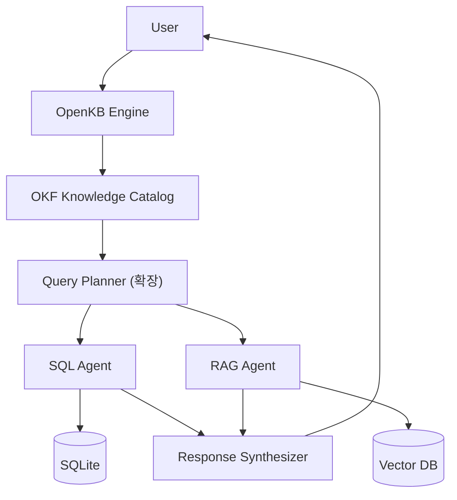
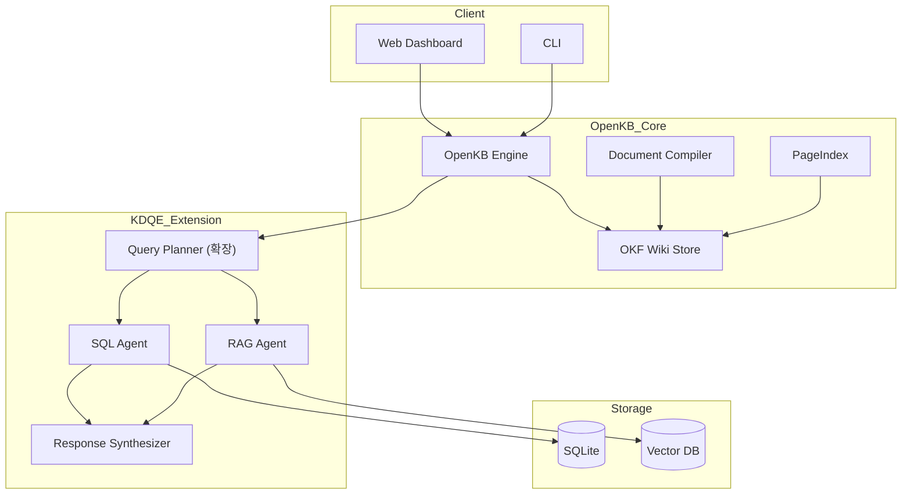
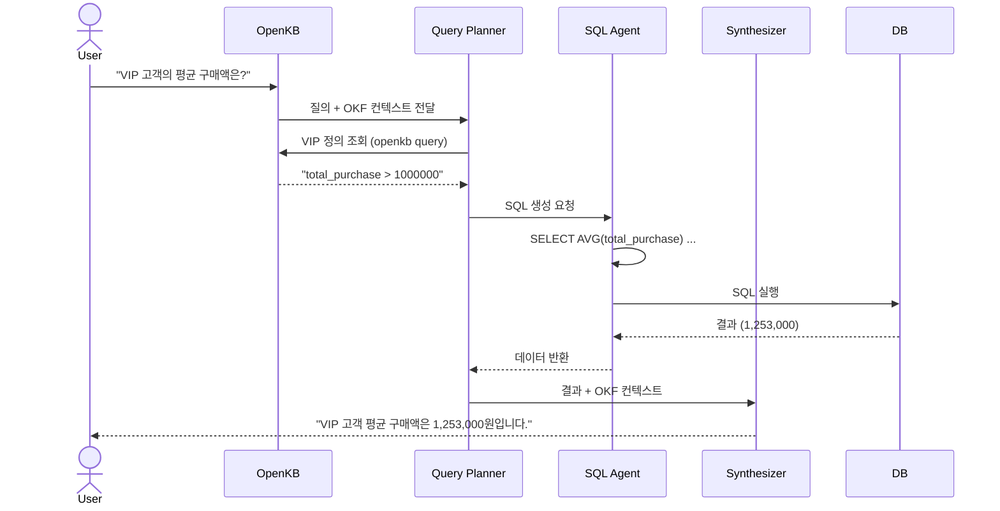
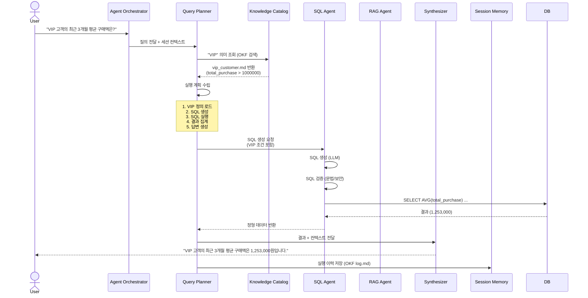

# KDQE (Knowledge and Data Query Engine)

> A Semantic Knowledge Operating System for Structured Data, Documents, and Agentic Query Execution

KDQE는 **OpenKB**를 핵심 지식 엔진으로 활용하여 사용자의 자연어 질문을 해석하고, OKF(Open Knowledge Format) 기반의 지식 카탈로그와 SQLite 데이터베이스를 통합적으로 조회하는 시스템입니다.

---

## Why KDQE?

대부분의 AI 시스템은 다음 두 가지 중 하나에 속합니다:

1. **Text-to-SQL** — 자연어를 SQL로 변환하지만 비즈니스 의미를 이해하지 못함
2. **RAG (Retrieval-Augmented Generation)** — 문서를 검색하지만 정형 데이터와 연결하지 못함

사용자가 묻습니다:

> "올해 VIP 고객 성장률이 어떻게 되나요?"

하지만 데이터베이스는 오직 다음만 알고 있습니다:

```sql
customers.total_purchase > 1000000
```

**누락된 계층은 의미(Semantics)입니다.**

KDQE는 OKF(Open Knowledge Format)와 OpenKB를 기반으로 한 **의미 계층(Semantic Layer)** 을 도입하여 이 문제를 해결합니다.

```
User Question
      ↓
   OpenKB (OKF Wiki)
      ↓
Query Planner (확장)
      ↓
SQLite + 문서 검색
      ↓
     Answer
```

---

## Architecture Overview



### OpenKB를 통한 OKF 기반 지식 계층

OpenKB는 **OKF(Open Knowledge Format)를 공식 지원**하는 오픈소스 CLI 도구로, 문서를 LLM으로 컴파일해 구조화되고 상호 연결된 위키 스타일의 지식 베이스를 구축합니다.

```bash
# OpenKB 초기화
$ openkb init

# 문서 추가 (자동 OKF 변환)
$ openkb add docs/sales_report.pdf

# 위키 컴파일 (OKF 형식으로 변환)
$ openkb compile

# 질의
$ openkb query "VIP 고객 정의가 무엇인가요?"
```

---

## Core Concepts

### 1. OKF Knowledge Catalog (OpenKB 기반)

OpenKB가 생성하는 `wiki/` 디렉토리는 OKF 명세를 준수합니다:

```
wiki/
├── index.md                      # 루트 페이지 (OKF 번들)
├── concepts/
│   ├── vip_customer.md           # type: BusinessRule
│   ├── active_customer.md        # type: BusinessRule
│   └── churn_risk.md             # type: BusinessRule
├── entities/
│   ├── customer.md               # type: Entity
│   ├── order.md                  # type: Entity
│   └── product.md                # type: Entity
├── metrics/
│   ├── monthly_sales.md          # type: Metric
│   └── retention_rate.md         # type: Metric
└── glossary.md                   # type: Glossary
```

**예시: VIP 고객 정의 (`concepts/vip_customer.md`)**

```yaml
---
type: BusinessRule
title: VIP 고객 정의
description: 연간 총 구매 금액이 100만원을 초과하는 고객
tags: [segmentation, vip, kpi]
---
# VIP 고객

## 정의
`total_purchase > 1000000`

## SQL 매핑
```sql
WHERE total_purchase > 1000000
```

## 관련 엔티티
- [Customer](/entities/customer.md)
- [Order](/entities/order.md)

## 관련 메트릭
- [VIP 고객 수](/metrics/retention.md)
- [VIP 매출 비중](/metrics/sales.md)
```

### 2. 확장된 Query Planner

OpenKB의 `query` 기능을 확장하여 **SQLite 데이터 조회**를 통합합니다:

```yaml
plan:
  - step: openkb_query
    action: "VIP 고객 정의 조회"
    output: vip_definition
  - step: resolve_sql
    action: "SQL 변환"
    mapping: "total_purchase > 1000000"
  - step: execute_sql
    target: sqlite:///data/ecommerce.db
    query: "SELECT COUNT(*) FROM customers WHERE total_purchase > 1000000"
  - step: synthesize
    action: "OpenKB 답변에 SQL 결과 통합"
```

### 3. Multi-Hop Query Execution

복잡한 질문은 여러 단계의 추론이 필요합니다:

**질문:**
> "올해 VIP 고객 성장률을 작년과 비교해줘"

**실행 계획:**

1. OpenKB에서 VIP 정의 조회 → `total_purchase > 1000000`
2. SQLite 2025년 VIP 고객 수 조회
3. SQLite 2026년 VIP 고객 수 조회
4. 성장률 계산
5. OpenKB 답변 스타일로 결과 합성

---

## System Architecture (상세)



---

## Query Flow (OpenKB + SQLite 통합)



---

## Implementation Guide: OpenKB + KDQE 확장

### 1. OpenKB 설치 및 초기화

```bash
# OpenKB 설치
pip install openkb

# 프로젝트 초기화
openkb init
```

### 2. OKF Knowledge Catalog 구축

```bash
# 문서 추가 (자동 OKF 변환)
openkb add docs/vip_policy.md
openkb add docs/sales_metrics.pdf
openkb add docs/customer_segments.docx

# OKF 컴파일
openkb compile
```

### 3. KDQE 확장 구현

```python
# kdqe_engine.py

import subprocess
import sqlite3
import json
from typing import Dict, Any

class KDQEEngine:
    def __init__(self, db_path: str, wiki_path: str = "./wiki"):
        self.db_path = db_path
        self.wiki_path = wiki_path

    def openkb_query(self, question: str) -> str:
        """OpenKB에 질의하여 OKF 개념 조회"""
        result = subprocess.run(
            ["openkb", "query", question],
            capture_output=True,
            text=True
        )
        return result.stdout

    def execute_sql(self, sql: str) -> list:
        """SQLite에 SQL 실행"""
        conn = sqlite3.connect(self.db_path)
        cursor = conn.cursor()
        cursor.execute(sql)
        results = cursor.fetchall()
        conn.close()
        return results

    def plan_and_execute(self, question: str) -> Dict[str, Any]:
        """
        1. OpenKB에서 관련 개념 조회
        2. SQL 생성 (LLM)
        3. SQL 실행
        4. 결과 합성
        """
        # Step 1: OKF 개념 조회
        context = self.openkb_query(question)

        # Step 2: SQL 생성 (LLM 호출)
        sql = self._generate_sql(question, context)

        # Step 3: SQL 실행
        data = self.execute_sql(sql)

        # Step 4: 결과 합성 (OpenKB 답변 스타일 적용)
        answer = self._synthesize(question, data, context)

        return {
            "answer": answer,
            "sql": sql,
            "data": data,
            "context": context
        }
```

### 4. CLI 인터페이스

```bash
# KDQE CLI 명령어
$ kdqe query "VIP 고객의 최근 3개월 평균 구매액은?"

출력:
📊 질의 결과:
- VIP 고객 정의: total_purchase > 1000000
- 실행된 SQL: SELECT AVG(total_purchase) ...
- 결과: 1,253,000원

💡 답변: VIP 고객(연간 구매 100만원 이상)의 최근 3개월 평균 구매액은 1,253,000원입니다.
```

---

## Repository Structure

```
kdqe/
├── README.md
├── requirements.txt
├── setup.py
├── kdqe/
│   ├── __init__.py
│   ├── engine.py          # KDQE 메인 엔진
│   ├── planner.py         # Query Planner
│   ├── sql_agent.py       # SQL 생성/실행
│   ├── synthesizer.py     # 응답 합성
│   └── openkb_wrapper.py  # OpenKB API 래퍼
├── wiki/                  # OpenKB OKF 위키
│   ├── index.md
│   ├── concepts/
│   ├── entities/
│   ├── metrics/
│   └── glossary.md
├── data/
│   └── ecommerce.db       # SQLite 데이터베이스
├── docs/                  # 원본 문서 (OpenKB 컴파일 전)
├── tests/
│   ├── test_queries/
│   └── test_sql/
├── cli.py                 # CLI 진입점
└── web/
    └── app.py             # Web Dashboard (Streamlit)
```

---

## Text-to-SQL 확장: OKF 기반 SQL 생성

OpenKB의 OKF 지식을 활용하여 SQL을 생성하는 핵심 로직:

```python
# sql_agent.py

def generate_sql(question: str, okf_context: str) -> str:
    """
    OKF 컨텍스트를 활용한 SQL 생성
    """
    prompt = f"""
    다음 OKF 지식을 참고하여 SQLite 쿼리를 생성하세요.

    [OKF 지식]
    {okf_context}

    [사용자 질문]
    {question}

    [SQLite 스키마]
    - customers: id, name, email, total_purchase, order_count, join_date
    - orders: id, customer_id, order_date, total_amount
    - order_items: id, order_id, product_id, quantity, price
    - products: id, product_name, category, price

    SQL만 출력하세요 (설명 없이):
    """

    # LLM 호출 (Gemini, Qwen 등)
    sql = llm_generate(prompt)
    return sql
```

---

## Supported LLM Providers

| Provider | Status | OpenKB 지원 |
|----------|--------|-------------|
| Gemini   | ✅     | ✅          |
| Claude   | ✅     | ✅          |
| Qwen 2.5 | ✅     | ✅          |
| OpenAI   | Planned | Planned   |

---

## Roadmap

### Phase 1: OpenKB 통합 (1주)
- [ ] OpenKB 설치 및 기본 CLI 테스트
- [ ] OKF 위키 초기 구축 (샘플 데이터)
- [ ] `openkb query` 연동 테스트

### Phase 2: SQLite 연동 (1-2주)
- [ ] SQL Agent 구현 (SQL 생성 + 실행)
- [ ] OKF → SQL 매핑 로직 구현
- [ ] 기본 질의-응답 파이프라인 완성

### Phase 3: Query Planner 고도화 (2주)
- [ ] 멀티홉 플래닝 구현
- [ ] OpenKB + SQL 결과 통합 로직
- [ ] RAG Agent 연동

### Phase 4: UI 완성 (1-2주)
- [ ] Web Dashboard (Streamlit)
- [ ] CLI 명령어 완성
- [ ] 평가 프레임워크 구축

---

# KDQE (Knowledge and Data Query Engine) — OKF 기반 구현 프로젝트 정의 문서


## 1. 프로젝트 개요

### 1.1 비전

KDQE는 사용자의 자연어 질문을 해석하여 정형 데이터베이스(SQLite), 비정형 문서(RAG), 비즈니스 규칙, 지식 카탈로그를 통합적으로 조회하고, Agent 기반 Query Planning 과정을 통해 최종 답변을 생성하는 **Semantic Knowledge Operating System**이다.

기존 Text-to-SQL 및 RAG 시스템이 '비즈니스 의미'를 이해하지 못하는 문제를 해결하기 위해, OKF(Open Knowledge Format)를 의미 계층(Semantic Layer)으로 도입한다.

### 1.2 핵심 목표

| 목표 | 설명 |
|------|------|
| **의미 기반 질의** | 사용자의 "VIP 고객"이라는 개념을 `total_purchase > 1000000`이라는 SQL 조건으로 자동 변환 |
| **멀티-홉 추론** | "올해 VIP 고객 성장률을 작년과 비교해줘" 같은 복합 질의를 단계별로 계획하고 실행 |
| **벤더 중립성** | OKF를 채택하여 클라우드/DB/에이전트 프레임워크에 종속되지 않는 포터블한 지식 저장소 구축 |
| **자기 진화** | 에이전트가 질의를 수행하며 얻은 인사이트를 OKF 번들에 기록하고, 지식 베이스가 스스로 진화 |


## 2. OKF 기반 Knowledge Catalog 설계

### 2.1 OKF 번들 구조

OKF는 마크다운 파일과 YAML Frontmatter로 구성된 디렉토리 기반 포맷이다.KDQE는 다음과 같은 OKF 번들 구조를 채택한다:

```
knowledge/
├── index.md                        # 번들 루트 (진입점)
├── catalog/
│   ├── index.md
│   ├── customer.md                 # type: Entity
│   ├── order.md                    # type: Entity
│   └── product.md                  # type: Entity
├── metrics/
│   ├── index.md
│   ├── sales.md                    # type: MetricGroup
│   ├── retention.md                # type: MetricGroup
│   └── growth.md                   # type: MetricGroup
├── business_rules/
│   ├── index.md
│   ├── vip_customer.md             # type: BusinessRule
│   └── refund_policy.md            # type: BusinessRule
├── glossary/
│   └── domain_terms.md             # type: Glossary
├── prompts/
│   ├── sql_generation.md           # type: PromptTemplate
│   └── answer_style.md             # type: PromptTemplate
├── query_templates/
│   ├── customer_summary.md         # type: QueryTemplate
│   └── sales_trend.md              # type: QueryTemplate
└── log.md                          # 변경 이력
```

### 2.2 OKF Concept 정의 예시

**`catalog/customer.md`** (Entity)
```yaml
---
type: Entity
title: Customer
description: 고객 마스터 정보를 저장하는 테이블
resource: sqlite:///data/ecommerce.db
tags: [core, customer, master]
table: customers
columns:
  customer_id: 고객 식별자 (PK)
  name: 고객명
  email: 이메일
  total_purchase: 누적 구매 금액
  order_count: 총 주문 건수
  join_date: 가입일
---
[Customer](/catalog/customer.md)는 [Order](/catalog/order.md)와 1:N 관계를 가집니다.
```

**`business_rules/vip_customer.md`** (BusinessRule)
```yaml
---
type: BusinessRule
title: VIP 고객 정의
description: 연간 구매 금액이 100만원을 초과하는 고객
applies_to: [Customer]
tags: [segmentation, vip]
---
# VIP 고객 조건

`total_purchase > 1000000`

## SQL 변환
```sql
WHERE total_purchase > 1000000
```

## 관련 메트릭
- [VIP 고객 수](/metrics/retention.md#vip-count)
- [VIP 매출 비중](/metrics/sales.md#vip-share)
```

**`metrics/sales.md`** (MetricGroup)
```yaml
---
type: MetricGroup
title: 매출 메트릭
description: 핵심 매출 지표 정의
tags: [sales, kpi]
---
## 월간 매출 (monthly_sales)
`SUM(total_amount)` WHERE `order_date` BETWEEN month_start AND month_end

## VIP 고객 평균 구매액 (vip_avg_purchase)
`AVG(total_purchase)` WHERE `total_purchase > 1000000`

## 신규 고객 매출 기여도 (new_customer_revenue_share)
`SUM(total_amount)` WHERE `join_date` >= current_month / 전체 매출
```

### 2.3 OKF Consumer (번들 로더)

OKF는 별도의 SDK 없이 표준 라이브러리로 파싱 가능하다.KDQE는 다음 함수로 번들을 로드한다:

```python
import pathlib, re, yaml
from typing import Dict, List, Tuple

def load_okf_bundle(root: str) -> Tuple[Dict, List]:
    """
    OKF 번들을 로드하여 concepts와 link graph를 반환.
    - concepts: {path: {type, title, description, tags, ...}}
    - links: [(source_path, target_path), ...]
    """
    concepts, links = {}, []
    for path in pathlib.Path(root).rglob("*.md"):
        text = path.read_text(encoding='utf-8')
        meta = {}
        if text.startswith("---"):
            _, fm, body = text.split("---", 2)
            meta = yaml.safe_load(fm) or {}
        else:
            body = text
        concepts[str(path)] = meta
        # 마크다운 링크 추출로 knowledge graph 구성
        for target in set(re.findall(r"\]\(([^)]+\.md)\)", body)):
            links.append((str(path), target))
    return concepts, links
```


## 3. 시스템 아키텍처 상세

### 3.1 전체 컴포넌트

```
┌─────────────────────────────────────────────────────────────────┐
│                        Client Layer                            │
│  ┌──────────────┐  ┌──────────────┐  ┌──────────────────────┐ │
│  │ Web Dashboard │  │     CLI      │  │   REST API / MCP     │ │
│  └──────────────┘  └──────────────┘  └──────────────────────┘ │
└─────────────────────────────────────────────────────────────────┘
                              │
                              ▼
┌─────────────────────────────────────────────────────────────────┐
│                      Agent Core Layer                          │
│  ┌──────────────────────────────────────────────────────────┐  │
│  │              Agent Orchestrator                          │  │
│  │  - 질의 수신 및 라우팅  - 세션 관리  - 컨텍스트 관리   │  │
│  └──────────────────────────────────────────────────────────┘  │
│                              │                                  │
│  ┌──────────────────────────────────────────────────────────┐  │
│  │              Query Planner                               │  │
│  │  - 질문 분석  - 의도 분류  - 실행 계획 수립            │  │
│  │  - 멀티홉 추론  - Plan 검증                            │  │
│  └──────────────────────────────────────────────────────────┘  │
│                              │                                  │
│  ┌──────────────────────────────────────────────────────────┐  │
│  │           Response Synthesizer                           │  │
│  │  - 결과 병합  - 자연어 생성  - 인사이트 추출           │  │
│  └──────────────────────────────────────────────────────────┘  │
└─────────────────────────────────────────────────────────────────┘
                              │
                              ▼
┌─────────────────────────────────────────────────────────────────┐
│                    Knowledge Layer (OKF)                       │
│  ┌──────────────┐  ┌──────────────┐  ┌──────────────────────┐ │
│  │   Catalog    │  │    Metrics   │  │   Business Rules     │ │
│  │  (Entities)  │  │  (Formulas)  │  │   (Definitions)      │ │
│  └──────────────┘  └──────────────┘  └──────────────────────┘ │
│  ┌──────────────┐  ┌──────────────┐  ┌──────────────────────┐ │
│  │   Glossary   │  │   Prompts    │  │  Query Templates     │ │
│  │  (Terms)     │  │ (Templates)  │  │   (Patterns)         │ │
│  └──────────────┘  └──────────────┘  └──────────────────────┘ │
└─────────────────────────────────────────────────────────────────┘
                              │
                              ▼
┌─────────────────────────────────────────────────────────────────┐
│                    Retrieval Layer                             │
│  ┌──────────────────────┐  ┌──────────────────────────────┐   │
│  │    SQL Agent         │  │        RAG Agent             │   │
│  │  - SQL 생성/검증     │  │  - 문서 청킹/임베딩         │   │
│  │  - 쿼리 최적화       │  │  - 벡터 검색                │   │
│  │  - 결과 정형화       │  │  - 문서 요약                │   │
│  └──────────────────────┘  └──────────────────────────────┘   │
└─────────────────────────────────────────────────────────────────┘
                              │
                              ▼
┌─────────────────────────────────────────────────────────────────┐
│                    Storage Layer                               │
│  ┌──────────────┐  ┌──────────────┐  ┌──────────────────────┐ │
│  │   SQLite     │  │  Vector DB   │  │   OKF Repository     │ │
│  │  (ecommerce) │  │ (Chroma/PG)  │  │   (Git managed)      │ │
│  └──────────────┘  └──────────────┘  └──────────────────────┘ │
└─────────────────────────────────────────────────────────────────┘
```

### 3.2 Query Flow 상세



### 3.3 Hermes OKF 연동 구조

`hermes-okf`를 KDQE의 **세션 메모리 및 의사결정 기록 레이어**로 활용:

| 레이어 | 역할 | OKF 연동 방식 |
|--------|------|---------------|
| **Knowledge Catalog** | 비즈니스 개념 정의 | OKF 번들로 저장 (catalog/, metrics/, business_rules/) |
| **Session Memory** | 질의-응답 이력, 의사결정 기록 | `hermes okf log-append`로 OKF log.md에 기록 |
| **Context Provider** | Planner가 참조할 과거 패턴 | `hermes okf search`로 관련 메모리 검색 |
| **Self-Evolution** | 새로운 인사이트를 지식으로 등록 | `hermes okf concept add`로 새 OKF 파일 생성 |


## 4. 질의 처리 파이프라인 상세

### 4.1 3단계 질의 변환 파이프라인

```
[자연어 질의] → [중간 수준 질의] → [SQL/검색 실행] → [자연어 응답]
```

#### 단계 1: 자연어 → 중간 수준 질의 (NL → Intermediate)

LLM이 OKF Knowledge Catalog를 참조하여 사용자 질의를 구조화된 JSON으로 변환:

```json
{
  "intent": "aggregate_query",
  "target_entity": "Customer",
  "metric": "avg_purchase_amount",
  "filters": {
    "segment": "VIP",
    "time_range": "last_3_months"
  },
  "output_format": "natural_language"
}
```

#### 단계 2: 중간 수준 질의 → 실행 (Intermediate → Execution)

Query Planner가 중간 수준 질의를 실행 가능한 작업 그래프로 변환:

```yaml
plan:
  - action: load_okf_concept
    target: "business_rules/vip_customer.md"
  - action: resolve_metric
    metric: "avg_purchase_amount"
    from: "metrics/sales.md"
  - action: generate_sql
    template: "query_templates/customer_avg.sql"
    params:
      condition: "total_purchase > 1000000"
      date_range: "DATE('now','-3 month')"
  - action: execute_sql
    target: "sqlite:///data/ecommerce.db"
  - action: synthesize_answer
    style: "prompts/answer_style.md"
```

#### 단계 3: 실행 결과 → 자연어 응답

Response Synthesizer가 SQL 실행 결과와 RAG 검색 결과를 통합:

```
"VIP 고객(연간 구매 100만원 이상)의 최근 3개월 평균 구매액은 1,253,000원입니다.
이는 전체 고객 평균(320,000원) 대비 291% 높은 수치입니다."
```

### 4.2 멀티홉 질의 예시

**질의**: *"올해 VIP 고객 성장률을 작년과 비교해줘"*

```yaml
plan:
  - action: load_okf_concept
    target: "business_rules/vip_customer.md"
  - action: execute_sql
    query: "SELECT COUNT(*) FROM customers WHERE total_purchase > 1000000 AND strftime('%Y', join_date) = '2025'"
    result_key: "vip_count_2025"
  - action: execute_sql
    query: "SELECT COUNT(*) FROM customers WHERE total_purchase > 1000000 AND strftime('%Y', join_date) = '2026'"
    result_key: "vip_count_2026"
  - action: calculate
    formula: "(vip_count_2026 - vip_count_2025) / vip_count_2025 * 100"
    result_key: "growth_rate"
  - action: synthesize_answer
    template: "VIP 고객 수는 2025년 {vip_count_2025}명에서 2026년 {vip_count_2026}명으로 {growth_rate}% 성장했습니다."
```


## 5. 구현 로드맵

### Phase 1: 기반 인프라 (1-2주)

| Task | 설명 | 산출물 |
|------|------|--------|
| 1.1 | OKF 번들 초기 구조 설계 | `knowledge/` 디렉토리 구조 |
| 1.2 | OKF Loader 구현 | `okf_loader.py` (concepts + graph) |
| 1.3 | SQLite DB 연결 및 스키마 추출 | `db_connector.py` |
| 1.4 | `okf-sqlite` 스킬 연동 | SQLite 스키마 → OKF 변환 파이프라인 |

### Phase 2: 핵심 에이전트 (2-3주)

| Task | 설명 | 산출물 |
|------|------|--------|
| 2.1 | Knowledge Catalog 검색기 | `catalog_search.py` (OKF 기반 개념 조회) |
| 2.2 | Query Planner 기본 구현 | `query_planner.py` (단일 홉) |
| 2.3 | SQL Agent 구현 | `sql_agent.py` (Text-to-SQL + 검증) |
| 2.4 | Response Synthesizer | `synthesizer.py` (결과 → 자연어) |

### Phase 3: 고급 기능 (3-4주)

| Task | 설명 | 산출물 |
|------|------|--------|
| 3.1 | 멀티홉 Query Planner | `multi_hop_planner.py` |
| 3.2 | Hermes OKF 연동 | 세션 메모리 + 의사결정 기록 |
| 3.3 | RAG Agent 연동 | 문서 검색 + OKF 컨텍스트 통합 |
| 3.4 | 중간 수준 질의 인터페이스 | JSON 기반 질의 API |

### Phase 4: 완성 및 최적화 (2-3주)

| Task | 설명 | 산출물 |
|------|------|--------|
| 4.1 | Web Dashboard | Streamlit/Gradio 기반 UI |
| 4.2 | CLI 도구 | `kdqe query "..."` 명령어 |
| 4.3 | 평가 프레임워크 | Exact Match, Execution Accuracy, Latency |
| 4.4 | OKF 번들 자동 업데이트 | 에이전트 피드백 기반 지식 진화 |


## 6. 기술 스택

| 계층 | 기술 | 선정 이유 |
|------|------|-----------|
| **LLM** | Qwen 2.5/3.5, Gemini, Claude | README에 명시된 지원 대상 |
| **벡터 DB** | Chroma / SQLite (sqlite-vec) | 경량, SQLite와 통합 용이 |
| **정형 DB** | SQLite | `sql-tutorial` 저장소와 호환 |
| **OKF 처리** | Python + PyYAML + pathlib | 별도 SDK 불필요 |
| **API** | FastAPI | REST API + MCP 서버 지원 |
| **UI** | Streamlit / Gradio | 빠른 프로토타이핑 |
| **CLI** | Click / Typer | 사용자 친화적 명령어 |
| **버전 관리** | Git | OKF 번들 버전 관리 |


## 7. OKF와 기존 접근법 비교

| 비교 항목 | OKF (KDQE 채택) | RAG | Text-to-SQL |
|-----------|-----------------|-----|-------------|
| **지식 저장** | 큐레이션된 개념 (마크다운) | 원시 문서 청크 | 없음 (스키마만) |
| **지식 갱신** | Git PR로 버전 관리 | 문서 재임베딩 | 스키마 변경 시 재학습 |
| **크로스링크** | 마크다운 링크로 그래프 형성 | 없음 (벡터 유사도) | 없음 |
| **벤더 종속성** | 없음 (파일 기반) | 임베딩 모델 종속 | DB 방언 종속 |
| **에이전트 가독성** | 즉시 읽기 가능 | 검색 후 청크 해석 필요 | SQL 변환 후 실행 |
| **인간 가독성** | 높음 (마크다운) | 낮음 (청크) | 보통 (SQL) |


## 8. 평가 프레임워크

### 8.1 평가 메트릭

| 메트릭 | 측정 방법 | 목표치 |
|--------|-----------|--------|
| **SQL Execution Accuracy** | 생성된 SQL이 정답 결과 반환 | > 90% |
| **Plan Success Rate** | 멀티홉 Plan이 오류 없이 완료 | > 85% |
| **Latency (P95)** | 질의 → 응답까지 소요 시간 | < 5초 |
| **Token Cost** | 질의당 평균 토큰 사용량 | < 5,000 tokens |
| **OKF Hit Rate** | Knowledge Catalog에서 개념 검색 성공률 | > 95% |

### 8.2 테스트 데이터셋

`sql-tutorial` 저장소의 30개 테이블, 69만 행 데이터를 기반으로 100+ 테스트 질의 구성:

```text
test_queries/
├── simple/
│   ├── q001.md  # "전체 고객 수는?"
│   └── q002.md  # "가장 많이 팔린 제품은?"
├── intermediate/
│   ├── q101.md  # "카테고리별 월간 매출 추이"
│   └── q102.md  # "VIP 고객의 평균 구매 금액"
├── complex/
│   ├── q201.md  # "올해 VIP 성장률 vs 작년"
│   └── q202.md  # "재구매율이 가장 높은 카테고리"
└── expected/
    ├── q101.sql  # 정답 SQL
    └── q101.json # 정답 결과
```

---

KDQE가 완성되면 OKF 스키마를 기반으로 CSV, SQLite, JSONL 등 다양한 데이터 소스에서 조건에 맞는 데이터를 조회하고 응답을 생성하는 것은 **충분히 가능**합니다. 또한 OpenKB의 구현을 단계적으로 분해해 OKF 중심의 자기 진화형 시스템으로 발전시키는 것도 현실적인 로드맵 위에 있습니다.

### 🔍 OKF 기반 다중 데이터 소스 질의 가능성 분석

KDQE의 핵심은 **OKF(Open Knowledge Format)를 표준 인터페이스**로 삼는 것입니다. OKF는 마크다운 파일과 YAML Frontmatter로 구성된 벤더 중립적인 포맷으로, 개념을 정의하고 상호 연결하는 데 최적화되어 있습니다. 이 구조를 활용하면 다양한 데이터 소스에 대한 질의를 추상화할 수 있습니다.

*   **OKF를 통한 데이터 소스 추상화**: OKF의 `Concept`은 특정 데이터 소스(SQLite, CSV, JSONL 등)를 가리키는 `resource` 필드와 실제 데이터를 조회하기 위한 `query` 또는 `schema` 정보를 포함할 수 있습니다. 예를 들어, `customers`라는 개념은 `sqlite:///db.sqlite`의 `customers` 테이블을, `sales_log`는 `s3://bucket/logs/*.jsonl`을 가리키도록 정의할 수 있습니다.
*   **통합 질의 엔진의 역할**: KDQE는 사용자의 자연어 질의를 받아 관련 OKF 개념들을 조회하고, 각 개념에 연결된 데이터 소스에 맞는 질의어(SQL, JSONPath, Pandas Query 등)를 생성한 뒤, 결과를 취합해 응답하는 **통합 질의 엔진** 역할을 수행하게 됩니다.
*   **기술적 실현 가능성**: SQLite, CSV, JSONL 등은 모두 Python에서 쉽게 다룰 수 있는 데이터 포맷입니다. OKF의 메타데이터를 파싱해 각 소스에 맞는 Connector를 구현하면, 사용자는 데이터가 어디에 있든 OKF가 정의한 '의미'를 통해 질의할 수 있는 환경이 조성됩니다.

### 🧩 OpenKB 점진적 분해 및 OKF 중심 체계화 전략

OpenKB는 문서를 LLM으로 컴파일해 OKF 위키를 구축하는 '컴파일러'이자 '지식 베이스'입니다. KDQE로의 점진적인 통합은 다음 단계로 가능합니다.

*   **1단계: OpenKB를 Knowledge Catalog로 활용**: 현재 상태 그대로 OpenKB를 도입합니다. `openkb add`와 `openkb compile`을 통해 다양한 문서에서 OKF 형식의 위키를 생성하고, `openkb query`로 지식을 조회하는 기능을 KDQE의 일부로 사용합니다. 이 단계에서 KDQE는 OpenKB 위에 얹혀 동작하는 얇은 래퍼가 됩니다.
*   **2단계: Query Planner를 OpenKB 위에 구현**: `openkb query`가 단순 텍스트 검색에 가깝다면, KDQE는 여기에 **의도 분석 및 실행 계획(Query Planning) 기능**을 추가합니다. 예를 들어, "작년 VIP 고객 수는?"이라는 질문에 대해, OpenKB에서 VIP의 정의를 가져오고, SQLite에서 데이터를 조회하는 일련의 계획을 수립하고 실행하는 레이어를 구현합니다.
*   **3단계: Data Connector 계층으로 OpenKB 확장**: OpenKB의 Wiki Foundation을 그대로 두고, **Generator 계층을 확장**해 `query` 기능이 SQLite, CSV 등 다양한 데이터 소스를 직접 조회할 수 있도록 개선합니다. 이로써 OpenKB는 '지식 정의'와 '데이터 조회'를 함께 처리하는 통합 엔진으로 진화합니다.
*   **4단계: OKF 중심의 완전한 재구현**: OKF 스키마와 상호 운용성에 대한 이해가 깊어지면, OpenKB 의존성을 줄이고 OKF를 직접 처리하는 **자체 코어 엔진**으로 전환합니다. 이 단계에서는 OKF의 `Concept` 링크를 따라 데이터 흐름을 오케스트레이션하는 완전한 **Knowledge Operating System**으로 성장할 수 있습니다.

### ♻️ Hermes Memory 및 Skill을 통한 자기 진화 능력 구축

`hermes-okf`를 활용하면 Hermes Agent에 OKF 기반의 **영속적이고 구조화된 메모리**를 부여할 수 있습니다.

*   **Hermes Memory Provider로서의 hermes-okf**: `hermes-okf`는 Hermes Agent의 `MemoryProvider` 추상 클래스를 구현한 플러그인입니다. 이를 통해 에이전트는 세션을 넘어 과거의 의사결정, 관찰, 도구 사용 이력을 OKF 번들 형태로 저장하고 검색할 수 있습니다.
*   **Skill을 통한 행동 숙련화**: Hermes Agent에서 Skill은 에이전트가 특정 작업을 수행하는 방법을 담은 '작업 매뉴얼'입니다. KDQE가 특정 유형의 질의(예: 월간 매출 보고서 생성)를 성공적으로 수행할 때마다, 그 과정을 Hermes Skill로 추상화하고 저장할 수 있습니다.
*   **자기 진화의 완성 (Self-Evolution)**: Memory와 Skill이 결합되면 Hermes는 **자기 성찰(Self-Reflection)** 과 **능력 개선(Self-Improvement)** 의 선순환 구조에 돌입합니다. 에이전트는 자신의 실패했던 쿼리 계획을 Memory에서 검토해 개선하고, 성공적인 패턴은 Skill로 체화해 다음에 더 빠르고 정확하게 실행합니다.

### 🗺️ 단계별 통합 로드맵

| 단계 | 주요 작업 | 핵심 결과물 |
| :--- | :--- | :--- |
| **Phase 1** | OpenKB 도입 및 OKF Catalog 구축 | `openkb` CLI로 관리되는 OKF 기반 지식 베이스 |
| **Phase 2** | Query Planner 구현 (OKF + Data Source) | OKF 개념과 SQLite/CSV 등을 연결하는 질의 실행 엔진 |
| **Phase 3** | `hermes-okf` Memory Provider 연동 | Hermes Agent가 OKF 메모리를 읽고 쓰는 환경 |
| **Phase 4** | Hermes Skill Factory 도입 및 Self-Evolution 구현 | 에이전트가 경험을 Skill로 체화하고 스스로 개선하는 루프 |

---

### 💎 종합 결론

KDQE가 완성되면 OKF는 단순한 문서 포맷을 넘어 **모든 데이터 소스에 대한 통합 질의의 추상화 계층**이자, **에이전트의 기억과 경험이 축적되는 자기 진화의 기반**이 될 것입니다.

OpenKB는 초기 지식 기반을 빠르게 구축하는 훌륭한 도구이며, `hermes-okf`는 Hermes Agent와의 심층적인 통합을 통해 시스템의 지능을 지속적으로 향상시키는 핵심 동력이 될 것입니다. 두 도구를 KDQE의 목표에 맞게 점진적으로 흡수하고 발전시키는 전략은 매우 실현 가능하며, 장기적인 비전을 달성하는 가장 효율적인 경로가 될 것입니다.


---


## 11. 참고 자료

- [OKF 공식 문서 (Google Cloud)](https://cloud.google.com/blog/products/data-analytics/how-the-open-knowledge-format-can-improve-data-sharing)
- Andrej Karpathy LLM Wiki Gist: https://gist.github.com/karpathy/442a6bf555914893e9891c11519de94f
- `okf-skills` 저장소 (okf-sqlite): https://github.com/xSAVIKx/okf-skills
- `hermes-okf`: https://github.com/EliaszDev/hermes-okf (경량 메모리 시스템)
- [OpenKB GitHub](https://github.com/vectifyai/openkb)
- [sql-tutorial (테스트 데이터)](https://github.com/civilian7/sql-tutorial)
- https://civilian7.github.io/sql-tutorial/ko/

---

### ⚖️ OpenKB vs. hermes-okf: KDQE 관점에서의 비교

| 비교 항목 | OpenKB | hermes-okf |
| :--- | :--- | :--- |
| **🎯 핵심 목적** | **지식 베이스 구축 및 컴파일러**<br>원본 문서를 LLM으로 컴파일해 구조화된 위키(OKF)를 생성하고 유지보수 | **에이전트 전용 메모리 시스템**<br>에이전트의 의사결정, 관찰, 도구 실행 이력 등을 OKF로 저장하고 검색 |
| **📥 입력** | PDF, Word, Excel, URL 등 **다양한 원본 문서** | 에이전트의 **행동 로그** (결정, 관찰, 도구 호출) |
| **📤 출력** | **OKF 형식의 위키** (요약, 개념, 엔티티 페이지, 상호 참조) | **OKF 형식의 메모리 번들** (세션, 결정, 계획, 도구 사용 기록) |
| **⚙️ 작동 방식** | **문서 컴파일 (Compile)**<br>`openkb add` → `openkb compile`로 지식을 **사전에 구축** | **실시간 기록 (Log)**<br>에이전트 실행 중 `@memorize_decision` 데코레이터 등으로 **실시간 저장** |
| **🔍 질의 방식** | **자연어 질의/채팅** (`openkb query`, `openkb chat`) | **검색 및 조회** (`hermes okf search`, `show`, `list`) |
| **🧠 핵심 기술** | **PageIndex**: 벡터 없는 트리 기반 인덱싱으로 장문 문서 검색 | **OKF Bundle**: 파일 기반 Concept CRUD, GraphExtractor, SearchIndex |
| **🔌 Hermes 연동** | **간접적**: `SKILL.md`를 통해 Hermes 같은 Agent CLI가 위키를 읽을 수 있음 | **기본 (Native)**: `HermesOKFMemoryProvider`로 Hermes Memory ABC 구현, `install-plugin`으로 자동 연동 |
| **🤖 KDQE에서의 역할** | **Knowledge Catalog (지식 저장소)**<br>비즈니스 규칙, 용어집, 메트릭 정의를 OKF로 관리 | **Session Memory & Decision Log (에이전트 기억)**<br>질의/분석 이력, 의사결정 과정, 실행 계획을 기록하고 참조 |

---

## [appendix] TechLead (Coding Agent) 역할

| 역할 | 인원 | 주요 책임 |
|------|------|-----------|
| **Backend Lead** | 1 | OKF Loader, Query Planner, SQL Agent |
| **LLM Engineer** | 1 | 프롬프트 엔지니어링, 모델 연동 및 평가 |
| **Full-stack Developer** | 1 | Web Dashboard, CLI |
| **Data Engineer** | 1 | SQLite DB 관리, OKF 번들 구축, `okf-sqlite` 연동 |
| **QA Engineer** | 1 | 테스트 데이터셋 구축, 평가 프레임워크 |

---

## 성공 기준 (Success Criteria)

1. ✅ OpenKB 기반 OKF Knowledge Catalog 구축 완료
2. ✅ 자연어 질의 → OKF 개념 조회 → SQL 변환 → 실행 → 응답까지 End-to-End 동작
3. ✅ 멀티홉 질의 (3단계 이상) 처리 성공률 85% 이상
4. ✅ Web Dashboard 및 CLI 데모 완성
5. ✅ 모든 컴포넌트 Docker 기반 배포 가능

1. **OKF 기반 Knowledge Catalog**가 30개 테이블의 모든 비즈니스 개념을 커버
2. **자연어 → 중간 수준 질의 → SQL** 변환 정확도 90% 이상
3. **멀티홉 질의** (3단계 이상) 처리 성공률 85% 이상
4. Web Dashboard와 CLI를 통한 **엔드투엔드 데모** 완성
5. 모든 컴포넌트가 **벤더 종속성 없이** Docker로 배포 가능

---

### 테스트 환경

- Sqlite: 테크샵(TechShop)이라는 가상의 전자상거래 쇼핑몰 데이터베이스
- DB path: D:\sqlite\output\ecommerce-ko.db
- 질의 예시:
  - "30세 이상 VIP 고객 중 이번 달 주문한 사람"