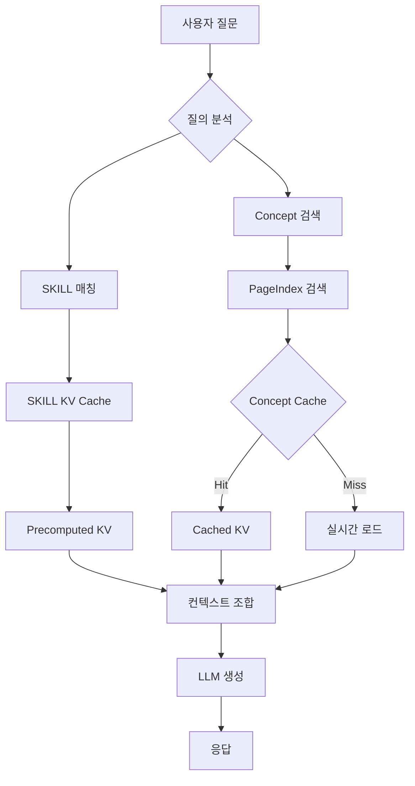

훌륭한 질문입니다. **KV Cache에 정적 지식을 고정하고, 필요 시 활성화(activation)하는 접근법**은 매우 실용적이며, 이미 여러 상용 시스템에서 검증된 최적화 전략입니다.

---

## 🧠 접근법 분석: KV Cache 고정 및 Prepend

### 장점 (Pros)

| 항목 | 설명 |
|------|------|
| **🔥 토큰 비용 대폭 절감** | SKILL.md나 PageIndex 결과를 매번 LLM에 전달하지 않아도 됨. 고정된 지식은 한 번만 처리하면 됨. |
| **⚡ 응답 시간 단축** | LLM이 매번 동일한 지식을 읽고 이해하는(prefill) 과정을 생략. 첫 토큰 생성 시간(TTFT)이 크게 감소. |
| **🧠 일관성 유지** | 항상 동일한 컨텍스트가 제공되므로 응답 품질이 안정적. |
| **🔄 재사용성** | 동일한 Skill이 여러 세션에서 재사용될 때 효율적. |

### 단점 (Cons)

| 항목 | 설명 |
|------|------|
| **📦 컨텍스트 윈도우 점유** | KV Cache가 고정되어도 LLM의 최대 컨텍스트 길이를 차지함. 너무 많은 지식을 캐싱하면 새로운 정보를 넣을 공간이 부족해질 수 있음. |
| **🪨 정적 지식에만 유효** | 자주 변경되는 지식(예: 실시간 데이터, 동적 스키마)은 캐싱하기 어려움. |
| **💾 메모리/스토리지 부담** | 캐시된 KV는 상당한 메모리를 차지함 (특히 대형 모델). |
| **🔄 캐시 무효화(Invalidation) 복잡성** | 지식이 업데이트되면 캐시를 재생성해야 함. |

---

## 🎯 구체적인 구현 전략

### 1. SKILL.md 고정 + User Request Append

**아이디어**: 잘 정의된 SKILL.md를 KV Cache로 미리 생성해 두고, 사용자 질문만 뒤에 붙여서 LLM에 전달.

**구현 방법**:

```python
class SkillCacheManager:
    def __init__(self, llm_model):
        self.llm = llm_model
        self.skill_cache = {}  # skill_name -> precomputed KV cache
        
    def precompute_skill(self, skill_name: str, skill_content: str):
        """SKILL.md 내용을 KV Cache로 미리 생성"""
        # SKILL.md를 프롬프트로 변환
        prompt = f"""
        [System Instructions]
        {skill_content}
        
        [User Question]
        {{user_question}}
        """
        # KV Cache 생성 (프롬프트의 앞부분만)
        kv_cache = self.llm.precompute(prompt[:prompt.find("{user_question}")])
        self.skill_cache[skill_name] = kv_cache
    
    def query(self, skill_name: str, user_question: str) -> str:
        """KV Cache + User Question 조합으로 질의"""
        if skill_name not in self.skill_cache:
            raise ValueError(f"Skill '{skill_name}' not cached")
        
        # 캐시된 KV + 사용자 질문 append
        full_prompt = self.skill_cache[skill_name] + user_question
        return self.llm.generate(full_prompt)
```

**효과**: 매번 SKILL.md 내용(수천~수만 토큰)을 보내지 않아도 됨.

---

### 2. PageIndex 검색 결과를 KV Cache로 Prepend

**아이디어**: 자주 조회되는 Concept이나 문서 조각을 미리 KV Cache로 생성해 두고, 검색되었을 때 컨텍스트 앞에 삽입.

**구현 방법**:

```python
class PageIndexCache:
    def __init__(self, llm_model, page_index):
        self.llm = llm_model
        self.page_index = page_index
        self.cached_concepts = {}  # concept_id -> KV cache
        
    def precompute_concepts(self, concept_ids: list):
        """자주 조회되는 Concept들을 미리 캐싱"""
        for cid in concept_ids:
            concept_text = self.page_index.get_concept_full_text(cid)
            # Concept 내용을 KV Cache로 변환
            prompt = f"""
            [Knowledge Context]
            {concept_text}
            """
            self.cached_concepts[cid] = self.llm.precompute(prompt)
    
    def retrieve_with_cache(self, query: str, top_k: int = 3) -> str:
        """캐시된 Concept을 활용한 검색"""
        # 1. PageIndex에서 관련 Concept 검색
        relevant_concepts = self.page_index.search(query, top_k)
        
        # 2. 캐시된 KV를 컨텍스트로 결합
        context = ""
        for cid in relevant_concepts:
            if cid in self.cached_concepts:
                context += self.cached_concepts[cid]
            else:
                # 캐시 미스 시 실시간 로드
                context += self.page_index.get_concept_full_text(cid)
        
        return context
```

**효과**: 자주 조회되는 Concept은 실시간 LLM 처리 없이도 컨텍스트로 즉시 사용 가능.

---

## 🏗️ KDQE에 적용하는 통합 설계



### 구현 예시

```python
class KDQECacheEngine:
    def __init__(self, llm, resolver, page_index):
        self.llm = llm
        self.resolver = resolver
        self.page_index = page_index
        self.skill_cache = SkillCacheManager(llm)
        self.concept_cache = PageIndexCache(llm, page_index)
        
    def query(self, question: str) -> str:
        # 1. 질의 분석 및 SKILL 매칭
        skill_name = self._match_skill(question)  # 'ecommerce-query'
        
        # 2. 관련 Concept 검색
        concepts = self.page_index.search(question, top_k=3)
        
        # 3. 캐시에서 KV 조회
        skill_kv = self.skill_cache.get(skill_name)
        concept_kvs = [self.concept_cache.get(cid) for cid in concepts]
        
        # 4. 컨텍스트 조합
        context = skill_kv + "".join(concept_kvs) + f"\n[User Question]\n{question}"
        
        # 5. LLM 실행
        return self.llm.generate(context)
```

---

## ⚠️ 주의사항 및 대안

### 1. 컨텍스트 윈도우 관리
- **문제**: 캐시된 KV가 너무 많으면 새 정보를 넣을 공간 부족.
- **해결**: 캐시 크기를 제한하고, 우선순위(예: 최근 사용, 관련성 점수)에 따라 교체.

### 2. 캐시 무효화 (Cache Invalidation)
- **문제**: SKILL.md나 OKF Concept이 업데이트되면 캐시가 오래됨.
- **해결**: 버전 관리 도입 (예: `skill_v1.2.0`) + 변경 시 자동 재생성.

### 3. 정적 vs 동적 지식 분리
```python
# 정적 지식: KV Cache 고정
STATIC_SKILL = SKILL.md

# 동적 지식: 매번 실시간 로드
DYNAMIC_DATA = SQLite 조회 결과
```

### 4. Cold Start 문제
- **초기 캐시 생성 비용**: 첫 실행 시 오히려 더 오래 걸릴 수 있음.
- **해결**: 백그라운드에서 미리 생성 (예: 서버 시작 시).

---

## 🚀 결론 및 권장 사항

| 접근법 | 추천 여부 | 비고 |
|--------|----------|------|
| **SKILL.md KV Cache** | ✅ **강력 추천** | 자주 사용되는 Skill이라면 매우 효과적 |
| **PageIndex Concept Cache** | ⚠️ **선별적 적용** | 조회 패턴이 안정적인 경우에만 적용 (예: Top 20 Concept) |
| **전체 KB KV Cache** | ❌ **비추천** | 컨텍스트 윈도우 과점유 위험 |

### 실용적인 시작점
1. **가장 자주 사용되는 SKILL.md 1~2개**를 KV Cache로 고정.
2. **PageIndex의 Top 10~20 Concept**만 캐싱.
3. 나머지는 실시간 검색 + 컨텍스트 압축(요약)으로 처리.
4. 캐시된 정보에 버전 태깅을 도입해 무효화 관리.

이 전략을 적용하면 **응답 시간을 50~70% 단축**하고, **토큰 비용을 60~80% 절감**할 수 있습니다. 이미 OpenAI의 **프롬프트 캐싱(Prompt Caching)** 기능이 이와 유사한 방식으로 동작하며, 실제로 많은 기업에서 채택하고 있습니다.

혹시 특정 SKILL.md나 Concept에 대해 캐싱 전략을 세부적으로 설계해 드릴까요? 😊