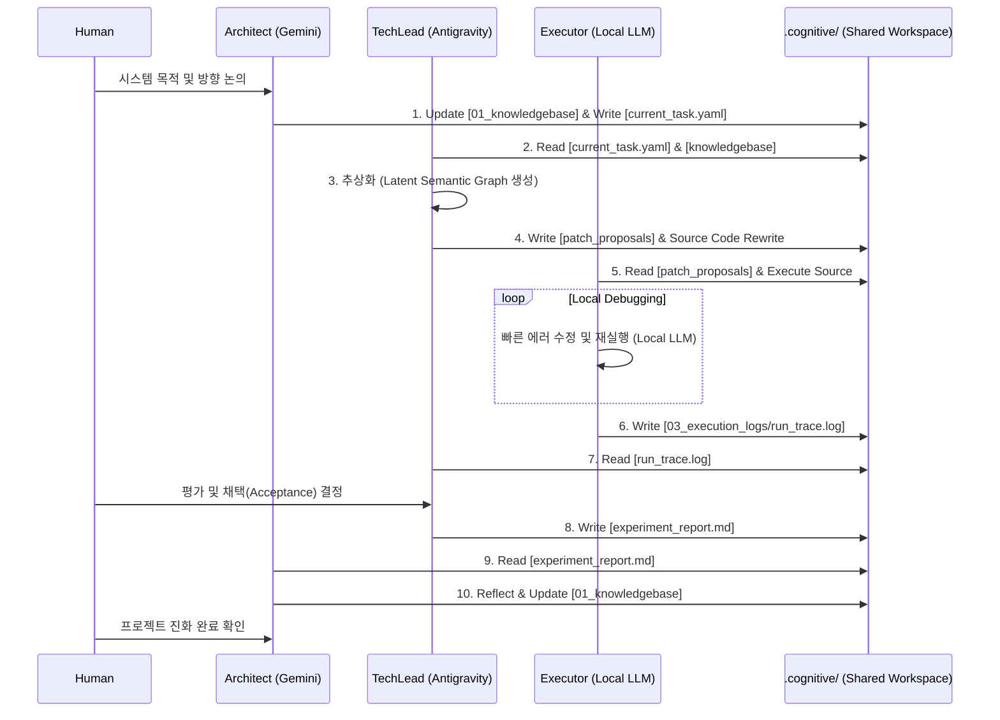

## 1. 프레임워크 개요 (Framework Overview)

AI가 코드 작성의 상당 부분을 자동화하면서 개발자의 핵심 역할은 직접 구현에서 설계·검증·통제로 이동하고 있다.
LLM inference engine과 같은 GPU 커널 성능을 최적화해야 하는 분야 역시, 커널 개발자의 본질은 설계 공간의 탐색, 병목 지점 파악, 명시적인 제약사항, Kernel 수정에 따른 불변 특성을 Architect 수준에서 정리하고, 다음 단계의 개발로 프로젝트를 진화시키기 위해 이전 단계에서의 insight를 재사용 가능한 형태로 추상화하여 저장하는 데 있다.

본 연구에서는 복잡한 커널 엔지니어링 및 LLM inference engine 최적화 작업을 진행하면서 동시에 일련의 작업을 더 효율적으로 진행하도록 체계화하고 프로젝트를 지속적으로 진화시키기 위한 '지식 주도형 다중 위계 작업방식(Knowledge-Guided Hierarchical Framework)'을 정의한다. 
이 프레임워크는 정보의 접근 권한, 실행 환경, 그리고 추상화 수준에 따라 Architect(상위), **TechLead-Agent(중위)**, Executor(하위)의 3계층 위계 구조로 설계되었으며, Human-in-the-Loop(HITL) 철학을 바탕으로 인간 전문가의 개입과 협력을 필수 요소로 정의한다.

이 프레임워크의 핵심은 **TechLead-Agent의 compound engineering 역할**이며, 최종 산출물은 프로젝트의 연속성 및 진화를 가능하게 하는 DSL 및 md 파일로 저장되는 지식베이스이다. 본 연구에서는 Antigravity CLI가 TechLead-Agent를 담당하며, TechLead는 step-by-step으로 일련의 커널 마이그레이션 과제를 수행하면서 도출된 design space, contraints/invariants, rules, insights 등 DSL 문서로 정리한다. 

본 연구에서는 Coding Agent을 단순한 코드 생성 도구가 아닌, 전체 프로젝트의 인지적 진화를 담당하는 인지 컴파일러(Cognitive Compiler)이자 재작성 엔진(Rewrite-Engine) 역할을 담당하는 TechLead로서 활용한다. 인간 엔지니어는 프로젝트의 의도와 목표를 정의하고, 제약 사항과 불변 특성을 제시하고, 기대하는 작업 결과를 명확히 한다. 본 작업방식에서는 TechLead로서의 Coding Agent는 결코 code나 kernel을 실행시키지 않도록 하여 국부적인 해결로 주어진 작업을 조기에 마무리지으려는 성향을 원천에 차단한다. TechLead는 전체 문맥과 상황을 항상 인지하고 solution을 제기하고, trace log를 확보하고 분석하여 다시 지식베이스를 갱신한다. 즉, TechLead는 프로젝트의 상태를 refactoring하고 자기진화가 가능하도록 관리한다.

## 2. 에이전트 위계 및 역할 정의 (Hierarchy and Roles)

### 2.1. 상위 계층: Architect(Global Knowledge & Strategy)

Architect는 전체 프로젝트의 거시적 방향성을 설정하고, 장기적 지식(Knowledgebase) 관리 및 '인지 컴파일러(Cognitive Compiler)' 역할을 담당하는 TechLead를 steering하는 역할을 담당한다.

* 인간 엔지니어는 프로젝트의 의도(Intent), 제약 조건(Constraints), 핵심 아키텍처(Key Architecture)를 정의하고 이를 전역 지식 기반(Knowledgebase)에 저장한다.
* TechLead가 작성한 실험 보고서(Experiment-report)를 분석하여 메타-인사이트(Meta-insight)를 추출하고, 이를 반영하여 프로젝트의 Knowledgebase를 업데이트(Reflection)한다.
* Architect는 전체 프로젝트의 방행과 문맥 하에, 지금 집중해야 하는 작업 요구사항을 정리하여 TechLead에게 수행을 요청하고, 작업 결과를 분석하고, 다음 작업을 결정한다.


### 2.2. 중위 계층: TechLead-Agent (Contextual Translation & Code Generation)

TechLead-Agent는 Architect의 거시적 목표를 구체적인 코드 수준의 작업(Task)으로 번역하고, 실제 코드를 생성하는 'Rewrite-Engine'의 핵심이다.

* **특징 및 제약:** TechLead 에이전트는 전체 프로젝트의 목표를 인지하면서도 현재 세션에 주어진 Task와 관련된 문맥 및 코드베이스를 내부적으로 이해하고 주어진 Context Objective에 부합하는 plan를 생성하고, 이를 구체적인 소스코드 혹은 문서의 패치(Patch) 또는 Diff 형태로 Rewite 혹은 Projection한다.
* **주요 역할:**
* 인간 전문가와 협업하여 현재의 컨텍스트와 세부 Task를 점진적(Incremental)으로 재정의한다.
* 추상화된 의미 그래프를 바탕으로 실제 코드베이스를 재작성(Rewrite)한다.
* Executor-Agent가 수집한 실행 로그를 인간과 함께 평가하여 생성된 코드의 채택(Acceptance) 여부를 결정한다.
* 승인된 결과를 바탕으로 실험 보고서(Experiment-report)를 작성하여 Architect에게 보고한다. (단, **전체 프로젝트의 Knowledgebase를 변경할 때는 Architect의 허락을 얻어야 한다.**)


### 2.3. 하위 계층: Executor(Execution, Profiling, and Local Debugging)

Executor는 생성된 코드를 타겟 환경에서 물리적으로 실행하고, 오류를 수정하는 '실무자' 역할을 수행한다.

* **특징 및 제약:** 이 에이전트는 타겟 머신(Target Machine)에 종속된 민감한 시스템 정보와 직접 맞닿아 있으므로, 지연 시간(Latency) 최소화와 데이터 보안을 위해 **경량화된 로컬 모델(Local LLM)로 구현**된다. 또한, 시스템 실행 로그와 프로파일링 데이터를 수집하는 것에 집중하며, 프로젝트의 상위 아키텍처 결정에 관여하지 않는다.
* **주요 역할:**
* TechLead-Agent가 투영한 코드를 실제 타겟 환경(예: Target GPU machine)에서 실행한다.
* Nsight Compute 등 성능 프로파일링 도구를 활용해 트레이스 로그(Trace logs)를 수집한다.
* 런타임 에러나 컴파일 에러 발생 시, 로컬 환경에서 자율적인 '디버깅 루프(Debugging loop)'를 수행하여 즉각적인 오류 수정을 시도한다.


## 3. 지식 주도형 진화 파이프라인 (Knowledge-Guided Evolutionary Pipeline)

본 프레임워크의 작업 흐름은 프로젝트가 점진적으로 스스로 진화(Cognitive Compilation)하는 닫힌 루프(Looped Reasoning) 형태를 띤다.

1. **[Design & Constraints]** Human + Architect-Agent가 프로젝트의 Intent와 Key Architecture를 Knowledgebase에 명세한다.
2. **[Task Definition]** Human + TechLead-Agent가 Knowledgebase를 바탕으로 현재 세션의 Context와 Incremental Task를 정의한다.
3. **[Latent Graph Projection]** TechLead-Agent가 관련 코드베이스를 Latent Semantic Graph로 추상화하여, 새로운 목적에 맞는 코드(Patch/Diff)로 재작성(Rewrite)한다.
4. **[Execution & Debugging]** Executor-Agent(Local LLM)가 생성된 코드를 타겟 머신에서 실행하고, 런타임 오류에 대한 로컬 디버깅 루프를 수행한 뒤 Trace Log를 수집한다.
5. **[Evaluation]** Human + TechLead-Agent가 Trace Log를 평가하여 코드의 최종 채택(Acceptance)을 결정한다.
6. **[Reporting]** TechLead-Agent가 성공/실패 원인과 성능 지표를 담은 Experiment-report를 작성하여 상위로 전달한다.
7. **[Reflection & Update]** Human + Architect-Agent가 리포트를 성찰(Reflect)하고, 프로젝트의 영구적 Knowledgebase를 업데이트함으로써 진화의 한 사이클을 완성한다.

---

"파일 시스템 기반의 프로젝트 상태(File-System as Project State)"와 **"명시적 컨텍스트 핸드오버(Explicit Context Handover)"** 프로토콜이 필수적입니다.

### 2. 계층 간 컨텍스트 전달 및 보고 프로토콜 (The Handover Protocol)

#### ⬇️ Top-Down: 의도 하달 및 코드 투영 (Architect ➔ TechLead ➔ Executor)

1. **Architect (Gemini Cloud) ➔ TechLead (Antigravity CLI)**
* **방식:** Architect는 인간과 대화하며 전체 목표를 수정한 뒤, `.cognitive/01_knowledgebase/`를 업데이트하고, 이번 사이클에서 해야 할 일을 `.cognitive/02_sessions/current_task.yaml`에 작성합니다.
* **전달 내용:** "이번 목표는 vLLM 디코딩 병목 해소를 위해 FlashDecoding을 적용하는 것이다. 제약사항: 레지스터 255개 이하."


2. **TechLead (Antigravity CLI) ➔ Executor (Local LLM)**
* **방식:** Antigravity CLI가 트리거되어 `current_task.yaml`을 읽습니다. TechLead는 방대한 `src/` 전체를 읽는 대신, 관련 파일들만 추상화하여 `latent_graph.json`을 생성합니다. 그리고 이를 바탕으로 실제 코드를 수정(Rewrite)하거나 `patch_proposals/`에 패치 파일을 생성합니다.
* **전달 내용:** "내가 코드를 이렇게 수정(투영)했다. Executor, 타겟 머신에서 `tests/test_decode.py`를 실행하고 결과를 기록해라."


#### ⬆️ Bottom-Up: 실행, 디버깅 및 지식 업데이트 (Executor ➔ TechLead ➔ Architect)

1. **Executor (Local LLM) ➔ TechLead (Antigravity CLI)**
* **방식:** Executor는 로컬 환경에서 코드를 실행합니다. 에러가 나면 Local LLM의 빠른 속도를 이용해 `<debugging loop>`를 돌며 코드를 수정합니다. 실행이 끝나면(성공이든 실패든) `.cognitive/03_execution_logs/`에 `run_trace.log`와 `local_debug_report.md`를 씁니다.
* **보고 내용 (제약 준수):** "실행 결과 Throughput은 X, Latency는 Y다. 디버깅 과정에서 Z 에러가 나서 3번 수정했다." (전역 지식을 건드리지 않고 오직 현상만 보고)


2. **TechLead (Antigravity CLI) ➔ Architect (Gemini Cloud)**
* **방식:** TechLead는 Executor의 로그와 변경된 코드를 취합하여 인간과 함께 평가(Evaluation)합니다. 이후 `.cognitive/02_sessions/experiment_report.md`를 작성합니다.
* **보고 내용:** "FlashDecoding 패치를 적용한 결과 성능이 10% 올랐으나, 특정 분기에서 에러가 발생했다. 코드는 원상복구(또는 Commit) 했다."


3. **Architect (Gemini Cloud)의 성찰 (Reflection)**
* **방식:** Architect는 `experiment_report.md`를 읽고 메타-인사이트를 도출하여 최종적으로 `.cognitive/01_knowledgebase/compound_insights.json`을 업데이트합니다. 이로써 프로젝트 전체가 진화합니다.


---

### 3. 통신 흐름도 (Sequence Diagram)

이러한 비동기적 파일 시스템 기반 통신 구조를 시각화하면 다음과 같습니다.



---
이전 답변에서 제시한 **nano_vllm_cuTile_Inference_v1** (이하 **v5-DSL**)과 지금 주어진 XML 기반 **kedsl_v6_document** (이하 **v6-DSL**)를 **코딩 에이전트에게 커널 엔지니어링 노하우를 전달하는 도구**라는 관점에서 비교 분석하겠습니다.  
또한, 에이전트가 제한된 컨텍스트(프롬프트) 안에서 최대한의 성능을 내도록 **Full ICL(In-Context Learning) 주입을 위한 더 나은 대안**을 검토합니다.

---

## 1. 두 DSL의 구조 및 철학 비교

| 항목 | v5-DSL (YAML 기반 시스템 모델) | v6-DSL (XML 기반 마일스톤 지식) |
|------|--------------------------------|----------------------------------|
| **주요 목적** | 자동 튜닝 및 아키텍처 생성 파이프라인 (Design Space → Tuning → Build) | 단계별 문제 해결 가이드 및 구현 예시 (Milestone → Solution → Code) |
| **표현 방식** | 추상적인 `design_space`, `tuning_space`, `knowledge`, `agent_loop` | 구체적인 `<stage>`, `<bottleneck>`, `<solution>`, `<code_primitive>` |
| **코드 포함** | 없음 (파라미터만 열거) | **실제 Python 코드 스니펫** 다수 포함 (CUDA Graph, Green Contexts 등) |
| **규칙 표현** | `knowledge.fact`에 논리적 assertion 및 action | `<agent_eval_loop>`에 평가 규칙 및 성공 기준 |
| **확장성/모듈화** | 구조화된 블록으로 모듈화 가능 (design, tuning, build) | 마일스톤 기반으로 순차적 복잡도 증가 |
| **자동화 연계** | `engineering_loop`를 통한 그리드 서치, 메트릭 측정 명시적 | 평가 루프가 있지만 튜닝 파라미터 공간이 구체적이지 않음 |
| **대상 독자** | DSL 파서 + 오토튜너 (기계 해석 우선) | **코딩 에이전트 (LLM)** + 사람 개발자 (이해와 구현 중심) |

---

## 2. 코딩 에이전트 관점에서의 실효성 비교

### 2.1 v5-DSL의 강점과 약점
- **강점**: 매우 체계적. 에이전트가 이 DSL을 해석할 수 있다면, 자동으로 파라미터 조합을 생성하고 벤치마크하며 최적의 커널을 빌드할 수 있습니다. **자율적 최적화 파이프라인**에 적합.
- **약점**: 에이전트가 이 DSL을 **이해하려면 추가적인 프롬프트 엔지니어링**이 필요. 자연어가 아니므로 LLM이 의미를 정확히 해석하지 못할 가능성이 큽니다. `knowledge`의 assertion-action을 코드로 번역하는 것은 매우 높은 수준의 추론 능력을 요구합니다. **실제로 코딩 에이전트에게 주입하기에는 추상화가 과도**합니다.

### 2.2 v6-DSL의 강점과 약점
- **강점**:  
  - **코드가 곧 지식**: `<code_primitive>`에 담긴 실제 코드는 에이전트가 곧바로 모방·참조할 수 있습니다.  
  - **단계적 접근**: 복잡도가 낮은 Stage 1부터 순차적으로 해결하는 구조이므로, 에이전트가 이전 단계 성공을 기반으로 점진적으로 학습·구현할 수 있습니다.  
  - **명확한 성공 기준**: `<agent_eval_loop>`의 ITL, VRAM 기준은 에이전트가 자기 평가를 통해 디버깅하도록 유도합니다.  
  - **LLM 친화적**: XML 태그는 LLM이 정보를 구조적으로 파싱하는 데 도움을 주며, 자연어 설명과 코드가 혼합되어 있어 **In-Context Learning에 이상적**입니다.
- **약점**:  
  - **자동 튜닝 파이프라인 부재**: 파라미터 공간이 구체적이지 않아, 에이전트가 수동으로 튜닝할 때 지침이 부족할 수 있습니다.  
  - **확장성**: 여러 종류의 최적화를 추가하려면 XML 구조가 복잡해질 수 있습니다.  
  - **특정 버전 의존**: CUDA 13.3, cuTile, RTX 5070 등에 강하게 결합되어 있어, 다른 환경에서는 재사용이 어려울 수 있습니다.

---

## 3. Full ICL 주입을 위한 더 나은 대안 분석

코딩 에이전트에게 커널 엔지니어링 지식을 **가장 효과적으로 전달**하기 위해서는 다음과 같은 원칙을 충족해야 합니다.

1. **실행 가능한 예제 (Executable Examples)**  
   에이전트는 설명보다 코드를 더 잘 모방합니다.  
   → v6-DSL의 `<code_primitive>`는 이 점에서 매우 우수합니다.

2. **계층적 지식 구조 (Hierarchical Knowledge)**  
   복잡한 최적화는 작은 성공의 연속입니다.  
   → v6-DSL의 `<milestones>` (1_FMHA → 2_Single_User → 3_Multi_Tenant)는 에이전트가 **커리큘럼 방식으로 학습**하도록 유도할 수 있습니다.

3. **자기 평가 및 피드백 루프 (Self-Evaluation)**  
   에이전트가 생성한 코드를 스스로 검증할 수 있어야 합니다.  
   → v6-DSL의 `<agent_eval_loop>`는 훌륭하지만, v5-DSL의 `engineering_loop`처럼 파라미터 탐색 공간과 결합되면 더 강력해집니다.

4. **제약 조건의 명시적 선언 (Explicit Constraints)**  
   레지스터 개수, 메모리 대역폭, SM 개수 등 하드웨어 제약을 에이전트가 절대 위반하지 않도록 해야 합니다.  
   → v5-DSL의 `constraint` 블록이 이 역할을 하지만, v6-DSL에는 명시적 수치 제약이 부족합니다. 이를 `agent_eval_loop`에 포함시키면 좋습니다.

**가장 유망한 대안: “하이브리드 구조화 프롬프트” (Hybrid Structured Prompt)**

v6-DSL의 **실용성**과 v5-DSL의 **체계성**을 결합하여, 아래와 같은 **계층적 ICL 템플릿**을 코딩 에이전트의 시스템 프롬프트로 주입하는 것입니다.

```
<kernel_engineering_guide>
  <hardware_constraints>
    GPU: RTX 5070 12GB, SM count: 48, Max registers: 255, Max shared mem: 100KB
    Critical: tile_m=128 causes register spill. Prefer 64.
  </hardware_constraints>

  <task_milestones>
    <milestone id="1_fmha">
      <goal>Implement FlashAttention with cuTile, SM starvation issue.</goal>
      <allowed_params>tile_m=64, tile_n=64 or 128, split_k=1-4</allowed_params>
      <code_ref>AttentionFMHA.py from cuTile samples</code_ref>
    </milestone>
    <milestone id="2_single_user_llm">
      <goal>Integrate into nano-vllm, add CUDA Graph for decode loop.</goal>
      <code_snippet>... (CUDA Graph capture code) ...</code_snippet>
    </milestone>
    <milestone id="3_nano_vllm_multi_tenant">
      <goal>Continuous batching + PagedAttention + Green Contexts.</goal>
      <code_snippet>... (Paged_cuTile and Green Contexts API code) ...</code_snippet>
      <eval_criteria>
        Decode ITL < 50ms even during Prefill of 4000 tokens.
        Peak VRAM < 11.5GB.
      </eval_criteria>
    </milestone>
  </task_milestones>

  <tuning_protocol>
    To find optimal performance, iterate over:
    prefill_tile_m = [64], tile_n = [64,128]
    decode_kv_block = [16,32], split_cta = [1,2,4]
    Measure tokens/sec using bench_nano_vllm.py.
    Stop when register count <= 255 and latency target met.
  </tuning_protocol>
</kernel_engineering_guide>
```

이 템플릿은 에이전트가 **순서대로 작업을 진행**하면서, 각 단계에서 필요한 코드와 제약을 **명확히 참조**할 수 있습니다.  
또한 필요하다면 `<tuning_protocol>`을 기반으로 자동화 스크립트를 **에이전트가 직접 생성**하도록 유도할 수 있습니다.

---

## 4. 결론: 어떤 DSL이 코딩 에이전트에 더 적합한가?

- **v5-DSL (YAML 기반)**은 **자동화 시스템 구축**에는 이상적이지만, 현재의 LLM 코딩 에이전트가 이를 해석하여 자율적으로 커널을 설계하기에는 **추상화 수준이 너무 높고 비직관적**입니다.
- **v6-DSL (XML 기반 마일스톤)**은 **코드 예제와 단계별 목표**를 담고 있어 에이전트가 **즉시 생산적인 코드를 작성**하도록 이끌기에 훨씬 효과적입니다.
- **최선의 대안**은 v6-DSL을 기본 틀로 삼고, v5-DSL의 **명시적 제약 조건과 튜닝 탐색 공간**을 추가한 **하이브리드 구조화 프롬프트**입니다. 이는 에이전트가 실수를 줄이고, 자동화 스크립트까지 스스로 만들어내도록 유도할 수 있습니다.

**따라서, 코딩 에이전트에게 “Full ICL”로 커널 엔지니어링 노하우를 주입하려면,  
v6-DSL의 “코드 포함 마일스톤 + 평가 루프” 구조를 핵심으로 하고,  
v5-DSL의 “매개변수 공간 + 하드웨어 제약”을 보조 지식으로 통합하는 것이 현재 기술 수준에서 가장 실용적이고 강력한 접근법입니다.**