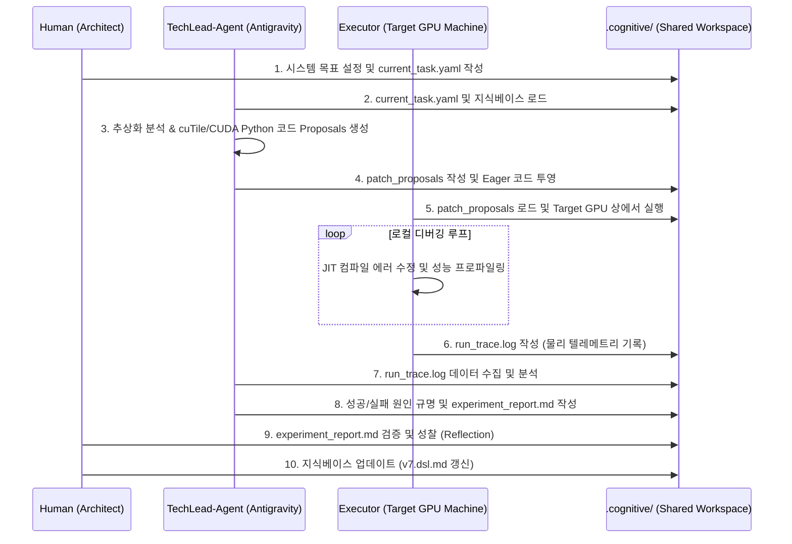

# 지식 주도형 커널 엔지니어링 프레임워크
**Knowledge-Guided Kernel Engineering Framework**

---

## 1. 프레임워크 개요 (Framework Overview)

거대 언어 모델(LLM) 서빙 엔진과 같이 고성능 병렬 처리가 요구되는 GPU 커널 프로그래밍 분야는 극단적인 물리적 자원 제약(스레드당 레지스터 수, L2 캐시 대역폭, SM 점유율 등) 하에서 최적의 결정을 내려야 하는 복잡한 설계 공간(Design Space)을 가지고 있다. 이러한 시스템의 최적화는 단순한 단일 코드 생성만으로는 불가능하며, 미시적(Micro) 물리 메트릭과 거시적(Macro) E2E 런타임 시스템 병목 간의 다차원적 상호작용을 규명하고 반영하는 반복적인 엔지니어링 피드백이 필수적이다.

본 프레임워크는 인간 엔지니어와 AI 코딩 에이전트가 최적의 커널 마이그레이션(MatMul $\rightarrow$ FMHA $\rightarrow$ llm-from-scratch $\rightarrow$ nano-vllm)을 협력적으로 수행하며 도출한 지식과 통찰을 구조화하고, 프로젝트의 연속성과 자기 진화성(Self-Evolution)을 확보하기 위해 정의된 3계층 구조의 **'지식 주도형 커널 엔지니어링 프레임워크(Knowledge-Guided Kernel Engineering Framework)'**이다. 

이 프레임워크는 정보의 추상화 수준, 실행 환경, 그리고 대상 시스템 환경에 따라 **Architect(상위)**, **TechLead(중위)**, **Executor(하위)**의 3계층 위계 구조로 구성된다. Architect가 '시스템 모델(System Model)'을 바탕으로 가설을 세우고, TechLead는 실험을 설계하고 구현하며, Executor가 target 환경에서 실험을 실행하고 trace data를 수집한다. 수집된 데이터를 바탕으로 TechLead가 시험 결과 분석 리포트를 작성하면, Architect는 이를 검토하고 도메인 특화 지식 및 시스템 모델을 수정하고 유지 관리한다. 즉, 기본의 Task Decomposition에 의한 작업 방식을 넘어, Scientist(가설 수립), TechLead(실험 설계 및 구현), Executor(실험 실행 및 측정) 구조를 도입하여 GPU 커널 개발을 통제된 과학 실험 과정으로 모델링한다. 

특히, 본 프레임워크의 근간이 되는 DSL은 **"하드웨어 메타데이터 $\rightarrow$ 설계/튜닝 공간 $\rightarrow$ 물리 제약 $\rightarrow$ 아키텍처 지식 $\rightarrow$ 코드 구현 프리미티브 $\rightarrow$ 자동 검증 수치 조건"**에 이르는 전 주기의 시스템 엔지니어링 정보를 구조화하는 핵심 지식 모델로 작동하며, 이를 통해 고도화된 최적화 지식이 다음 커널 엔지니어링 세션으로 안전하게 전이되고 축적되도록 보장한다.

이 프레임워크를 기반으로 다음 4단계로 난이도를 높이며 실험을 진행하며 이 과정에서 획득한 데이터 및 insights는 DSL 형식으로 축적된다.
1) MatMul
2) FMHA
3) LLM from scratch
4) nano-vLLM kernel migration

---

## 2. 3계층 위계 구조 및 역할 정의 (Hierarchical Roles & Boundaries)

```
       +---------------------------------------------+
       |       Architect (인간 개발자 / Strategy)     |  <-- 전역 지식 승인 & 정책 결정
       +---------------------------------------------+
                              | I2S (Intent-to-Experiment)
                              v
       +---------------------------------------------+
       |       TechLead (AI 에이전트 / Translation)   |  <-- 지식 번역 & 코드 Proposal 생성
       +---------------------------------------------+
                              | S2E (Experiment-to-Execution)
                              v
       +---------------------------------------------+
       |       Executor (인간 & Local LLM / Target)  |  <-- 물리 실행, 디버깅 & 원격 분석
       +---------------------------------------------+
                              | T2K (Telemetry-to-Knowledge)
                              +----------------------+ (물리 메트릭 피드백)
```

### 2.1. 상위 계층: Architect (Global Knowledge & Strategy)
* **주요 역할**: 프로젝트의 궁극적인 의도(Intent), 전역적 제약 조건(Constraints), 핵심 시스템 모델을 수립하고 제어한다.
* **주요 구성**: 인간 개발자가 주도하며, 대규모 클라우드 LLM(Gemini)이 구조설계 어시스턴트로 작동한다.
* **통제 경계**: 하위 계층에서 피드백된 실험 보고서(Experiment-report)의 정량적 지표를 종합 평가하여 메타-인사이트를 추출하고, 이를 최종적으로 프로젝트 영구 지식베이스(Knowledgebase)에 영속(Reflection)시킨다.

### 2.2. 중위 계층: TechLead-Agent (Contextual Translation & Code Proposal)
* **주요 역할**: Architect의 거시적 설계 목표와 지식베이스 규칙들을 타겟 컴파일러 환경(cuTile & CUDA Python 1.0)에 맞는 구체적인 소스코드 패치(Patch)와 튜닝 탐색 계획으로 번역(Translation)한다.
* **주요 구성**: Antigravity CLI가 탑재된 AI 코딩 에이전트(TechLead)가 단독 전담한다.
* **제약 사항**: TechLead는 지식의 의미적 추상화(Semantic Mapping)와 코드 재작성(Rewrite)에만 전념하며, **타겟 머신 상에서 코드를 직접 컴파일하거나 실행하지 않는다.** 로컬 실행의 세부 에러에 함몰되지 않고 전체적인 아키텍처 불변성(Invariants)과 설계 규칙을 수호하는 데 집중하기 위함이다.

### 2.3. 하위 계층: Executor (Physical Execution, Profiling, and Local Debugging)
* **주요 역할**: TechLead가 투영한 코드를 실제 타겟 GPU 머신(RTX 5070 등) 환경에서 물리적으로 빌드하고 실행하며, 성능 데이터를 프로파일링하여 반환한다.
* **주요 구성**: 인간 개발자의 로컬 조작과 타겟 머신 내부의 경량화된 로컬 실행기(Local LLM 및 드라이버 분석 도구)가 결합되어 수행된다.
* **통제 경계**: 런타임 에러나 JIT 컴파일 구문 오류 발생 시, 상위 계층의 관여 없이 로컬 범위 내에서 즉각적인 디버깅 루프를 수행하여 수정된 코드를 론칭한다. 전역 아키텍처 결정에는 절대 관여하지 않으며, 오직 실행 가능성 확보와 정량적 텔레메트리 데이터(Nsight Compute 메트릭, ITL, Throughput 등) 수집에 전념한다.

---

## 3. 상호작용 프로토콜 규격 (Interaction Protocols)

본 프레임워크의 진화 사이클은 **S2E**와 **T2K**라는 명시적인 파일 시스템 기반 API/문서 전달 규약에 의해 동작한다.

### 3.1. Spec-to-Execution (S2E) Protocol [Top-Down]
연구실(Host)에서 논리적으로 도출된 최적화 사양을 실험실(Target Machine)로 배포하고 주입하는 프로토콜이다.
1. **Architect ➔ TechLead**: Architect는 설계 사양 및 당면 과제를 `.cognitive/sessions/current_task.yaml` 파일로 직렬화하여 하달한다.
2. **TechLead ➔ Executor**: TechLead는 해당 테스크와 지식베이스 규칙을 분석하여 타겟 코드베이스를 재작성(Rewrite)하고, 구체적인 코드 Proposal과 JIT 컴파일 인자(Tile 크기, SM 할당 등)가 담긴 패치 명세(`patch_proposals/`)를 생성하여 실험실로 투영한다.

### 3.2. Telemetry-to-Knowledge (T2K) Protocol [Bottom-Up]
실험실(Target)의 실제 실행 데이터와 물리적 병목 메트릭을 지식화하여 연구실(Host)로 환원하는 프로토콜이다.
1. **Executor ➔ TechLead**: Executor는 코드를 실행하고 Nsight Compute 및 E2E 측정 스크립트를 기동하여 수집한 하드웨어 물리 데이터(스레드당 레지스터 수, L2 캐시 residency, 메모리 할당자 스래싱 현상, 런타임 컴파일 경고 등)를 `.cognitive/execution_logs/run_trace.log`로 구조화하여 보고한다.
2. **TechLead ➔ Architect**: TechLead는 텔레메트리 데이터와 코드를 교차 비교 분석하여 타겟 성능 개선 비율 및 실패 요인을 담은 `experiment_report.md`를 합성해 Architect에게 제출한다.
3. **Architect의 성찰(Reflection)**: Architect는 리포트를 승인하고, 발견된 물리적 한계점(예: "tile_m=128 적용 시 Register Spilling 발생하므로 64로 강제 제한해야 함")을 `v7.dsl`의 명시적 제약 및 지식 규칙으로 추가 저장하여 다음 컴파일의 영구 지식으로 축적한다.

---

## 4. 파일 시스템 기반 상태 관리 구조 (Context Handover Protocol)

본 프레임워크는 상태의 연속성을 확보하기 위해 작업 폴더 내의 특정 디렉토리를 물리적 상태 정보로 취급한다.

* `.cognitive/01_knowledgebase/`: 최적화 규칙, 하드웨어 임계치 정보 및 영구 지식베이스 (`v7.dsl.md`, `framework.md`)
* `.cognitive/02_sessions/`: 현재 진행 중인 태스크 세션 정보 (`current_task.yaml`, `experiment_report.md`)
* `.cognitive/03_execution_logs/`: 실행 결과 로그 및 분석 데이터 (`run_trace.log`, `nsight_metrics.csv`)
* `patch_proposals/`: 소스코드 반영용 패치 파일 및 제안 코드 primitives

---

## 5. 지식 주도형 진화의 순환 프로세스 (Evolutionary Closed Loop)



이 프레임워크는 하드웨어 수준의 커널 최적화가 전체 소프트웨어 스택과 충돌하는 순간을 단순 실패로 규정하지 않고, **피드백 프로토콜(T2K)을 통해 지식베이스의 논리 제약으로 영구히 자산화**함으로써, 에이전트와 컴파일러가 다음 론칭 시 동일한 오류를 원천 차단하고 스스로 진화할 수 있는 강력한 인지적 컴파일 환경을 제공한다.
