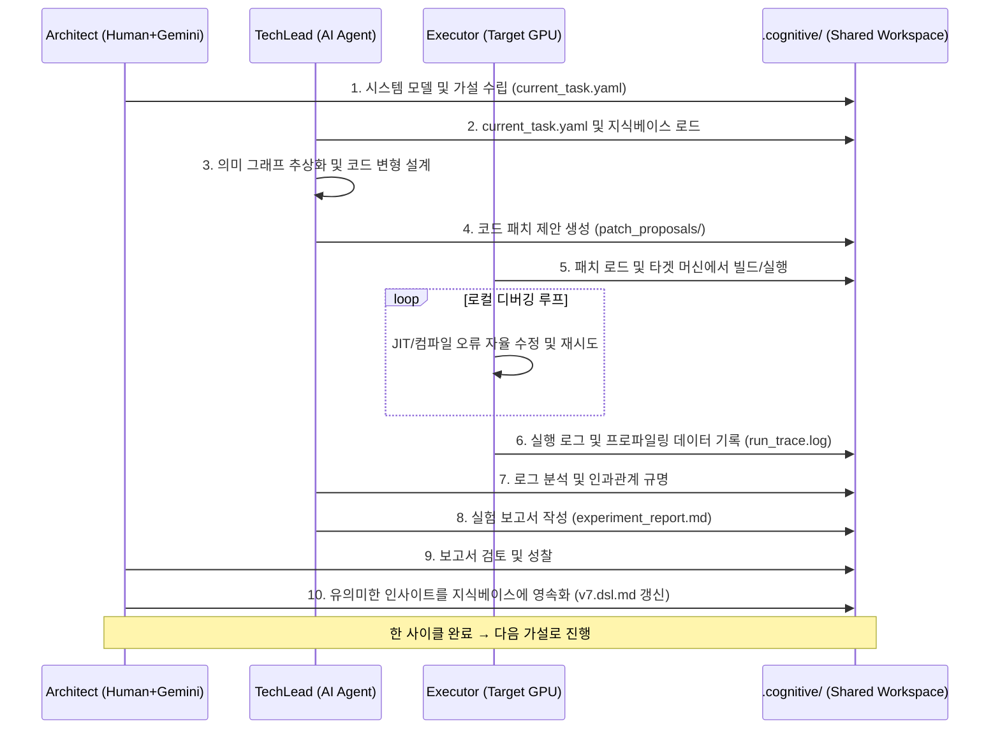

# 지식 주도형 커널 엔지니어링 프레임워크
**Knowledge-Guided Kernel Engineering Framework**

---

## 1. 프레임워크 개요: 인지 컴파일러와 통제된 과학실험으로서의 커널 엔지니어링

거대 언어 모델(LLM) 서빙 엔진과 같은 GPU 커널 프로그래밍 분야는 극도로 제한된 물리적 자원(레지스터, 공유 메모리, SM 점유율, L2 캐시 대역폭) 하에서 최적의 결정을 내려야 하는 복잡한 설계 공간을 가진다. 이러한 최적화는 단순한 코드 생성만으로는 불가능하며, **미시적(Micro) 물리 메트릭과 거시적(Macro) E2E 시스템 병목 간의 다차원적 상호작용**을 규명하고 반영하는 반복적인 실험적 탐구가 필수적이다.

본 프레임워크는 이러한 커널 엔지니어링을 **통제된 과학실험(Controlled Scientific Experiment)의 과정**으로 모델링하고, 인간과 AI 에이전트가 협력하여 지식을 축적하고 시스템을 진화시키는 **인지 컴파일러(Cognitive Compiler)**의 개념을 구현한다.

### 1.1. 인지 컴파일러(Cognitive Compiler)란?

전통적 컴파일러가 고정된 규칙에 따라 소스 코드를 기계어로 변환하는 반면, **인지 컴파일러**는:
- **실험 결과를 지식으로 흡수**하여 자신의 변환 규칙을 동적으로 갱신한다.
- **하드웨어 피드백 루프**를 통해 최적화 결정의 정확성을 지속적으로 검증한다.
- **도메인 지식**을 구조화된 형태로 보존하고, 후속 세션에 재사용한다.

즉, 인지 컴파일러는 "코드 변환기"가 아닌, **"시스템 모델을 진화시키는 학습적 컴파일러"**이다.

### 1.2. 통제된 과학실험으로서의 커널 엔지니어링

본 프레임워크는 커널 최적화를 다음의 과학적 방법론 사이클로 정의한다:

| 과학적 방법론 단계 | 프레임워크 대응 요소 |
| :--- | :--- |
| **가설 수립 (Hypothesis)** | Architect가 시스템 모델과 지식 베이스를 기반으로 최적화 방향 설정 |
| **실험 설계 (Experiment Design)** | TechLead가 구체적인 코드 변형과 측정 조건을 명세화 |
| **실험 수행 (Execution)** | Executor가 타겟 환경에서 코드를 빌드/실행하고 데이터 수집 |
| **데이터 분석 (Analysis)** | TechLead가 실행 로그와 프로파일링 데이터를 평가 |
| **성찰 및 지식 갱신 (Reflection)** | Architect가 결과를 종합하고 지식 베이스에 영속화 |

이를 통해 단순한 시행착오(Trial-and-Error)가 아닌, **검증 가능한 지식의 축적**이 이루어진다.

---

## 2. 3계층 위계 구조: 실험 역할의 분리와 협력

프레임워크는 정보의 추상화 수준, 실행 환경, 시스템 접근 권한에 따라 **Architect(상위)**, **TechLead(중위)**, **Executor(하위)**의 3계층 위계로 구성된다. 각 계층은 명확한 책임과 통제 경계를 가지며, 전체적으로 **과학실험 팀**의 역할 분담을 반영한다.

```
       +-------------------------------------------------+
       |  Architect (연구 책임자 / 시스템 지식 관리자)    |  ← 가설 수립, 지식 승인
       +-------------------------------------------------+
                              │ Intent-to-Experiment (I2E)
                              ▼
       +-------------------------------------------------+
       |  TechLead (실험 설계자 / 코드 변환 엔진)         |  ← 실험 설계, 구현, 분석
       +-------------------------------------------------+
                              │ Spec-to-Execution (S2E)
                              ▼
       +-------------------------------------------------+
       |  Executor (실험 수행자 / 현장 측정 엔지니어)     |  ← 실행, 프로파일링, 디버깅
       +-------------------------------------------------+
                              │ Telemetry-to-Knowledge (T2K)
                              └─────────────────────────────┐
                                                             ▼
                                                        지식 피드백 루프
```

### 2.1. 상위 계층: **Architect** (연구 책임자 · 시스템 모델 관리자)

- **역할**: 프로젝트의 최종 목표(Intent), 전역적 제약 조건, 시스템 모델을 정의하고, 실험 결과를 성찰하여 지식 베이스를 갱신한다.
- **주체**: 인간 개발자가 주도하며, 대규모 클라우드 LLM(예: Gemini)이 구조 설계 어시스턴트로 참여한다.
- **핵심 산출물**:
  - 시스템 모델 명세 (`v7.dsl.md`)
  - 실험 설계 지침 (`current_task.yaml`)
  - 실험 보고서 검토 및 지식 반영 (Reflection)
- **통제 경계**: 타겟 머신에서 코드를 직접 실행하지 않으며, 하위 계층이 수집한 물리 메트릭을 해석하여 **추상적 수준의 인사이트**로 전환하는 데 집중한다.

### 2.2. 중위 계층: **TechLead** (실험 설계자 · 코드 변환 엔진)

- **역할**: Architect의 가설과 지식 베이스 규칙을 구체적인 코드 수정(패치)과 실험 조건으로 **번역(Translation)**한다. 실행 결과를 분석하여 실험 보고서를 작성한다.
- **주체**: Antigravity CLI가 탑재된 AI 코딩 에이전트가 단독 전담한다.
- **핵심 산출물**:
  - 코드 패치 제안 (`patch_proposals/`)
  - 실험 보고서 (`experiment_report.md`)
- **제약 사항**: 타겟 머신에서 코드를 직접 컴파일하거나 실행하지 않는다. 이는 로컬 실행 에러에 함몰되지 않고, **아키텍처 불변성과 설계 규칙을 수호**하는 데 전념하기 위함이다.

### 2.3. 하위 계층: **Executor** (실험 수행자 · 현장 측정 엔지니어)

- **역할**: TechLead가 설계한 코드를 타겟 GPU 머신(RTX 5070 등)에서 빌드/실행하고, 성능 데이터를 프로파일링하여 원시 데이터를 수집한다. 런타임 오류 발생 시 자율적인 로컬 디버깅을 수행한다.
- **주체**: 인간 개발자(로컬 조작) + 경량 로컬 LLM(디버깅 보조) + 프로파일링 도구(Nsight Compute 등)의 결합.
- **핵심 산출물**:
  - 실행 로그 (`run_trace.log`)
  - 프로파일링 메트릭 (`nsight_metrics.csv`)
- **통제 경계**: 전역 아키텍처 결정에 관여하지 않으며, 오직 **실행 가능성 확보와 정량적 텔레메트리 수집**에 전념한다.

---

## 3. 상호작용 프로토콜: 과학실험의 표준 절차

프레임워크의 진화 사이클은 **I2E(Intent-to-Experiment)**, **S2E(Spec-to-Execution)**, **T2K(Telemetry-to-Knowledge)**라는 명시적 프로토콜을 통해 구현된다. 이는 과학실험에서 연구 계획 → 실험 수행 → 데이터 보고에 해당하는 표준 절차를 정의한다.

### 3.1. Intent-to-Experiment (I2E) Protocol [Top-Down]

연구 책임자(Architect)의 가설과 목표를 실험 설계자(TechLead)에게 전달하는 단계이다.

1. **Architect**는 시스템 모델과 지식 베이스를 참조하여 최적화 가설 및 제약 조건을 `.cognitive/sessions/current_task.yaml`로 명세화한다.
2. 명세에는 **탐색할 설계 공간**(예: Tile 크기 64~256), **측정할 지표**(예: Throughput, ITL), **성공 기준**(예: Throughput 10% 향상)이 포함된다.

### 3.2. Spec-to-Execution (S2E) Protocol [Top-Down]

실험 설계자(TechLead)가 구체적인 코드 변형과 실행 조건을 생성하고, Executor가 이를 물리적으로 실행하는 단계이다.

1. **TechLead**는 `current_task.yaml`과 지식 베이스 규칙을 분석하여, cuTile/CUDA Python 코드를 재작성(Rewrite)하고 구체적인 패치 명세를 `patch_proposals/`에 생성한다.
2. 패치에는 커널 파라미터(Tile 크기, SM 할당 등)와 함께, JIT 컴파일러 플래그 및 측정 스크립트 호출 방법이 포함된다.
3. **Executor**는 이 명세를 로드하고, 타겟 머신에서 빌드/실행을 수행한다.

### 3.3. Telemetry-to-Knowledge (T2K) Protocol [Bottom-Up]

실행 결과와 물리적 병목 데이터를 분석 가능한 지식으로 전환하여 상위 계층으로 환원하는 단계이다.

1. **Executor**는 실행 로그와 Nsight Compute 등에서 수집한 하드웨어 메트릭(레지스터 사용량, L2 캐시 미스율, SM 점유율, 할당자 스래싱 현상 등)을 `.cognitive/execution_logs/run_trace.log`로 구조화하여 보고한다.
2. **TechLead**는 로그를 분석하고 코드 변경과 성능 변화의 인과관계를 규명하여 `experiment_report.md`를 작성한다. 보고서에는 **성공/실패 원인**, **정량적 개선/악화 비율**, **발견된 병목**이 포함된다.
3. **Architect**는 보고서를 검토하고, 유의미한 인사이트를 추출하여 지식 베이스(`v7.dsl.md`)에 영속화(Reflection)한다. 예: *"Tile 크기 128 적용 시 Register Spilling 발생 → 64로 제한"*.

---

## 4. 파일 시스템 기반 지식 및 상태 관리 구조

프레임워크는 작업 공간 내 물리적 디렉토리를 **지식·실험·분석의 영구적 저장소**로 활용한다. 이는 과학실험의 **실험 노트북(Notebook)** 과 같은 역할을 수행한다.


이 구조는 **실험의 재현성**과 **지식의 연속성**을 보장하며, 새 세션 시작 시 이전 실험의 교훈을 참조할 수 있게 한다.

---

## 5. 지식 주도형 진화의 순환 과정 (Evolutionary Closed Loop)

과학적 방법론의 순환을 따르는 본 프레임워크의 진화 사이클은 아래 다이어그램으로 요약된다.



이 순환 과정의 각 단계는 **명시적인 문서 교환(파일 기반)**을 통해 이루어지므로, 인간과 AI 에이전트가 동일한 작업 공간을 공유하며 **비동기적 협력**이 가능하다.

---

## 6. 지식의 축적과 자기 진화(Self-Evolution) 메커니즘

본 프레임워크의 궁극적 목표는 **단발성 최적화가 아닌, 지속적 자기 진화**이다. 이를 위해 다음의 메커니즘이 내장되어 있다.

### 6.1. DSL 기반 지식 표현

`v7.dsl.md`는 다음과 같은 항목들을 구조화하여 저장한다:

- **하드웨어 메타데이터**: GPU 모델별 SM 수, 레지스터 한계, L2 크기
- **설계/튜닝 공간**: 가변 파라미터(Tile 크기, 스레드 블록 크기, 루프 언롤 팩터)
- **물리 제약 조건**: Register Spilling 임계치, 최대 공유 메모리 사용량
- **아키텍처 지식**: 커널 패턴(예: FMHA, PagedAttention)의 최적 구현 프리미티브
- **자동 검증 수치 조건**: Throughput 하한, 지연 시간 상한 등

### 6.2. 실패로부터 학습 (Learning from Failure)

실패한 실험은 단순히 버려지지 않고, `experiment_report.md`에 **실패 원인**과 **관찰된 현상**을 상세히 기록한 후, Architect가 이를 제약 조건이나 경고 규칙으로 지식 베이스에 추가한다. 예를 들어:

> *"Tile size (128, 128) 시도 시 register spilling 발생 → 향후 Tile 크기 선택 시 `tile_m * tile_k <= 64 * 64` 조건을 강제하도록 v7.dsl 업데이트"*

이를 통해 동일한 오류가 반복되는 것을 원천 차단한다.

### 6.3. 지식 전이 (Knowledge Transfer)

한 도메인(예: Prefill 커널)에서 얻은 인사이트는 지식 베이스에 저장되어, 다른 도메인(예: Decode 커널)의 최적화에 재사용된다. 이는 **프로젝트 전반의 학습 효율을 기하급수적으로 향상**시킨다.

---

## 7. 프레임워크의 적용 로드맵

본 프레임워크는 다음의 4단계 난이도 상승을 통해 검증 및 고도화된다. 각 단계에서 획득한 데이터와 인사이트는 DSL 형식으로 축적된다.

| 단계 | 목표 | 핵심 학습 내용 |
| :--- | :--- | :--- |
| **0) MatMul** | Tiled GEMM 커널 구현 및 최적화 | Shared memory, Register blocking, Bank conflict |
| **1) FMHA** | Fused Multi-Head Attention 구현 | Online softmax, Causal mask, Wavefront 병렬화 |
| **2) LLM from scratch** | 전체 Transformer 추론 루프 구축 | KV Cache, LayerNorm, Feed-forward 통합 |
| **3) micro-vLLM kernel migration** | PagedAttention + Continuous Batching 통합 | Dynamic shape, Memory allocator, Green Contexts |

각 단계를 완료할 때마다, 해당 커널의 최적 설계 패턴과 제약 조건이 `v7.dsl.md`에 누적되며, 다음 단계의 실험 설계에 활용된다.

---

## 8. 결론: 인지 컴파일러의 미래

본 프레임워크는 GPU 커널 최적화를 **과학적 탐구의 순환**으로 재정의하고, 인간과 AI 에이전트가 협력하여 **지식 중심의 자기 진화**를 실현하는 인지 컴파일러의 프로토타입을 제시한다. 이는 단순한 자동화 도구를 넘어, **시스템 엔지니어링 지식의 지속적 축적과 재사용**을 가능하게 하는 새로운 패러다임이다.

향후 발전 방향으로는:
- **동적 실험 설계**: 베이지안 최적화 등을 활용한 실험 계획 자동화
- **멀티 모달 지식**: 코드뿐 아니라 프로파일링 시각화, 논문 텍스트를 통합한 지식 베이스 확장
- **크로스-프로젝트 전이**: 서로 다른 최적화 프로젝트 간 지식 공유 메커니즘

이 프레임워크는 결국 **시스템이 스스로 학습하고 진화하는** 지능형 개발 환경의 초석이 될 것이다.