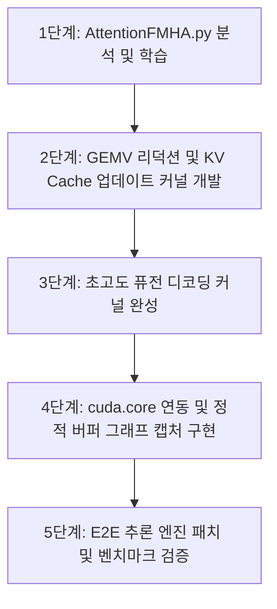

# cuTile 기반 LLM 추론 마이그레이션에서의 커널 런치 오버헤드 실증 분석 및 최적화 전략
**Whitepaper: Kernel Launch Overhead Analysis and Optimization Strategies in cuTile-based LLM Inference Migration**

---

## 1. 서론: 파이썬-C++ 경계벽(The Python-to-C++ Wall)과 런치 오버헤드

거대 언어 모델(LLM)의 디코딩(Decoding) 단계는 전형적으로 매 스텝마다 오직 1개의 새로운 토큰만을 생성하는 **낮은 연산 밀도(Low Arithmetic Intensity)** 워크로드이다. 이 단계에서는 연산 자체의 시간보다 데이터 로드 및 제어 명령 송출 속도가 전체 지연시간을 지배하는 **메모리 대역폭 및 호스트 오버헤드 제약(Memory-bandwidth & Host-bound)** 특성을 띈다.

PyTorch 네이티브 환경은 고도로 최적화된 C++ 백엔드(ATen) 및 PyBind11 계층을 통해 파이썬 오버헤드를 극소화(약 5~15µs 수준)하며 즉시 커널을 디스패치한다. 반면, Python-first DSL인 cuTile 환경에서는 `ct.launch`가 호출될 때마다 다음과 같은 제어 흐름 비용이 누적적으로 청구된다:
1. **JIT 컴파일러 캐시 검사(JIT Dictionary Look-up)**: 입력 텐서들의 형상(Shape), 스트라이드(Stride), 데이터 타입을 결합하여 JIT 컴파일 룩업 테이블을 검사하는 비용.
2. **드라이버 API 매핑 오버헤드**: `cuda-python` 바인딩 계층(ctypes)을 통과하여 물리 커널 심볼을 획득하고 GPU 하드웨어에 커널을 론칭하는 비용.

이로 인해 발생하는 **수십에서 수백 마이크로초(µs)의 런치 오버헤드(Launch Overhead)**는 200 토큰 안팎의 짧은 프롬프트 시퀀스를 처리하는 '얕은 연산' 환경에서 GPU 연산 본연의 기동 시간보다 CPU의 준비 시간이 더 길어지는 **호스트-디바이스 연산 역전 현상**을 초래한다. 따라서 cuTile로의 엔진 마이그레이션 과정에서는 이러한 호스트 단의 런치 오버헤드를 제어하는 아키텍처적 설계가 필수적으로 선행되어야 한다.

---

## 2. cuTile 기본 커널(`AttentionFMHA.py`)의 분석 및 서빙 이식 한계

NVIDIA가 제공하는 기본 FlashAttention 구현체(`AttentionFMHA.py`)는 글로벌 메모리 접근을 억제하고 온칩 SRAM(Shared Memory) 상에서 softmax reduction을 융합 처리하는 훌륭한 타일링(Tiling) 설계 템플릿을 제공한다. 그러나 이 구현체를 실전 LLM 추론 엔진에 직결하기에는 다음과 같은 치명적인 아키텍처적 한계가 존재한다.

1. **KV 캐시(KV Cache) 통합 구조의 부재**:
   - 기본 FMHA 커널은 매 스텝마다 전체 시퀀스의 Key, Value 텐서를 새로 투영하고 연산한다. 이는 매 스텝 과거 토큰들을 누적 저장하는 KV 캐시 구조를 지원하지 않기 때문에, 토큰 생성 길이가 늘어남에 따라 계산 복잡도가 $O(N^2)$으로 폭증하게 된다.
2. **단일 커널 격리에 따른 런치 오버헤드 집중**:
   - 어텐션 연산만 단독 커널로 실행될 경우, 어텐션 앞뒤의 Projection 레이어(QKV Linear, Output Linear) 및 정규화(LayerNorm), Residual 연산 등을 처리하기 위해 추가적인 PyTorch 또는 cuTile 커널 호출이 수차례 동반된다. 이는 디코딩 스텝당 `ct.launch` 호출 횟수를 증가시켜 호스트 런칭 오버헤드의 영향을 배가시킨다.

---

## 3. CUDA Graph 배제 조건 하에서의 최적화: 초고도 퓨전(Super Fusion) 전략

만약 dynamic continuous batching의 복잡성 등으로 인해 CUDA Graph를 사용하지 못하고 Eager Serving을 유지해야 하는 환경이라면, 파이썬 런치 오버헤드를 극복할 수 있는 유일한 대안은 **커널 호출 빈도를 극단적으로 낮추는 초고도 퓨전(Super Fusion)** 아키텍처이다.

이는 PyTorch의 역할을 순수 VRAM 메모리 할당(Alloc) 및 임베딩 룩업(Embedding Lookup)으로 최소화하고, 단일 트랜스포머 레이어의 전 과정을 단 하나의 cuTile 커널 내에서 순차 처리하도록 융합하는 기법이다.

### 3.1. 레이어 단위 초고도 퓨전 아키텍처

| 단계 | 제안 커널 구성 | 커널 내 통합 연산 흐름 (Single-Kernel Sequence) |
| :--- | :--- | :--- |
| **Prefill 단계** | `fused_prefill_block` | $x \rightarrow \text{LN} \rightarrow \text{QKV Projection} \rightarrow \text{KV Cache Write} \rightarrow \text{Tiled FMHA} \rightarrow \text{Out Projection} \rightarrow \text{FFN} \rightarrow \text{Residual} \rightarrow y$ |
| **Decode 단계** | `fused_decode_block` | $x \rightarrow \text{LN} \rightarrow \text{QKV Projection} \rightarrow \text{KV Cache Update} \rightarrow \text{GEMV Attention} \rightarrow \text{Out Projection} \rightarrow \text{FFN} \rightarrow \text{Residual} \rightarrow y$ |
| **Logits 산출** | `lm_head_gemm` | 가중치 공유(Weight Sharing)를 고려하여 분리된 최종 분류기 선형 연산 (GEMV) |

### 3.2. 디코딩 어텐션 및 KV Cache 통합 (fused_decode_block 내부)

디코딩 스텝에서는 Query 벡터가 단일 토큰(Q: `[1, num_heads, head_dim]`)이므로, 무거운 GEMM 대신 메모리 읽기 중심의 **리덕션(Reduction) 커널**로 어텐션을 재설계한다.

```python
# [fused_decode_block 내부 의사 코드]
# 1. 이전 레이어 출력 x에 대한 LayerNorm 연산 수행
# 2. QKV Projection 가중치를 곱해 q, k, v 산출
# 3. K_cache[:, t, :] = k, V_cache[:, t, :] = v (정적 VRAM 주소 갱신)
# 4. K_cache의 0..t(현재 시퀀스 길이) 영역에 대해 어텐션 맵 연산
scores = Q @ K_cache[:, :t, :].T / sqrt(head_dim)
scores = online_softmax(scores) # 온칩 레지스터 리덕션으로 중간 행렬 생성 억제
attn_out = scores @ V_cache[:, :t, :]
# 5. Out Projection, Residual Add, LN, FFN 연산을 레지스터 파일 내에서 직접 연결 수행
```

이와 같이 단일 커널 내부에서 중간 피처(Feature map)를 VRAM 글로벌 메모리에 쓰지 않고 레지스터 및 공유 메모리(SRAM) 상에서 직접 피딩하므로, 레이어당 `ct.launch` 호출 횟수가 정확히 **1회**로 한정된다. 모델이 6개 레이어로 구성된 경우, 토큰 생성당 단 7회의 `ct.launch` 호출만으로 연산이 마감되어 Eager Serving 하에서도 실용적인 추론 속도를 확보할 수 있다.

---

## 4. CUDA Graph(`cuda.core`) 도입을 통한 런치 오버헤드 완전 소거 전략

CUDA 13.3부터 고도화된 **`cuda.core` Python 패키지**를 통합하면, Python 수준의 cuTile 호출 조차도 단일 실행 그래프로 캡처하여 호스트의 모든 런타임 제어 오버헤드를 제거할 수 있다.

### 4.1. Graph Capture 메커니즘
`ct.launch`는 내부적으로 CUDA Driver API의 커널 기동 명령을 호출하므로, `cuda.core` 스트림이 캡처 모드인 상태에서 호출되면 물리 실행 대신 그래프 노드(Graph Node)로 하드웨어 메모리에 등록된다.

```python
from cuda.core import experimental as std_cuda  # API 규격에 맞춰 로드

graph = std_cuda.Graph()
graph.begin_capture()

# Graph 내부에서 모든 레이어의 cuTile 론칭을 노드로 기록
for layer_idx in range(N_LAYERS):
    ct.launch(fused_decode_block_kernel, args=(x, weights[layer_idx], K_cache[layer_idx], V_caches[layer_idx], seq_len))
ct.launch(lm_head_kernel, args=(x, head_weight, logits))

graph.end_capture()
graph.instantiate() # 가상 메모리 주소 및 레지스터 사양 하드웨어 바인딩
```

캡처 및 인스턴스화가 완결된 후에는 매 디코딩 스텝마다 `graph.launch()` 명령 단 1회만 호출하므로, Python-to-C++ 경계벽 및 ctypes 바인딩 오버헤드가 원천적으로 사라진다.

### 4.2. 동적 형상(Dynamic Shape) 대응 방안
CUDA Graph는 캡처 시점의 메모리 주소와 할당 크기를 고정하는 한계가 있어 가변 길이 KV Cache 처리가 까다롭다. 이를 해결하기 위해 두 가지 방안을 채택한다.
1. **정적 최대 크기 버퍼링(Static Padding with Masking)**:
   - 최대 시퀀스 길이(예: 2048) 크기의 고정 텐서를 캐시 풀로 사전 할당(`torch.empty` 또는 `cuda.core` direct allocation)한다.
   - 커널 내부에는 물리적 텐서 모양 대신 현재 가동 중인 유효 토큰 포인터(`current_seq_len`)를 정수 인자로 전달하고, 커널 내부 루프 범위 제한 및 인과 마스킹(Causal Masking)을 제어한다. 이를 통해 Graph 재생 중 메모리 리할당을 방지한다.
2. **동적 파라미터 업데이트(Graph Parameter Update)**:
   - CUDA Graph 커널 인자 업데이트 API를 사용해 그래프 리컴파일 없이 `current_seq_len` 인자의 값만 신속히 재매핑하여 기동한다.

---

## 5. cuTile + `cuda.core` 통합 추론 엔진 개발 로드맵



### 5.1. 의사코드 스케치 (E2E Decoding Loop)

```python
import torch
import cutile as ct
from cuda.core import experimental as std_cuda

# 1. 모델 파라미터 및 정적 KV 캐시 할당 (Host-Target 공통 메모리 준비)
MAX_SEQ_LEN = 2048
N_LAYERS = 6
K_caches = [torch.zeros(1, num_heads, MAX_SEQ_LEN, head_dim, device='cuda') for _ in range(N_LAYERS)]
V_caches = [torch.zeros(1, num_heads, MAX_SEQ_LEN, head_dim, device='cuda') for _ in range(N_LAYERS)]
x_buffer = torch.zeros(1, embed_dim, device='cuda')
logits_buffer = torch.zeros(1, vocab_size, device='cuda')

# 2. CUDA Graph 생성 및 순차 커널 캡처
graph = std_cuda.Graph()
graph.begin_capture()

for l in range(N_LAYERS):
    # 초고도 퓨전 커널 론칭 기록
    ct.launch(fused_decode_block_kernel, args=(
        x_buffer, weights[l], K_caches[l], V_caches[l], 
        current_seq_len_tensor, MAX_SEQ_LEN
    ))
# 최종 Logits 론칭 기록
ct.launch(lm_head_kernel, args=(x_buffer, head_weight, logits_buffer))

graph.end_capture()
graph.instantiate()

# 3. 최적화된 E2E 추론 루프 구동
current_seq_len = prompt_len
for step in range(max_new_tokens):
    # GPU 텐서 내부 포인터 업데이트
    current_seq_len_tensor.copy_(current_seq_len)
    
    # 단일 그래프 실행 (Launch Overhead 소거)
    graph.launch()
    
    # 출력 Logits 샘플링 및 다음 루프 입력 피딩
    next_token = torch.argmax(logits_buffer)
    x_buffer.copy_(embed_table[next_token])
    
    current_seq_len += 1
```

---

## 6. 결론

- **단일 어텐션 커널의 격리 실행**은 LLM 추론 마이그레이션 시 파이썬 JIT 룩업과 ctypes 드라이버 래퍼가 유발하는 **Kernel Launch Overhead** 병목으로 인해 PyTorch 대비 열세를 면하기 어렵다.
- 이를 해결하기 위한 정답은 **"초고도 퓨전"**과 **"CUDA Graph 캡처"**의 유기적 결합이다.
- 레이어의 모든 연산을 단일 커널로 통폐합하는 초고도 퓨전을 통해 커널 런치 횟수 자체를 제어하고, `cuda.core` 기반 그래프 캡처로 런칭 비용을 $0$으로 만듦으로써, 파이썬 기반 DSL의 생산성 편의를 유지하면서도 C++ 네이티브 추론 엔진에 필적하는 극상의 디코딩 성능을 확보할 수 있다.