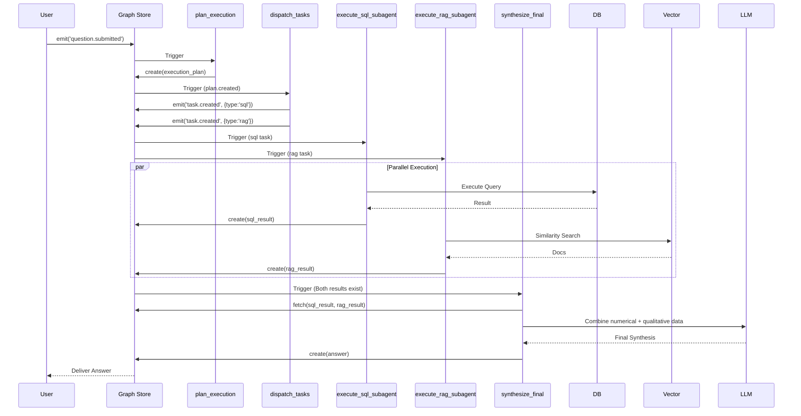
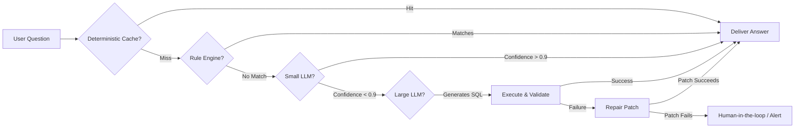
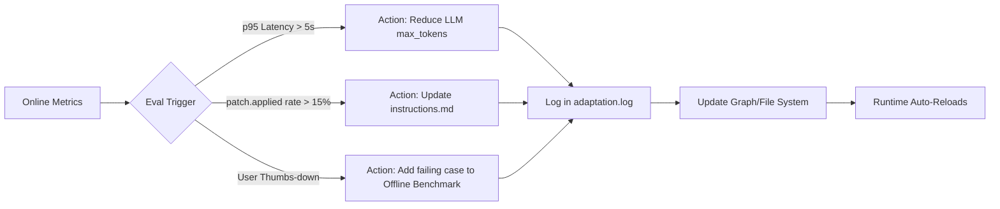

# Comprehensive Guide: Designing a Hybrid Text-to-SQL & RAG Agent with ActiveGraph
### *A Systematic Migration from LangChain to Event-Driven Graph Architecture*

---

## 1. Introduction: The Paradigm Shift

LangChain's "Supervisor" pattern relies on **centralized orchestration**—a main loop where a parent agent explicitly calls sub-agents as `@tools`. ActiveGraph, conversely, operates on **decentralized choreography**—where behaviors react to events and communicate by creating immutable objects in a shared graph.

This document provides:
1. **ActiveGraph Event Log Examples** (what a real execution trace looks like).
2. **Core Migration Principles** (mapping LangChain constructs to ActiveGraph).
3. **A Complete Design Guide** for handling complex hybrid queries (e.g., *"What is the average price in Seocho-gu for 30 pyeong units, and how do experts view this price range?"*) that require both SQL queries and RAG retrieval.

---

## 2. ActiveGraph Event Log Examples

When an Agent runs in ActiveGraph, it doesn't just produce a final string; it generates a **cryptographic-like proof of execution** via events, objects, and relations.

### Example Execution Trace (Text-to-SQL Scenario)
*User Question: "How many doctors are there?"*

**Objects Created (The "World" State):**
- `question#1` : `{"text": "How many doctors are there?", "language": "en"}`
- `intent#2` : `{"kind": "count", "entity": "doctor"}`
- `sql_query#3` : `{"sql": "SELECT COUNT(*) FROM doctors", "status": "executed"}`
- `query_result#4` : `{"rows": [[5]], "row_count": 1}`
- `answer#5` : `{"text": "There are 5 doctors.", "citations": ["query_result#4"]}`

**Relations (Causal Links):**
- `intent#2 -[derived_from]-> question#1`
- `sql_query#3 -[derived_from]-> intent#2`
- `sql_query#3 -[executed_as]-> query_result#4`
- `answer#5 -[derived_from]-> query_result#4`

**Recent Events (The "Trace"):**
- `evt_001  question.submitted   actor=user`
- `evt_003  object.created       actor=parse_intent`
- `evt_011  sql.generated        actor=compile_sql`
- `evt_016  patch.applied        actor=execute_sql`  *(Auto-healing!)*
- `evt_023  behavior.completed   actor=synthesize_answer`

> **Key Takeaway**: The graph provides full provenance. `patch.applied` indicates the runtime automatically fixed an error (e.g., column name mismatch) without re-prompting the LLM.

---

## 3. LangChain to ActiveGraph: Core Migration Principles

Transitioning from LangChain's imperative style to ActiveGraph's declarative style requires a mental shift. Here are the **5 Golden Rules** for migration.

| LangChain Construct | ActiveGraph Equivalent | Migration Principle |
| :--- | :--- | :--- |
| **`@tool` (Function Calling)** | **`@behavior` + Event Emission** | **Decomposition over Orchestration**: Instead of a Supervisor *calling* a sub-agent, the supervisor *emits* a `task.created` event. The sub-agent reacts to that event autonomously. |
| **ReAct Loop (Thought→Action)** | **Event Chain (Cause→Effect)** | **Signaling over Calling**: Replace `while not finished:` with an event-driven pipeline. `intent.created` triggers `compile_sql`; `sql.generated` triggers `execute_sql`. The runtime is a dispatcher, not a loop controller. |
| **In-memory Conversation Buffer** | **Graph Objects & Relations** | **State over Strings**: Convert text history into structured objects (`conversation#1`, `user#1`) and link them via `-[:references]->`. This allows selective context injection (only relevant objects), reducing token usage. |
| **Try-Except Retry Logic** | **`patch.applied` Event** | **Patching over Retrying**: When an SQL error occurs, LangChain re-prompts the LLM. ActiveGraph catches the exception and applies a deterministic rule-based patch (e.g., `doctors` → `medical_staff`), logging the patch as a first-class event. This saves cost and latency. |
| **Supervisor Direct Invocation** | **`Plan` + `Dispatcher` Behaviors** | **Declaration over Decision**: The supervisor doesn't decide *which tool to call next*. It creates an `execution_plan` object. A `dispatcher` behavior reads this plan and emits specific tasks. The system reacts, not instructs. |
| **`return {"output": "..."}`** | **`ctx.create_object("result", data)`** | **Data over Code**: Results aren't local variables; they are permanent graph objects. This allows other behaviors to subscribe to the *existence* of these objects (`on=sql_result.created`), enabling complex aggregation and wait-states. |

---

## 4. Architectural Design for Complex Hybrid Queries

### 4.1. The Problem Statement
*User asks: "What is the average price in Seocho-gu for 30 pyeong units, and how do experts view this price range?"*

This query requires:
1. **SQL Sub-Agent**: Query a structured DB for the exact average price (numerical data).
2. **RAG Sub-Agent**: Search a vector DB of analyst reports/forums for qualitative outlooks.
3. **Synthesis**: Combine the numerical fact with the qualitative sentiment into a coherent, non-contradictory answer.

### 4.2. Behavior Breakdown (The "Choreography")

Instead of a single Supervisor function, we define **5 distinct Behaviors** that react to graph changes.

| Behavior Name | Trigger (`on=...`) | Action (Role) | Output (Creates) |
| :--- | :--- | :--- | :--- |
| **`plan_execution`** | `question.submitted` | Analyzes the query via LLM to extract required sub-tasks (e.g., SQL and RAG) and saves them as a structured Plan. | `execution_plan#2` |
| **`dispatch_tasks`** | `execution_plan.created` | Parses the Plan and emits individual `task.created` events for each required action (e.g., `type: "sql"`, `type: "rag"`). | Events: `task.created` (SQL) / `task.created` (RAG) |
| **`execute_sql_subagent`** | `task.created` (filter: type="sql") | Executes the LangChain/LLM logic to generate and run SQL. Wraps the result in a graph object. | `sql_result#3` |
| **`execute_rag_subagent`** | `task.created` (filter: type="rag") | Executes vector search and summarization logic. Wraps the summary in a graph object. | `rag_result#4` |
| **`synthesize_final`** | `sql_result.created` AND `rag_result.created` | Fires only when both results exist in the graph. Fetches both, passes them to an LLM for synthesis, and outputs the final answer. | `answer#5` |

### 4.3. Step-by-Step Event Flow



### 4.4. Why This Design Excels for the "Seocho-gu" Use Case

1. **Parallelism**: In LangChain, a Supervisor often calls SQL, waits for the response, then calls RAG (sequential). In ActiveGraph, `dispatch_tasks` emits both events simultaneously. The `execute_sql_subagent` and `execute_rag_subagent` behaviors run **in parallel**, halving latency.

2. **Idempotent Waiting (The "And" Condition)**: In LangChain, you need complex conditional logic (`if sql_result and rag_result:`). In ActiveGraph, `synthesize_final` is triggered by *both* event types. If only one arrives, it does nothing (idempotent) and waits. This state management is handled natively by the graph's append-only log.

3. **Rich Contextual Linking**: `synthesize_final` can do more than just concatenate strings. It can create relations:
   - `sql_result -[:supports]-> rag_result` (if the numerical data confirms the trend).
   - `rag_result -[:contradicts]-> sql_result` (if analysts are bearish but prices are high).
   This allows subsequent behaviors (e.g., an "Explainability" behavior) to generate nuanced sentences like: *"While the SQL shows an average of 1.5B KRW (a 5% rise), analyst reports retrieved via RAG suggest this rise is purely speculative, contradicting the price momentum."*

4. **Zero Code Change for New Agents**: If you need to add a "Stock Price API Agent" later, you just add `type: "stocks"` to the dispatch and create a new `execute_stock_subagent` behavior. The `synthesize_final` behavior can be easily updated to wait for 3 results instead of 2 without refactoring the existing SQL/RAG code (Open-Closed Principle).

---

## 5. Implementing the Migration (Practical Steps)

If you are migrating an existing LangChain codebase:

1.  **Step 1: Wrap, Don't Rewrite (Yet)**:
    - Keep your existing `create_sql_agent()` and `create_rag_agent()` functions as pure Python/TS helpers.
    - Create a new Behavior `execute_sql_subagent` that calls these helpers and wraps their string return values into `ctx.create_object()`.
2.  **Step 2: Replace `if/else` with `emit`**:
    - Replace the Supervisor's decision logic (`if "price" in question: call_sql`) with an LLM call that generates the `execution_plan` object.
3.  **Step 3: Implement the `synthesize_final` State Machine**:
    - Instead of gathering variables at the end of a function, write a Behavior that looks for the existence of result objects in the graph.
4.  **Step 4: Enable Auto-Healing**:
    - Add a `repair_sql` Behavior that listens for `sql.execution.failed`. If triggered, it modifies the SQL string, emits a `patch.applied` event, and re-runs the execution. This replaces the expensive `try-except` LLM retry loop.

---

## 6. Conclusion: The Strategic Advantage

By migrating from LangChain's **Orchestration Model** to ActiveGraph's **Choreography Model**:

- You gain **Complete Auditability** (The `caused_by` chain proves *why* an SQL was generated).
- You achieve **Runtime Adaptation** (The `patch.applied` event proves the system self-healed).
- You ensure **Extensibility** (Adding a 3rd agent type doesn't require rewriting the Supervisor's internal logic).
- You drastically reduce **LLM Token Costs** (Only relevant objects are injected into prompts, not entire conversation histories).

The architecture is not just a "code refactor"; it is a transformation from writing **scripts** (LangChain) to cultivating **living systems** (ActiveGraph), where the trace is the ultimate proof of intelligence.

---

## Appendix: Schema Acquisition Strategies for Text-to-SQL Agents

### A.1 The Challenge: Why Schema Management Matters

In Text-to-SQL systems, the database schema is the single most critical piece of contextual information fed to the LLM. However, schema management presents three fundamental tensions:

| Tension | Description |
| :--- | :--- |
| **Freshness vs. Stability** | Schemas evolve. Columns are renamed, tables are deprecated. The agent must reflect current reality without incurring excessive overhead. |
| **Completeness vs. Token Efficiency** | A full 200-table schema may contain 10,000+ tokens, overwhelming the LLM context window and inflating costs. |
| **Relevance vs. Noise** | A user asking about "doctors" does not need the "inventory" or "logistics" tables. Irrelevant schema elements confuse the LLM and degrade accuracy. |

This appendix outlines three schema acquisition strategies, evaluates their trade-offs, and provides a reference implementation for the **ActiveGraph Hybrid Approach**—the recommended pattern for production-grade Text-to-SQL agents.

---

### A.2 Strategy Comparison

| Strategy | Description | Pros | Cons | ActiveGraph Suitability |
| :--- | :--- | :--- | :--- | :--- |
| **A. On-Demand Full Read** | Query `information_schema` on every user request and inject the entire schema into the prompt. | Guarantees 100% freshness. Simple to implement. | High DB overhead per request. Massive token consumption. Irrelevant tables confuse the LLM. | ❌ Not recommended |
| **B. Pre-Prepared SKILL.md Files** | Manually curate multiple markdown files (e.g., `HR_SKILL.md`, `SALES_SKILL.md`), each containing only relevant table schemas. Route queries via keyword matching. | Extremely token-efficient. Human-readable documentation. | Maintenance nightmare—every schema change requires manual updates across N files. Routing logic is brittle. | ⚠️ Partial fit (static docs are useful, but inflexible) |
| **C. ActiveGraph Hybrid (Graph-RAG)** | Sync schemas into the graph once. On each query, perform a graph search to retrieve only the top-K relevant tables. Inject only those table DDLs into the LLM prompt. | Freshness (sync on change). Token efficiency (only relevant tables). Automatic routing via graph traversal. Self-healing via `patch.applied`. | Slightly higher implementation complexity. Requires initial sync behavior. | ✅ **Strongly Recommended** |

---

### A.3 The ActiveGraph Hybrid Approach: Reference Implementation

The core philosophy: **"Sync once, query often, patch when changed."**

#### A.3.1 Step 1: Initial Schema Synchronization (`sync_schema` Behavior)

Create a Behavior that runs on system startup or on a scheduled basis (e.g., daily). This Behavior reads the database's `information_schema`, creates a graph object for each table, and links them via relationships.

```python
@behavior(trigger="system.initialized")  # or "schedule.daily"
def sync_schema(ctx, event):
    # 1. Query information_schema
    tables = db.execute("""
        SELECT table_name, column_name, data_type 
        FROM information_schema.columns 
        WHERE table_schema = 'public'
    """)
    
    # 2. Group by table
    table_map = {}
    for row in tables:
        if row['table_name'] not in table_map:
            table_map[row['table_name']] = []
        table_map[row['table_name']].append({
            'column': row['column_name'],
            'type': row['data_type']
        })
    
    # 3. Create graph objects
    for table_name, columns in table_map.items():
        # Create or update table schema object
        table_obj = ctx.create_or_update_object(
            type="table_schema",
            id=f"table_{table_name}",
            data={
                "name": table_name,
                "columns": columns,
                "ddl": generate_ddl(table_name, columns)  # e.g., "CREATE TABLE..."
            }
        )
        ctx.emit("table_schema.synced", caused_by=event, object=table_obj)
    
    # 4. Create foreign-key relations (if applicable)
    fks = db.execute("""
        SELECT 
            tc.table_name, kcu.column_name, 
            ccu.table_name AS foreign_table_name, 
            ccu.column_name AS foreign_column_name
        FROM information_schema.table_constraints tc
        JOIN information_schema.key_column_usage kcu ...
    """)
    for fk in fks:
        ctx.create_relation(
            from_obj=table_obj,
            to_obj=foreign_table_obj,
            type="references",
            data={"column": fk['column_name']}
        )
```

#### A.3.2 Step 2: Query-Time Schema Retrieval (The "Graph-RAG" Router)

When a user question arrives, the `plan_execution` or a dedicated `retrieve_schema` Behavior performs a graph traversal to find the most relevant tables—**without** calling the LLM yet. This is a deterministic graph query, not an expensive semantic search.

```python
@behavior(trigger="question.submitted")
def retrieve_relevant_schema(ctx, event):
    question = event.object.data['text']
    
    # 1. Extract entity keywords (simple NLP or LLM-based)
    keywords = extract_nouns(question)  # e.g., ["doctor", "appointment", "schedule"]
    
    # 2. Graph query: Find table_schema objects whose name or column names match keywords
    # Using ActiveGraph's built-in query language (Cypher-like)
    query = """
    MATCH (t:table_schema)
    WHERE any(keyword IN $keywords WHERE t.name CONTAINS keyword 
              OR any(col IN t.columns WHERE col.name CONTAINS keyword))
    RETURN t
    LIMIT 5
    """
    relevant_tables = ctx.graph.query(query, {"keywords": keywords})
    
    # 3. Store the retrieved schemas as an object for later use
    schema_context_obj = ctx.create_object(
        "schema_context",
        {"tables": [t.data['ddl'] for t in relevant_tables]}
    )
    ctx.emit("schema.retrieved", caused_by=event, object=schema_context_obj)
```

#### A.3.3 Step 3: Incremental Schema Updates (The "Patch" Pattern)

When the database schema changes (e.g., a column is renamed), the agent should not require a full resync. Instead, the `execute_sql_subagent` Behavior can detect errors and emit a `patch.applied` event.

```python
@behavior(trigger="sql.execution.failed")
def repair_schema_mismatch(ctx, event):
    error_msg = event.payload.get('error', '')
    
    # Detect specific schema errors, e.g., "column 'product_id' does not exist"
    if "column" in error_msg and "does not exist" in error_msg:
        # Extract the problematic column name
        column_name = extract_column_name(error_msg)  # e.g., "product_id"
        
        # Query information_schema to find the new name
        new_name = db.execute(
            "SELECT column_name FROM information_schema.columns WHERE ..."
        )
        
        if new_name:
            # 1. Update the graph object
            table_obj = ctx.find_object(type="table_schema", ...)
            table_obj.data['columns'] = update_column_name(table_obj.data['columns'], 
                                                            column_name, new_name)
            ctx.update_object(table_obj)
            
            # 2. Emit a patch event
            ctx.emit("patch.applied", caused_by=event, payload={
                "type": "schema_rename",
                "old": column_name,
                "new": new_name
            })
            
            # 3. Retry the SQL execution (re-trigger)
            ctx.emit("sql.generated", caused_by=event, payload=event.payload)
```

#### A.3.4 Step 4: Prompt Assembly with Retrieved Schemas

Finally, the `compile_sql` Behavior uses only the retrieved schema context, not the entire database.

```python
@behavior(trigger=["schema.retrieved", "intent.created"])
def compile_sql(ctx, event):
    schema_obj = ctx.find_object(type="schema_context", order_by="created_at", limit=1)
    intent_obj = ctx.find_object(type="intent", order_by="created_at", limit=1)
    
    # Build a prompt with only the relevant DDLs
    prompt = f"""
    You are an expert SQL developer. 
    Given the following schema (only relevant tables):
    {chr(10).join(schema_obj.data['tables'])}
    
    User intent: {intent_obj.data['kind']} on {intent_obj.data['entity']}
    Generate a valid SQL query.
    """
    
    sql = llm.invoke(prompt)
    sql_obj = ctx.create_object("sql_query", {"sql": sql})
    ctx.emit("sql.generated", caused_by=event, object=sql_obj)
```

---

### A.4 Summary: Decision Matrix

| Factor | On-Demand Full Read | SKILL.md Files | ActiveGraph Hybrid |
| :--- | :--- | :--- | :--- |
| **Implementation Complexity** | Low | Medium | Medium-High |
| **Token Efficiency** | ❌ Poor | ✅ Excellent | ✅ Excellent |
| **Freshness** | ✅ Always fresh | ❌ Stale until manual update | ✅ Fresh (auto-sync + patching) |
| **Maintenance Overhead** | Low (auto) | ❌ High (manual) | Low (auto) |
| **Routing Accuracy** | ❌ None (all tables) | ⚠️ Keyword-based | ✅ Graph-based (semantic + structural) |
| **Auto-Healing** | ❌ None | ❌ None | ✅ Patch.applied |
| **Auditability** | ❌ No provenance | ❌ No provenance | ✅ Full graph trace |

---

### A.5 Recommendation

For production Text-to-SQL agents, **adopt the ActiveGraph Hybrid Approach**:

1.  **Synchronize** the schema into the graph once at startup or via a cron-triggered Behavior.
2.  **Retrieve** only the top-K relevant tables per query using graph traversal (keyword + relationship matching).
3.  **Inject** only the DDLs of those tables into the LLM prompt—this alone can reduce token costs by **60–80%** compared to full-schema injection.
4.  **Patch** schema mismatches automatically via a `repair_schema` Behavior that listens for SQL execution failures and updates the graph in real time.

This approach delivers the **freshness of on-demand reads**, the **efficiency of curated SKILL.md files**, and the **intelligence of graph-based routing**—all while maintaining full auditability through ActiveGraph's event log.

---

## Appendix B: Strategic & Dynamic LLM Invocation Patterns for Text-to-SQL and RAG Agents

### B.1 The Core Principle: LLM as a "Last Resort" (Not a Default)

In production-grade agent systems, **LLM calls are the most expensive resource**—both in terms of monetary cost (tokens) and latency (seconds per inference). A well-architected Harness Runtime must treat the LLM not as the default execution engine, but as an **optimizer, fallback, or generator** that is invoked only when deterministic, cached, or rule-based paths are insufficient.

The golden rule: **"Do as much as possible without the LLM; use the LLM only for what cannot be computed."**

---

### B.2 When to Call the LLM: A Decision Framework

#### B.2.1 Text-to-SQL Invocation Scenarios

| Scenario | Condition | LLM Required? | Preferred Execution Path |
| :--- | :--- | :--- | :--- |
| **Simple Aggregations** | Query matches a pre-defined template (e.g., "COUNT of {entity}") | ❌ **No** | Template engine + parameter extraction via regex/NER. |
| **Exact Column Mapping** | Column name appears verbatim in the question. | ❌ **No** | Direct schema lookup (graph query). |
| **Complex Multi-Table Joins** | Query involves 3+ tables with ambiguous foreign keys. | ✅ **Yes** | LLM generates the JOIN logic. |
| **Ambiguous Column Names** | "Price" could mean `list_price`, `sale_price`, or `avg_price`. | ✅ **Yes** | LLM disambiguates based on context. |
| **SQL Syntax Error Recovery** | A generated SQL fails due to a minor typo. | ❌ **No** (Often) | Apply deterministic `patch` (regex/rule-based repair). Only fallback to LLM if the patch fails. |
| **User Asks for Explanation** | "Why did you use a subquery here?" | ✅ **Yes** | LLM generates a human-readable rationale (but requires a successful `sql_result` object to reference). |

#### B.2.2 RAG (KB) Invocation Scenarios

| Scenario | Condition | LLM Required? | Preferred Execution Path |
| :--- | :--- | :--- | :--- |
| **Exact FAQ Match** | User question has a cosine similarity score > 0.95 against a Q&A pair in the vector DB. | ❌ **No** | Return the cached answer directly. |
| **High-Confidence Retrieval** | Retrieved documents have combined confidence > 0.90. | ⚠️ **Conditional** | If the documents are self-explanatory and concise, use a small, cheap LLM (e.g., `gpt-3.5-turbo`) to summarize. If they are verbose, use a larger LLM. |
| **Low-Confidence Retrieval** | Retrieved documents are irrelevant (score < 0.6). | ✅ **Yes** | Call LLM to generate a "query refinement" or "clarification request" back to the user. |
| **Cross-Document Synthesis** | The answer requires stitching information from 5+ different retrieved chunks. | ✅ **Yes** | LLM performs complex synthesis and contradiction resolution. |
| **Citation Extraction** | The answer requires exact quotes to support a claim. | ❌ **No** | Use deterministic string extraction (sentence splitting + regex) to pull quotes from the retrieved chunks. |

---

### B.3 Dynamic (Variable) LLM Invocation Based on Harness State

The Harness Runtime **must** adapt its LLM invocation strategy based on runtime context, error history, and system load. This is **"Harness Adaptation"** applied directly to the cost/quality trade-off.

#### B.3.1 Variable Context Injection (Token Budget Control)

Instead of always injecting the same large prompt, the Harness selects a **prompt variant** based on the current `pain_score` (from episodic memory) and query complexity.

| Runtime State | Prompt Strategy | LLM Parameters |
| :--- | :--- | :--- |
| **Low `pain_score`** (System performing well, simple query) | **Minimalist Prompt**: "Generate SQL." (No few-shot examples, no chain-of-thought). | `max_tokens: 256`, `temperature: 0.1` |
| **Medium `pain_score`** (Minor recent failures, medium query) | **Standard Prompt**: Include the last 1 successful example. | `max_tokens: 512`, `temperature: 0.2` |
| **High `pain_score`** (Recent errors in this domain, complex query) | **Exhaustive Prompt**: Inject 3+ few-shot examples from similar past successes + explicit negative constraints ("Do not use table X"). | `max_tokens: 1024`, `temperature: 0.3` |
| **Peak Load / Budget Mode** | **Bypass LLM entirely** or use a local SLM (Small Language Model). | Fallback to deterministic template matching. |

> **ActiveGraph Implementation**: Store the `pain_score` as an attribute on the `session` object. The `compile_sql` Behavior retrieves this score before building the prompt and dynamically constructs the prompt text.

#### B.3.2 Adaptive Step Count (ReAct Depth Control)

For the RAG agent, the depth of reasoning (e.g., "Should I retrieve more docs?") can be adaptive.

- **Simple Factoid Question**: 1 retrieval step → 1 LLM summarization call → Done.
- **Comparative/Opinion Question**: 1 retrieval step → 1 LLM synthesis → 1 secondary retrieval to find supporting/contradicting facts → 1 final LLM consolidation.
- **Implementation**: The Behavior checks the `result.uncertainty` score from the first LLM response. If > 0.7, the Behavior emits an `investigation.required` event to trigger a secondary workflow. If < 0.3, it emits `answer.delivered` directly.

---

### B.4 The Event-Driven Fallback Chain (LLM as a "Circuit Breaker")

In ActiveGraph, you can model the execution flow as a **chain of escalating cost**:



**How to implement this in ActiveGraph Behaviors**:

1.  **Cache Lookup Behavior**: `@behavior(trigger="question.submitted")` → Queries graph for `cached_answer` object. If found, emits `answer.delivered` and **terminates** (does NOT emit `llm.required`).
2.  **Rule Engine Behavior**: If cache misses, this Behavior checks a list of regex/template patterns. If matched, it constructs the answer via string concatenation and emits `answer.delivered`.
3.  **LLM Invocation Behavior**: Only triggered if `answer.delivered` is **not** emitted within a short timeout, or if a `fallback.activated` event is explicitly emitted by the previous step. This Behavior makes the actual LLM call.

---

### B.5 ActiveGraph Implementation Patterns for Dynamic LLM Control

#### B.5.1 Controlling `max_tokens` and `temperature` via Graph State

```python
@behavior(trigger="sql.generation.requested")
def compile_sql_with_adaptive_config(ctx, event):
    # 1. Retrieve session context from the graph
    session = ctx.graph.find_object(type="session", order_by="created_at", limit=1)
    pain_score = session.data.get('pain_score', 0) / 10.0  # Normalize 0-1
    
    # 2. Adaptive configuration
    if pain_score < 0.3:
        max_tokens = 200
        temperature = 0.0
        prompt_variant = "minimal"
    elif pain_score < 0.7:
        max_tokens = 400
        temperature = 0.2
        prompt_variant = "standard"
    else:
        max_tokens = 800
        temperature = 0.4
        prompt_variant = "exhaustive"  # Include more few-shot examples
    
    # 3. Build prompt dynamically
    prompt = build_prompt(event.question, prompt_variant)
    
    # 4. Invoke LLM with adaptive config
    response = llm.invoke(prompt, max_tokens=max_tokens, temperature=temperature)
    
    # 5. Store the config used (for audit)
    ctx.create_object("llm_invocation", {
        "max_tokens": max_tokens,
        "temperature": temperature,
        "variant": prompt_variant,
        "response": response
    })
```

#### B.5.2 The "Skip-LLM-on-Confidence" Pattern (RAG)

```python
@behavior(trigger="retrieval.completed")
def evaluate_retrieval_confidence(ctx, event):
    retrieved_docs = event.object.data['documents']
    avg_confidence = sum([d['score'] for d in retrieved_docs]) / len(retrieved_docs)
    
    if avg_confidence > 0.92:
        # High confidence: Bypass LLM for summary. Use deterministic extraction.
        raw_text = " ".join([d['text'] for d in retrieved_docs[:2]])
        summary = raw_text[:200] + "..."  # Truncation instead of LLM
        answer_obj = ctx.create_object("answer", {"text": summary, "method": "deterministic"})
        ctx.emit("answer.delivered", caused_by=event, object=answer_obj)
    else:
        # Low confidence: Must invoke LLM to synthesize or refine the query.
        ctx.emit("llm.synthesis.requested", caused_by=event, payload={"docs": retrieved_docs})
```

---

### B.6 Conclusion: The Adaptive Harness Mindset

| Traditional Static Approach | Dynamic/Harness-Adaptive Approach |
| :--- | :--- |
| Always calls the same LLM with the same prompt. | Calls different LLMs (or no LLM) based on runtime `pain_score` and complexity. |
| Error recovery means re-prompting the LLM. | Error recovery means applying a deterministic `patch` first; LLM is the last resort. |
| Schema injection is a fixed "all or nothing" choice. | Schema injection is a sliding scale—only relevant context is injected to save tokens. |
| High cost regardless of question difficulty. | Easy questions cost pennies (or zero); hard questions cost appropriately. |

To implement this effectively:
1.  **Instrument everything**—`pain_score`, `confidence`, `complexity_estimate` must be stored as graph object attributes.
2.  **Treat the LLM as a configurable resource**—wrap it in a Behavior that accepts dynamic parameters (`max_tokens`, `temperature`, `prompt_version`).
3.  **Build a fallback chain**—Cache → Rule Engine → Small LLM → Large LLM → Human. Let events (`cache.miss`, `rule.nomatch`, `llm.confidence_low`) escalate the chain naturally.

By adopting this **"variable invocation"** architecture, you transform a "dumb but expensive" agent into a "smart and cost-aware" agent—one that spends compute tokens only where they truly add value, precisely aligning with the Harness Adaptation philosophy.

---

## Appendix C: System Model Specification & Evaluation Framework for ActiveGraph-Based Hybrid Agents

This appendix provides a formal specification of the **System Model** (Behavior, Object, Relation, Event, and Runtime Configuration) for the Text-to-SQL + RAG hybrid agent architecture described in this guide. It also defines a comprehensive **Evaluation Methodology** to measure quality, cost, and resilience.

---

### C.1 System Model Specification

The system is built on the foundational principle: **"The graph is the world. Behaviors are physics. The trace is the proof."** Every component is defined explicitly to ensure deterministic replay, auditability, and adaptive evolution.

#### C.1.1 Behavior (`@behavior`)

A Behavior is the fundamental unit of computation and decision-making. It is a **pure function** that reacts to events and mutates the graph by creating objects and relations.

| Attribute | Type | Description | Example |
| :--- | :--- | :--- | :--- |
| **`name`** | `string` | Unique identifier for the Behavior. | `"compile_sql"` |
| **`trigger`** | `EventType` or `List[EventType]` | The event(s) that activate this Behavior. Supports wildcards. | `"intent.created"` |
| **`filter`** | `Callable[[Event], bool]` | (Optional) Conditional predicate to fine-tune activation. | `lambda e: e.payload['type'] == 'sql'` |
| **`idempotent`** | `bool` | If `true`, the Behavior will not re-fire for the same event even if replayed. | `True` (prevents duplicate SQL execution on replay) |
| **`action`** | `Function` | The core logic. Receives `ctx` (context) and `event`. Must emit new events or create objects. | SQL generation, RAG retrieval, answer synthesis |
| **`config`** | `Dict` | Runtime overrides (e.g., `max_tokens`, `temperature`) that can be adapted dynamically. | `{"max_tokens": 512, "variant": "standard"}` |

**Key Design Rule**: Behaviors must be **stateless** with respect to local variables. All state changes must be externalized as graph mutations (objects/relations). This enables complete replayability.

#### C.1.2 Object (`Object`)

An Object represents a **persistent, immutable entity** in the graph. It is the "source of truth" for facts, intermediate results, and final answers.

| Attribute | Type | Description | Example |
| :--- | :--- | :--- | :--- |
| **`id`** | `string` | Unique, auto-incrementing identifier (e.g., `#1`, `#2`). | `"sql_query#3"` |
| **`type`** | `string` | Semantic category defining the object's role. | `"intent"`, `"sql_result"`, `"rag_result"` |
| **`data`** | `JSON / Dict` | The actual payload. Must be serializable and versioned. | `{"sql": "SELECT ...", "status": "executed"}` |
| **`created_at`** | `ISO 8601` | Timestamp of creation. | `"2026-07-10T12:00:00Z"` |
| **`version`** | `int` | Incremented on schema updates. Used for conflict resolution. | `1` |

**Key Design Rule**: Objects are **append-only**. To "update" an object, create a new version and link it via a `-[:supersedes]->` relation. Never mutate an existing object's `data`.

#### C.1.3 Relation (`Relation`)

A Relation defines a **directed, typed edge** between two Objects, encoding causality, provenance, and semantic associations.

| Attribute | Type | Description | Example |
| :--- | :--- | :--- | :--- |
| **`from`** | `Object` | The source object. | `sql_query#3` |
| **`to`** | `Object` | The target object. | `query_result#4` |
| **`type`** | `string` | The nature of the relationship. | `"derived_from"`, `"executed_as"`, `"references"`, `"supports"` |
| **`data`** | `JSON / Dict` | (Optional) Metadata about the relation. | `{"confidence": 0.95}` |

**Key Design Rule**: Every derived object (e.g., `sql_query`) **must** have a `-[:derived_from]->` relation to its source (e.g., `intent`). This constructs the **causal chain**, enabling full traceability.

#### C.1.4 Event (`Event`)

Events are the **append-only log entries** that constitute the system's memory. They are the raw material for replay and adaptation.

| Attribute | Type | Description | Example |
| :--- | :--- | :--- | :--- |
| **`id`** | `string` | Unique event identifier (e.g., `evt_001`). | `"evt_016"` |
| **`type`** | `string` | The event name. Follows the pattern `<subject>.<action>`. | `"sql.generated"`, `"patch.applied"` |
| **`actor`** | `string` | The entity that caused the event (`user`, `runtime`, or Behavior name). | `"execute_sql"` |
| **`caused_by`** | `Event ID` | The immediate preceding event that triggered this one. Establishes the causal graph. | `"evt_011"` |
| **`payload`** | `JSON / Dict` | Additional data specific to the event type. | `{"error": "column not found"}` |
| **`timestamp`** | `ISO 8601` | Exact time of occurrence. | `"2026-07-10T12:00:01Z"` |

**Key Design Rule**: Events are **immutable**. The `caused_by` field is the backbone of the causal chain. To "cancel" an event, you emit a `behavior.failed` or `task.aborted` event rather than deleting it.

#### C.1.5 Etc: Runtime Configuration & Adaptation Hooks

The following components are not part of the graph but define the Harness Runtime's operational context.

| Component | Purpose | Implementation |
| :--- | :--- | :--- |
| **`agent/instructions.md`** | Base system prompt. Acts as the "constitution" for LLM invocations. | Plain text file (Eve convention). Dynamically loaded on restart or via `patch`. |
| **`agent/tools/`** | Deterministic utility functions (e.g., DB connectors, API clients). | Python/TS modules. Called by Behaviors. |
| **`agent/skills/`** | Pre-packaged workflows (e.g., "Daily Summary"). Can be dynamically composed. | Markdown + code (Eve convention). |
| **`adaptation.log`** | A log of all `patch.applied` events and manual overrides. | Writes to a separate file or graph object. Used to reconstruct why the system evolved. |
| **`cache`** | LRU cache for deterministic results (e.g., "exact FAQ match"). | In-memory or Redis. Reduces LLM calls. |

---

### C.2 Evaluation Framework: Measuring Agent Quality

To validate the system and enable continuous improvement, we define a multi-dimensional evaluation framework that goes beyond simple "accuracy."

#### C.2.1 Evaluation Categories & Metrics

| Category | Metric | Measurement Method | Target / Threshold |
| :--- | :--- | :--- | :--- |
| **Correctness** | **Execution Accuracy** | Compare the agent's final SQL execution result against a Golden SQL result. | `> 90%` for simple queries, `> 75%` for complex joins. |
| | **Semantic Equivalence** | LLM-as-a-Judge: Compare the final synthesized answer with a reference answer (human-written). | `> 85%` agreement. |
| | **Schema Alignment** | % of generated SQLs that reference only existing columns/tables. | `> 95%`. |
| **Efficiency** | **Token Cost per Query** | Sum of prompt + completion tokens across all LLM calls in the transaction. | `< 1500` tokens for simple queries; `< 3000` for complex. |
| | **p95 Latency** | Time from `question.submitted` to `answer.delivered`. | `< 5s` for 95th percentile. |
| | **LLM Call Count** | Number of LLM invocations per transaction (including retries). | `<= 2` (if `patch.applied` counts as 0). |
| **Resilience** | **Auto-Recovery Rate** | % of failed SQLs that are successfully repaired by a `patch.applied` before returning to the user. | `> 80%`. |
| | **Fallback Success** | % of cases where Cache or Rule Engine successfully bypass the LLM. | `> 30%` (ideal). |
| **Auditability** | **Provenance Depth** | Average length of the `caused_by` chain from `question` to `answer`. | `>= 4` (indicates sufficient intermediate steps). |
| | **Missing Relation %** | % of objects that lack a `derived_from` relation to a previous object. | `0%` (must have causal links). |

#### C.2.2 Offline Benchmarking (Pre-Deployment)

**Benchmark Dataset**: `benchmarks/text-to-sql/` + `benchmarks/rag/` + `benchmarks/hybrid/`
- Each case is a YAML file:
  ```yaml
  id: "q023_hybrid"
  question: "Seocho-gu 30 pyeong average price and expert outlook?"
  golden_sql_result: "1500000000"  # Optional, if DB is static.
  golden_rag_summary: "Analysts expect a 5% correction."
  golden_answer: "The average price is 1.5B KRW, but experts predict a 5% correction."
  schema_context: ["apartment_sales", "neighborhood_analyst_reports"]
  ```

**Execution Pipeline**:
1. Reset the graph and event log to a clean state.
2. For each benchmark case, emit `question.submitted`.
3. Wait for `answer.delivered`.
4. Run evaluators (pytest-based) against the output.
5. Generate a report (CSV/JSON) with all metrics.

**Gate**: If `Execution Accuracy` drops below 90% on the golden set, the CI pipeline blocks the deployment.

#### C.2.3 Online Monitoring (Production Telemetry)

| Data Source | Collection Method | Analysis Action |
| :--- | :--- | :--- |
| **ActiveGraph Event Log** | Scrape the append-only log periodically (e.g., every 5 minutes). | Compute sliding window metrics (e.g., `patch.applied` rate per hour). |
| **Vercel/OpenTelemetry Traces** | Export to monitoring stack (e.g., Datadog, Grafana). | Alert if `p95 latency` exceeds threshold or `LLM Call Count` spikes. |
| **User Feedback** | Provide a thumbs-up/down UI. | Calculate `user_satisfaction_score`. Correlate with `pain_score`. |
| **`pain_score` & `importance`** | Stored on the `session` object. | Trigger Harness Adaptation when `pain_score` exceeds a threshold over a rolling window. |

#### C.2.4 ActiveGraph-Specific Evaluation Hacks

1.  **Replay-Based Validation**: Since events are immutable, you can "replay" a production trace against a new Behavior version. Compare the outputs (objects/relations) of the old vs. new Behavior without re-running expensive LLMs (if the LLM response is deterministic or cached). This is a massive efficiency gain over traditional "rerun" testing.
2.  **Graph Density Analysis**: After a run, compute the number of relations vs. objects. A low ratio (e.g., 0.5 relations per object) indicates a "black box" where intermediate steps were not captured. A high ratio (e.g., > 2) indicates the system is overly fragmented. Ideal: ~1.5 relations per object.

#### C.2.5 Continuous Improvement Loop (Adaptation Trigger)



---

### C.3 Summary: The Spec-Driven Agent Lifecycle

1.  **Define**: Write Behaviors, Objects, Relations, and Events in code.
2.  **Benchmark**: Run offline evals against the golden dataset. Gate on metrics.
3.  **Deploy**: Monitor production logs, telemetry, and user feedback.
4.  **Adapt**: Use `pain_score`, `patch.applied`, and latency metrics to trigger dynamic configuration changes (e.g., prompt variants, model selection, or `instructions.md` updates).
5.  **Re-Benchmark**: The adaptation itself triggers a new offline evaluation pass to ensure the change does not regress other areas (e.g., adding a rule for `doctors` must not break queries for `patients`).

By adhering to this **System Model Specification** and **Evaluation Framework**, your Text-to-SQL + RAG agent transitions from a static LLM wrapper into a **self-aware, adaptive, and continuously learning system**—the true embodiment of Harness Adaptation.

---

Here is the **concrete, production-ready specification** for implementing an ActiveGraph-based Hybrid Agent (Text-to-SQL + RAG). 

I have stripped out all conceptual fluff and defined exactly which **Behaviors**, **Objects**, **Relations**, **Events**, and **Runtime Artifacts (ETC)** you need to code to handle the "*Seocho-gu 30 pyeong average price + expert outlook*" use case and similar hybrid queries.

---

## 1. Behaviors (The "Physics" Engine)

These are the active functions that react to events and mutate the graph. 

| Behavior Name | Trigger (`on=`) | Filter / Condition | Action (What it actually does) | Emits (Output) |
| :--- | :--- | :--- | :--- | :--- |
| **`ingest_schema`** | `system.initialized` | `schema_version` changed | Reads `information_schema` via SQLAlchemy, creates Table/Column objects, and links Foreign Keys. | `schema.synced` |
| **`parse_user_intent`** | `question.submitted` | None | Calls LLM (or lightweight NER) to extract `entity`, `metric`, `filters` (e.g., location, size) and determines if `requires_sql`, `requires_rag`, or `both`. | `intent.parsed` |
| **`retrieve_relevant_tables`** | `intent.parsed` | `requires_sql == True` | Queries the graph using Cypher (e.g., `MATCH (t:Table) WHERE t.name CONTAINS $entity`). Retrieves only the Top 3 DDLs. | `schema.retrieved` |
| **`compile_sql`** | `schema.retrieved` | None | Builds a dynamic prompt (injected with the 3 DDLs and the intent). Calls the LLM with `temperature=0.1`. Parses the LLM output into a raw SQL string. | `sql.generated` |
| **`execute_query`** | `sql.generated` | None | Runs the SQL string against the DB engine using a read-only connection. Captures `row_count` and `execution_time_ms`. | `sql.executed` (success) or `query.failed` (error) |
| **`repair_sql`** | `query.failed` | `error` contains "column" or "relation" | Uses a deterministic regex map (e.g., `"doctors" -> "medical_staff"`) to patch the SQL. If regex fails, calls LLM *once* to fix the error based on the DB error message. | `patch.applied` (then re-emits `sql.generated`) |
| **`retrieve_docs`** | `intent.parsed` | `requires_rag == True` | Embeds the user question, queries the Vector DB, retrieves top 5 chunks, and calculates `avg_confidence`. | `docs.retrieved` |
| **`synthesize_rag`** | `docs.retrieved` | `avg_confidence < 0.85` | Calls LLM with the retrieved chunks to generate a concise summary. If `avg_confidence > 0.85`, bypasses LLM and uses string truncation instead. | `rag.synthesized` |
| **`fuse_answers`** | `sql.executed` AND `rag.synthesized` | State Check (Idempotent) | Waits until **both** objects exist in the graph for this session. Fetches both, builds a "numerical + qualitative" prompt, calls the final LLM to merge them into a single cohesive paragraph. | `answer.synthesized` |
| **`deliver_response`** | `answer.synthesized` OR `sql.executed` (if SQL only) | None | Formats the final answer object, attaches the `causal_chain` as metadata, and pushes it to the HTTP/WebSocket channel. | `answer.delivered` |
| **`record_feedback`** | `user.feedback` | None | Captures thumbs-up/down. If down, increments the `pain_score` on the `Session` object and logs the `question.id` to a "retraining queue". | `feedback.logged` |

---

## 2. Objects (Immutable State Nodes)

These are the persistent entities stored in the graph. They are never mutated; new ones are created for each turn.

| Object Type | `data` Payload | Created By | Purpose |
| :--- | :--- | :--- | :--- |
| **`question`** | `{"text": "서초구 30평대...", "language": "ko", "session_id": "sess_123"}` | `parse_user_intent` | The root source of truth for the entire transaction. |
| **`intent`** | `{"entity": "apartment", "metric": "avg_price", "filters": {"district": "Seocho", "size_pyeong": 30}, "requires_sql": true, "requires_rag": true}` | `parse_user_intent` | Machine-readable action plan. |
| **`table_schema`** | `{"table_name": "apt_sales", "columns": [{"name":"price", "type":"int"}], "ddl": "CREATE TABLE..."}` | `ingest_schema` | Cached DDL for a specific table. Shared across all sessions. |
| **`schema_context`** | `{"table_refs": ["apt_sales", "neighborhoods"], "ddl_string": "CREATE TABLE..."}` | `retrieve_relevant_tables` | The specific subset of the schema injected into the LLM for this query. |
| **`sql_query`** | `{"raw_sql": "SELECT AVG(price)...", "params": [], "llm_used": "gpt-4o-mini"}` | `compile_sql` | The generated code artifact. |
| **`query_result`** | `{"rows": [[1500000000]], "row_count": 1, "execution_ms": 45}` | `execute_query` | The structured data from the database. |
| **`retrieved_chunks`** | `{"chunks": [{"text": "...", "score": 0.92}], "avg_conf": 0.78}` | `retrieve_docs` | Raw vector search results. |
| **`rag_summary`** | `{"summary": "Experts predict a 5% correction.", "citations": ["doc_42"]}` | `synthesize_rag` | Qualitative distilled information. |
| **`answer`** | `{"text": "The avg is 1.5B KRW, but experts predict a 5% drop.", "confidence": 0.94}` | `fuse_answers` | The final human-readable output. |
| **`failure`** | `{"error": "column 'size' ambiguous", "stage": "execute_query"}` | `query.failed` | Error object used to trigger the `repair_sql` behavior. |

---

## 3. Relations (Causal & Associative Links)

Relations define the **"Proof"** (Trace). They connect Objects to show how data flowed.

| Relation Type | From (`Source`) | To (`Target`) | `data` Payload | Meaning |
| :--- | :--- | :--- | :--- | :--- |
| **`derived_from`** | `intent` | `question` | `{"confidence": 1.0}` | The intent originated from this specific user question. |
| **`injected_into`** | `schema_context` | `sql_query` | `{"token_count": 450}` | This specific schema subset was used to generate this SQL. |
| **`executed_as`** | `sql_query` | `query_result` | `{"row_count": 1}` | This SQL produced this exact result set. |
| **`references`** | `sql_query` | `table_schema` | `{"table": "apt_sales"}` | This SQL touched this specific table. |
| **`supports`** | `query_result` | `rag_summary` | `{"numeric_trend": "up", "text_trend": "up"}` | The numerical data confirms the qualitative outlook (Alignment). |
| **`contradicts`** | `query_result` | `rag_summary` | `{"numeric_trend": "up", "text_trend": "down"}` | The numerical data conflicts with the expert outlook (used by `fuse_answers` to generate nuanced responses). |
| **`cites`** | `answer` | `rag_summary` | `{"quote": "5% correction"}` | The final answer directly uses this summary as a source. |
| **`belongs_to_session`** | `question` | `session` | `{}` | Groups all objects under a single user interaction thread. |
| **`superseded_by`** | `sql_query` (v1) | `sql_query` (v2) | `{"reason": "patch"}` | Links the patched SQL to the failed one (used for auditing the `repair_sql` behavior). |

---

## 4. Events (The Append-Only Signal Bus)

Events are the triggers that start Behaviors. They are the "Nouns" of the system.

| Event Type | `payload` Data | Emitted By | Subscribed By (Behavior) |
| :--- | :--- | :--- | :--- |
| **`question.submitted`** | `{"text": "...", "session_id": "..."}` | HTTP Channel | `parse_user_intent` |
| **`intent.parsed`** | `{"requires_sql": true, "requires_rag": true}` | `parse_user_intent` | `retrieve_relevant_tables` AND `retrieve_docs` (Parallel triggering) |
| **`schema.synced`** | `{"table_count": 150, "version": "v2"}` | `ingest_schema` | (No listener; signals system readiness) |
| **`schema.retrieved`** | `{"ddl_count": 3}` | `retrieve_relevant_tables` | `compile_sql` |
| **`sql.generated`** | `{"sql": "SELECT...", "llm_model": "..."}` | `compile_sql` | `execute_query` |
| **`query.failed`** | `{"error": "...", "sql": "..."}` | `execute_query` | `repair_sql` |
| **`patch.applied`** | `{"old_sql": "...", "new_sql": "...", "method": "regex"}` | `repair_sql` | `execute_query` (re-triggers execution) |
| **`sql.executed`** | `{"row_count": 5}` | `execute_query` | `fuse_answers` (if RAG needed) or `deliver_response` (if SQL only) |
| **`docs.retrieved`** | `{"chunk_count": 5, "avg_score": 0.78}` | `retrieve_docs` | `synthesize_rag` |
| **`rag.synthesized`** | `{"summary": "..."}` | `synthesize_rag` | `fuse_answers` |
| **`answer.synthesized`** | `{"text": "..."}` | `fuse_answers` | `deliver_response` |
| **`answer.delivered`** | `{"text": "...", "to_channel": "http"}` | `deliver_response` | (End of chain; logs to audit trail) |
| **`feedback.received`** | `{"rating": "down", "question_id": "q1"}` | User UI | `record_feedback` |

---

## 5. ETC (Runtime Artifacts & Configuration)

Non-graph components required to make the Behaviors run.

| Artifact | Location / Format | Purpose | Update Mechanism |
| :--- | :--- | :--- | :--- |
| **`instructions.md`** | `agent/instructions.md` (Eve standard) | Base system prompt for the LLM. Defines the agent's persona, date formatting rules, and output JSON schemas. | Updated by `patch.applied` events when `pain_score` exceeds threshold. |
| **`Schema Cache`** | In-memory Dict / Redis | Stores parsed DDLs keyed by `table_name` to avoid hitting the DB for `information_schema` on every query. | `ingest_schema` writes to it. |
| **`Repair Map`** | `agent/config/repair_rules.yaml` | A YAML file containing deterministic regex replacements (e.g., `s/`product_id`/`prod_uid`/g`). | Manually updated by engineers, or auto-populated by a dedicated `learn_from_failures` behavior. |
| **`Session State`** | ActiveGraph Object (`session#1`) | Holds `pain_score`, `conversation_turn_count`, and `user_timezone` to dynamically adjust LLM `temperature` and `max_tokens`. | Updated by every `question.submitted` and `feedback.received`. |
| **`Eval Harness`** | `evals/text_to_sql_benchmark.py` | Pytest suite that runs the offline benchmarks against a static copy of the DB. | Triggered on every CI/CD commit. Blocks deployment if Execution Accuracy drops below 90%. |

---

### Implementation Note (How to wire this):
When the system starts, `ingest_schema` runs once. When a user asks the hybrid question, `parse_user_intent` fires, emitting `intent.parsed`. This single event has **two subscribers** (`retrieve_relevant_tables` and `retrieve_docs`), so they run **in parallel**. The `fuse_answers` Behavior is configured with `trigger=["sql.executed", "rag.synthesized"]` and internally checks `ctx.graph.find_objects(...)` for both. If one is missing, it does nothing (idempotent). Only when the last one arrives does the final synthesis run—achieving parallel execution with zero complex `asyncio` code in the supervisor.