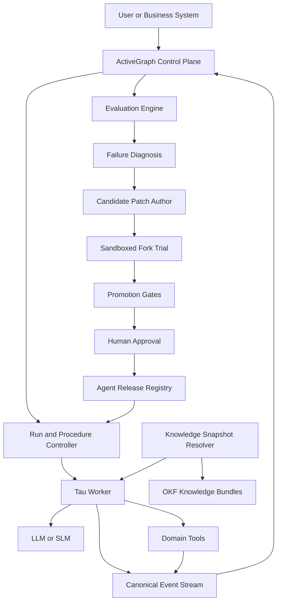

# 핵심 판단

가장 좋은 확장 방식은 다음과 같습니다.

> **Tau는 업무를 수행하는 교체 가능한 Target Agent로 유지하고, ActiveGraph는 실행과 개선을 통제하는 Enterprise Control Plane으로 사용한다. OKF는 agent가 사용하는 지식·절차·정책의 배포 형식으로 사용하고, Evaluation Pack은 변경을 production에 승격시키는 품질 게이트로 사용한다.**

즉, Tau를 직접 복잡한 enterprise framework로 키우기보다 다음 구조로 분리해야 합니다.

```text
Enterprise Outer Loop
 ├─ ActiveGraph: 실행 기록, 상태, lineage, fork, diff, promotion
 ├─ OKF: 지식, 정책, 절차, schema, 사례
 ├─ Evaluation-first: 회귀검사, held-out 검증, 승격 기준
 └─ Release Registry: agent와 지식의 승인된 버전

Target Inner Loop
 └─ Tau: 모델 호출, tool 사용, 작업 실행, 결과 생성
```

Tau는 이미 모델 provider, agent loop, tool, event, session과 coding application을 분리하고 있습니다. 특히 core가 UI나 파일 경로를 모르고 event stream을 발생시키도록 설계되어 있으므로 외부 control plane과 연결하기 좋은 구조입니다. ([GitHub][1])

---

# 1. Enterprise outer loop의 정확한 정의

Outer loop는 단순 모니터링이 아닙니다.

```text
명세
 → Agent 구성
 → 실행
 → Trace 수집
 → 평가
 → 실패 진단
 → 개선안 생성
 → 격리 시험
 → Held-out 검증
 → 승인
 → 승격
 → 운영 관찰
 → 다음 개선
```

이를 다음 두 loop로 나누는 것이 좋습니다.

## Inner loop: Tau가 한 작업을 완료하는 과정

```text
User Goal
  → LLM
  → Tool Call
  → Tool Result
  → LLM
  → Final Result
```

Tau의 agent loop는 model response를 받고, tool을 실행하고, 결과를 transcript에 추가한 뒤 tool call이 없어질 때까지 반복합니다. ([Tau][2])

## Outer loop: Agent system 자체를 개선하는 과정

```text
Agent Release N
  → 여러 업무 실행
  → 실패 패턴 발견
  → Candidate Patch 생성
  → Forked Trial
  → Evaluation
  → Release N+1 또는 Reject
```

ActiveGraph는 append-only event log를 source of truth로 두고 graph를 그 log의 projection으로 구성하므로, replay, fork, diff와 lineage를 outer loop의 기본 원리로 사용할 수 있습니다. ([GitHub][3])

---

# 2. 권장 전체 아키텍처



여기서 source of truth는 하나가 아니라 책임별로 나뉩니다.

| 책임                     | Source of truth            |
| ---------------------- | -------------------------- |
| 실제로 무슨 일이 일어났는가        | ActiveGraph event log      |
| Agent가 어떤 지식을 사용했는가    | OKF snapshot과 content hash |
| 어떤 agent 버전이 승인되었는가    | Release Registry와 Git tag  |
| 변경이 성능을 개선했는가          | Evaluation Run             |
| 누가 승인을 내렸는가            | Approval event             |
| 현재 production 버전은 무엇인가 | Deployment alias           |

---

# 3. Tau를 ActiveGraph에 연결하는 방식

## 권장 방식: 별도 process의 worker adapter

초기 prototype에서는 Tau extension으로 연결할 수 있습니다. Tau extension은 event stream을 관찰하고, tool call 전후를 가로채며, custom tool과 durable session entry를 추가할 수 있습니다. ([Tau][4])

하지만 enterprise 수준에서는 다음처럼 분리하는 것이 안전합니다.

```text
ActiveGraph Runtime Process
          │
          │ RunSpecification
          ▼
Tau Worker Process / Container
          │
          │ Canonical Events
          ▼
ActiveGraph Event Ingestor
```

이 구조의 장점은 다음과 같습니다.

* Tau 장애가 control plane을 손상시키지 않음
* Tau 외에 다른 agent로 교체 가능
* tool 권한과 파일 접근을 container에서 제한 가능
* 동일한 실행을 다른 model이나 agent로 비교 가능
* outer loop가 target agent에 의해 수정되지 않음

Tau extension은 임의 Python을 같은 session 안에서 실행하므로, Tau도 project extension을 기본적으로 비활성화합니다. 따라서 production에서는 신뢰 경계를 extension 내부보다 process 또는 container 경계에 두는 편이 안전합니다. ([Tau][4])

---

## Tau Worker의 공통 인터페이스

Tau에 종속되지 않는 target interface를 정의해야 합니다.

```python
class AgentTarget:
    async def prepare(self, specification: "RunSpecification") -> None:
        ...

    async def execute(
        self,
        specification: "RunSpecification",
        emit: "EventEmitter",
    ) -> "RunResult":
        ...

    async def cancel(self, run_id: str) -> None:
        ...

    async def collect_artifacts(self, run_id: str) -> list["ArtifactRef"]:
        ...
```

`RunSpecification`에는 최소한 다음 정보가 들어갑니다.

```yaml
run_id: run_20260727_001
goal: "VIP 고객을 찾고 근거와 함께 보고하라"

agent_release:
  id: okf-query-agent
  version: 0.4.2
  runtime: tau
  runtime_version: 0.1.x

model:
  provider: local
  model: qwen-coder
  config_hash: sha256:...

knowledge_snapshot:
  bundle: techshop-knowledge
  version: 0.8.0
  commit: 3d9e...
  content_hash: sha256:...

procedure:
  id: grounded-data-query
  version: 0.3.0

policy:
  bundle: data-query-policy
  version: 0.2.1

evaluation:
  pack: techshop-query-eval
  version: 0.5.0

limits:
  max_turns: 12
  max_tool_calls: 20
  max_wall_time_seconds: 180
  allow_write_tools: false
```

이렇게 해야 “같은 agent를 다시 실행했다”는 말이 재현 가능한 의미를 갖습니다.

---

# 4. Tau event를 ActiveGraph event로 정규화하기

Tau에는 `agent_start`, `turn_start`, `message_end`, `tool_execution_start`, `tool_execution_end`, `compaction`, retry 등의 event가 있습니다. 이를 그대로 저장하기보다 enterprise 공통 event envelope로 감싸는 것이 좋습니다. ([Tau][2])

## Canonical event envelope

```json
{
  "event_id": "evt_01J...",
  "run_id": "run_20260727_001",
  "sequence": 42,
  "timestamp": "2026-07-27T11:15:22.310+09:00",
  "type": "tool.responded",
  "actor": {
    "type": "agent",
    "id": "okf-query-agent",
    "release": "0.4.2"
  },
  "subject": {
    "type": "tool_call",
    "id": "call_019"
  },
  "payload": {},
  "lineage": {
    "parent_event_id": "evt_...",
    "goal_id": "goal_...",
    "turn_id": "turn_03"
  },
  "snapshots": {
    "agent_release": "sha256:...",
    "knowledge": "sha256:...",
    "procedure": "sha256:...",
    "tool_contract": "sha256:..."
  }
}
```

## Tau–ActiveGraph event mapping

| Tau event              | Enterprise event               |
| ---------------------- | ------------------------------ |
| `agent_start`          | `run.started`                  |
| `turn_start`           | `agent.turn.started`           |
| `message_end`          | `model.responded`              |
| `tool_execution_start` | `tool.requested`               |
| `tool_execution_end`   | `tool.responded`               |
| `compaction_start`     | `context.compaction.started`   |
| `compaction_end`       | `context.compaction.completed` |
| `auto_retry_start`     | `execution.retry.started`      |
| `agent_settled`        | `run.settled`                  |
| artifact write         | `artifact.created`             |
| final response         | `run.result.produced`          |

Tau event에 없는 enterprise event는 bridge 또는 domain tool wrapper가 발생시킵니다.

```text
knowledge.query.requested
knowledge.concept.read
knowledge.context.assembled
policy.check.requested
policy.check.passed
approval.requested
evaluation.case.graded
candidate.proposed
candidate.promoted
```

---

# 5. ActiveGraph의 graph schema

이벤트만 저장하고 graph object를 설계하지 않으면 분석이 어려워집니다.

## 주요 object types

```text
Goal
Run
AgentRelease
ModelConfiguration
Procedure
KnowledgeSnapshot
KnowledgeConcept
Tool
ToolCall
Artifact
EvalPack
EvalCase
Grade
Failure
FailureRegime
PatchCandidate
Trial
Approval
Promotion
Deployment
```

## 주요 relations

```text
Run --attempts--> Goal
Run --uses--> AgentRelease
Run --uses--> KnowledgeSnapshot
Run --follows--> Procedure
Run --produces--> Artifact

ToolCall --invokes--> Tool
ToolCall --supports--> Artifact
KnowledgeConcept --supports--> Answer

EvalCase --evaluates--> Run
Grade --grades--> EvalCase
Failure --occurred_in--> Run
Failure --classified_as--> FailureRegime

PatchCandidate --addresses--> FailureRegime
PatchCandidate --changes--> AgentComponent
Trial --tests--> PatchCandidate
Approval --approves--> PatchCandidate
Promotion --promotes--> PatchCandidate
```

이렇게 구성하면 다음 질문을 graph query로 해결할 수 있습니다.

```text
어떤 knowledge concept가 잘못된 답에 반복적으로 사용됐는가?
어떤 tool schema 변경 후 실패율이 높아졌는가?
어떤 prompt 변경이 비용을 증가시켰는가?
어떤 failure regime이 최근 20회 실행에서 반복됐는가?
human-reviewed knowledge만 사용한 실행의 정확도는 얼마인가?
```

---

# 6. OKF의 역할: Context 저장소가 아니라 지식 계약

OKF와 ActiveGraph Pack을 같은 것으로 취급하면 안 됩니다.

| 구성요소             | 성격            | 담당                                 |
| ---------------- | ------------- | ---------------------------------- |
| OKF Bundle       | 선언적 지식        | 업무 개념, schema, 정책, 절차, 근거          |
| ActiveGraph Pack | 실행 가능한 Python | behavior, tool, policy enforcement |
| Tau Skill        | 작업 수행 지침      | model이 따르는 국소적 절차                  |
| Eval Pack        | 테스트 계약        | 사례, grader, threshold              |
| Release Manifest | 배포 단위         | 위 자산들의 승인된 조합                      |

ActiveGraph Pack은 object type, relation type, behavior, tool, prompt와 policy를 묶는 Python package입니다. 반면 OKF는 Markdown과 YAML frontmatter를 사용하는 최소 형식이며 특정 runtime이나 query infrastructure를 규정하지 않습니다. ([Active Graph][5])

현재 OKF v0.2는 provenance, trust, freshness, lifecycle, attestation을 first-class로 다루므로 agent-generated knowledge를 outer loop에 포함하기에 이전보다 적합합니다. ([GitHub][6])

## 권장 OKF bundle

```text
okf/
├─ index.md
├─ domain/
│  ├─ customer.md
│  ├─ order.md
│  └─ product.md
├─ schemas/
│  ├─ tables/
│  │  ├─ customers.md
│  │  └─ orders.md
│  └─ output/
│     └─ grounded-answer.md
├─ procedures/
│  ├─ grounded-data-query.md
│  ├─ ambiguous-query-resolution.md
│  └─ query-validation.md
├─ policies/
│  ├─ read-only-database.md
│  ├─ pii-handling.md
│  └─ evidence-required.md
├─ tools/
│  ├─ inspect-schema.md
│  └─ execute-read-query.md
├─ examples/
│  ├─ successful/
│  └─ failed/
├─ failure-regimes/
│  ├─ schema-selection-error.md
│  ├─ join-path-error.md
│  ├─ sql-generation-error.md
│  └─ answer-grounding-error.md
├─ metrics/
│  ├─ task-success-rate.md
│  └─ evidence-coverage.md
├─ computations/
│  └─ task-success-rate.md
└─ decisions/
   └─ adr-001-read-only-agent.md
```

## Context Snapshot Resolver

Tau가 OKF 폴더를 직접 무제한 탐색하게 두기보다, outer loop가 context snapshot을 만들어 전달하는 것이 좋습니다.

```text
Goal 분석
 → root index 조회
 → 관련 concept 후보 선택
 → link expansion
 → trust/freshness 검사
 → policy 포함 여부 검사
 → token budget 적용
 → immutable context manifest 생성
 → Tau에 전달
```

결과는 반드시 기록합니다.

```yaml
context_snapshot:
  id: context_019
  bundle_hash: sha256:...
  selected:
    - schemas/tables/customers
    - procedures/grounded-data-query
    - policies/read-only-database
  excluded:
    - concept: schemas/tables/legacy_customers
      reason: stale
  trust_summary:
    human_reviewed: 2
    machine_confirmed: 1
    unverified: 0
```

OKF는 `stale_after`, actor, verification과 attested computation을 표현할 수 있으므로, context compiler가 단순 유사도뿐 아니라 신뢰도와 freshness를 선택 기준으로 사용할 수 있습니다. ([GitHub][6])

---

# 7. Evaluation-first를 promotion gate로 만들기

평가는 마지막 보고서가 아니라 모든 변경의 진입 조건이어야 합니다.

## 평가 계층

| Gate           | 검사 대상                                     |
| -------------- | ----------------------------------------- |
| G0 Static      | schema, hash, import, policy, bundle link |
| G1 Unit        | 개별 tool, resolver, formatter              |
| G2 Replay      | 기존 event log를 재생했을 때 divergence 여부        |
| G3 Scenario    | 고정 fixture에서 end-to-end 수행                |
| G4 In-sample   | 알려진 실패 사례 개선 여부                           |
| G5 Held-out    | 보지 않은 사례에서 일반화 여부                         |
| G6 Safety      | 금지 tool, 권한, PII, destructive action      |
| G7 Operational | latency, token, tool-call 수, 비용           |
| G8 Canary      | 제한된 실제 업무에서 regression 여부                 |

## Eval Pack 예시

```text
eval-packs/
└─ techshop-query/
   ├─ pack.yaml
   ├─ cases/
   │  ├─ core.jsonl
   │  ├─ adversarial.jsonl
   │  ├─ regression.jsonl
   │  └─ heldout.enc.jsonl
   ├─ graders/
   │  ├─ answer_correctness.py
   │  ├─ sql_equivalence.py
   │  ├─ evidence_coverage.py
   │  ├─ policy_compliance.py
   │  └─ trace_conformance.py
   ├─ fixtures/
   │  └─ techshop.db
   └─ thresholds.yaml
```

```yaml
promotion_gate:
  required:
    task_success_rate:
      min: 0.90
      regression_tolerance: 0.00

    critical_case_pass_rate:
      min: 1.00

    evidence_coverage:
      min: 0.95

    prohibited_tool_calls:
      max: 0

    heldout_improvement:
      min_delta: 0.02

    p95_tool_calls:
      max: 8

  approval_required:
    - tool_contract_changed
    - policy_changed
    - write_permission_added
```

ActiveGraph의 fork–test–promote는 domain-neutral한 격리, 비교와 fail-closed adoption을 제공하지만, 평가 threshold와 승인 정책은 product layer가 정의하도록 설계되어 있습니다. ([Active Graph][7])

ActiveGraph 기반 Regimes 연구도 candidate 변경을 static check, sandbox, in-sample evaluation과 held-out validation을 통과한 경우에만 승격시키는 구조를 사용합니다. 특히 known failure에만 맞춘 수정이 아니라 held-out 사례에서 살아남아야 개선으로 인정한다는 점이 중요합니다. ([arXiv][8])

---

# 8. 개선 가능한 “Action Seam”을 제한해야 한다

개선 agent에게 전체 repository 수정 권한을 주면 원인 분석과 안전한 승격이 어려워집니다.

Candidate patch는 반드시 특정 seam 하나를 대상으로 해야 합니다.

```text
S1: System prompt
S2: Tau skill
S3: OKF retrieval/query policy
S4: Context assembly rule
S5: Tool description 또는 schema
S6: Procedure transition
S7: Validator
S8: Deterministic operator
S9: Model configuration
S10: Runtime code
```

각 seam마다 별도 위험 수준을 둡니다.

| Seam             | 자동 제안 |      자동 시험 |           자동 승격 |
| ---------------- | ----: | ---------: | --------------: |
| Prompt 문구        |    가능 |         가능 |        제한적으로 가능 |
| Skill            |    가능 |         가능 |           승인 권장 |
| Retrieval weight |    가능 |         가능 |        제한적으로 가능 |
| OKF concept      |    가능 |         가능 | human review 필요 |
| Tool schema      |    가능 |         가능 |           승인 필수 |
| Procedure        |    가능 |         가능 |           승인 필수 |
| 권한 정책            |   제안만 |         가능 |        자동 승격 금지 |
| Runtime code     |    가능 | sandbox 필수 |           승인 필수 |

## Failure regime에서 seam으로 routing

```text
KnowledgeNotFound
    → OKF content 또는 retrieval seam

KnowledgeWasRetrievedButIgnored
    → context assembly 또는 reader prompt seam

WrongToolSelected
    → tool description/schema seam

CorrectToolWrongArguments
    → tool schema/example seam

ProcedureStepSkipped
    → procedure runtime seam

CorrectExecutionWrongAnswer
    → answer synthesis/validator seam

PolicyViolation
    → policy enforcement seam
```

이 구조는 “실패한 사례를 model에 주고 아무 코드나 고치게 하는 것”보다 실험 변수를 좁히고 결과를 설명하기 쉽습니다.

---

# 9. Fork–trial–promotion의 실제 흐름

```text
1. Baseline run 집합에서 failure 수집
2. Failure classifier가 regime 부여
3. 가장 영향이 큰 regime 선택
4. 허용된 seam 결정
5. Candidate patch 작성
6. Git worktree 또는 artifact branch 생성
7. ActiveGraph parent run에서 fork
8. 별도 subprocess/container에서 trial
9. Baseline과 trace/result diff
10. In-sample eval
11. Held-out eval
12. Safety와 cost gate
13. Human approval
14. Git merge/tag
15. Release Registry alias 변경
16. Canary 실행
17. Production 또는 rollback
```

ActiveGraph의 fork는 graph state를 격리하지만 candidate Python code의 process state까지 자동으로 격리하는 것은 아니므로, 현재 ActiveGraph도 subprocess trial executor와 resource/event/LLM-call limit 구조를 사용합니다. ([GitHub][9])

중요한 점은 **ActiveGraph의 `promote()`와 Git merge를 동일시하면 안 된다는 것**입니다.

ActiveGraph promotion은 fork의 structural graph delta를 parent에 적용합니다. 외부 prompt, skill, Python code와 OKF 파일은 별도 artifact repository에서 merge하고 tag해야 합니다. ActiveGraph에는 “어떤 candidate가 어떤 평가를 통과해 어떤 release로 승격되었는지”를 event로 기록합니다. ActiveGraph도 실제로 발생하지 않은 fork의 tool·LLM event를 parent log에 복사하지 않고, parent가 fork의 결과 delta를 채택했다는 정직한 이력을 기록하는 방식을 택합니다. ([GitHub][10])

---

# 10. Agent Release를 하나의 immutable manifest로 묶기

다음과 같은 release manifest가 필요합니다.

```yaml
api_version: ax-agent/v1
kind: AgentRelease

metadata:
  name: okf-query-agent
  version: 0.4.2
  created_by: human:architect
  source_commit: 8f31c2a

runtime:
  adapter: tau
  tau_version: 0.1.x
  worker_image: registry/okf-query-agent@sha256:...

activegraph:
  packs:
    - name: tau_bridge
      version: 0.2.0
    - name: okf_context
      version: 0.4.0
    - name: query_governance
      version: 0.3.1

knowledge:
  bundles:
    - name: techshop-knowledge
      version: 0.8.0
      digest: sha256:...

procedure:
  id: grounded-data-query
  version: 0.3.0
  digest: sha256:...

skills:
  - id: plan-data-query
    digest: sha256:...
  - id: validate-answer
    digest: sha256:...

tools:
  contract_digest: sha256:...
  allowed:
    - okf.search
    - database.inspect_schema
    - database.execute_read_query

evaluation:
  pack: techshop-query
  version: 0.5.0
  report: evalrun_20260727_018

promotion:
  approved_by: human:architect
  approval_event: evt_01J...
```

Production에서는 이 manifest 전체를 하나의 unit으로 배포해야 합니다.

모델만 바뀌었거나, OKF 문서만 수정됐거나, tool description만 수정됐더라도 다른 release입니다.

---

# 11. 권장 repository 구조

```text
ax-agent-system/
├─ platform/
│  ├─ activegraph_control/
│  ├─ run_scheduler/
│  ├─ event_ingestor/
│  ├─ release_registry/
│  ├─ policy_engine/
│  └─ sandbox_executor/
│
├─ adapters/
│  ├─ tau/
│  │  ├─ worker.py
│  │  ├─ event_mapper.py
│  │  ├─ tool_proxy.py
│  │  └─ extension/
│  └─ common/
│     └─ target_protocol.py
│
├─ activegraph-packs/
│  ├─ tau_bridge/
│  ├─ okf_context/
│  ├─ evaluation/
│  ├─ evolution/
│  ├─ governance/
│  └─ release_management/
│
├─ agents/
│  └─ okf-query-agent/
│     ├─ SYSTEM_MODEL.yaml
│     ├─ PROCEDURE.yaml
│     ├─ POLICY.md
│     ├─ skills/
│     ├─ prompts/
│     ├─ tools/
│     └─ releases/
│
├─ knowledge/
│  └─ techshop-okf/
│
├─ eval-packs/
│  └─ techshop-query/
│
├─ trials/
│  ├─ candidates/
│  └─ reports/
│
└─ dashboards/
   ├─ run_inspector/
   ├─ specification_conformance/
   └─ evolution_history/
```

---

# 12. 단계별 구현 순서

## Phase A — Observe

기존 Tau 동작을 변경하지 않고 event만 ActiveGraph에 적재합니다.

완료 조건:

```text
Tau 1회 실행
→ 모든 turn과 tool call 기록
→ artifact와 final answer 연결
→ replay 가능한 run graph 생성
```

## Phase B — Ground

OKF Context Resolver를 추가합니다.

완료 조건:

```text
어떤 concept를 왜 선택했는지 기록
stale/unverified concept 식별
answer에서 evidence lineage 확인
```

## Phase C — Evaluate

현재 외부 eval pack을 ActiveGraph behavior로 연결합니다.

완료 조건:

```text
Run 완료
→ eval case 자동 생성 또는 연결
→ deterministic grader 실행
→ trace grader 실행
→ EvalReport artifact 생성
```

## Phase D — Diagnose

Failure taxonomy와 seam routing을 추가합니다.

완료 조건:

```text
실패
→ failure regime
→ 책임 pipeline stage
→ 수정 가능한 seam
→ 근거 포함 diagnosis
```

## Phase E — Improve

Candidate patch author와 sandbox trial을 추가합니다.

완료 조건:

```text
Candidate 생성
→ 별도 branch/worktree
→ ActiveGraph fork
→ sandbox trial
→ baseline diff
```

## Phase F — Govern

Held-out gate, 승인과 release registry를 추가합니다.

완료 조건:

```text
승격 이유와 평가 결과 추적
누가 승인했는지 추적
현재 production release 재현 가능
rollback 가능
```

---

# 13. 현재 프로젝트에 적합한 첫 vertical slice

사용자께서 이미 구축한 DB 질의·응답 CLI와 external eval pack을 대상으로 하는 것이 가장 좋습니다.

## Pilot agent

```text
OKF-Grounded Data Query Agent
```

## 허용 tool

```text
okf.list_bundles
okf.search_concepts
okf.read_concept
database.inspect_schema
database.execute_read_query
answer.validate_evidence
```

## 첫 번째 failure regimes

```text
IntentClassificationError
SchemaSelectionError
JoinPathError
QueryGenerationError
QueryExecutionError
ResultInterpretationError
EvidenceGroundingError
AbstentionError
PolicyViolation
```

## 첫 번째 candidate seams

```text
OKF schema concept
Query planning skill
Tool description
SQL validation rule
Answer grounding prompt
```

이 pilot이 안정화된 후 동일한 outer loop를 CUDA kernel agent에 적용할 수 있습니다.

```text
DB Query Agent
  Query correctness
  Evidence grounding
  SQL safety

CUDA Kernel Agent
  Numerical correctness
  Compilation success
  Performance regression
  Memory safety
```

Outer loop는 같고, OKF bundle·tools·failure taxonomy·eval pack만 교체됩니다.

---

# 최종 구조

```text
                 Enterprise Outer Loop
┌──────────────────────────────────────────────────────┐
│ ActiveGraph                                          │
│ Goal → Run → Trace → Eval → Failure → Patch → Trial │
│                         → Approval → Promotion        │
│                                                      │
│ OKF                   Evaluation Pack                │
│ Knowledge/Policy      Cases/Graders/Gates            │
│                                                      │
│ Release Registry                                     │
│ Immutable approved configurations                    │
└───────────────────────┬──────────────────────────────┘
                        │ RunSpecification
                        ▼
┌──────────────────────────────────────────────────────┐
│ Tau Target Agent                                     │
│ Model → Tool → Result → Model                        │
│                                                      │
│ Custom domain tools                                  │
│ Sandboxed workspace                                  │
└───────────────────────┬──────────────────────────────┘
                        │ Canonical Events
                        ▼
                  ActiveGraph Event Log
```

핵심 원칙은 다음 한 문장으로 정리할 수 있습니다.

> **Tau가 업무를 수행하고, OKF가 무엇을 알아야 하는지 규정하며, Evaluation Pack이 무엇이 좋은 동작인지 판정하고, ActiveGraph가 그 전체 변화의 이력과 개선 수명주기를 지배하게 해야 합니다.**

가장 먼저 구현해야 할 산출물은 `TauTargetAdapter`, `CanonicalEventEnvelope`, `RunSpecification`, `KnowledgeSnapshotManifest` 네 가지입니다. 이 네 계약이 안정되면 이후 Tau를 다른 coding agent나 전용 runtime으로 교체해도 enterprise outer loop는 그대로 유지됩니다.

[1]: https://github.com/huggingface/tau/blob/main/README.md "tau/README.md at main · huggingface/tau · GitHub"
[2]: https://twotimespi.dev/internals/agent-loop/ "The agent loop & events · Tau"
[3]: https://github.com/yoheinakajima/activegraph "GitHub - yoheinakajima/activegraph: Event-sourced graph runtime for durable and stateful agents · GitHub"
[4]: https://twotimespi.dev/guides/extensions/ "Extensions · Tau"
[5]: https://docs.activegraph.ai/guides/authoring-packs/ "Authoring packs - Active Graph"
[6]: https://github.com/GoogleCloudPlatform/knowledge-catalog/blob/main/okf/SPEC.md "knowledge-catalog/okf/SPEC.md at main · GoogleCloudPlatform/knowledge-catalog · GitHub"
[7]: https://docs.activegraph.ai/guides/fork-test-promote/ "Fork, test, promote - Active Graph"
[8]: https://arxiv.org/abs/2606.10241 "Regimes: An Auditable, Held-Out-Gated Improvement Loop Demonstrated on LongMemEval with ActiveGraph"
[9]: https://github.com/yoheinakajima/activegraph/blob/main/trial-isolation-design.md "activegraph/trial-isolation-design.md at main · yoheinakajima/activegraph · GitHub"
[10]: https://github.com/yoheinakajima/activegraph/blob/main/promote-design.md "activegraph/promote-design.md at main · yoheinakajima/activegraph · GitHub"

---

## 핵심 답변

Tau 밖에 ActiveGraph를 별도 framework로 두는 가장 큰 장점은 **Tau를 더 똑똑하게 만드는 것**이 아니라,

> **개별 agent의 추론과 실행을 기업이 통제할 수 있는 업무 상태, 절차, 기록, 평가 대상으로 바꾸는 것**

입니다.

다만 중요한 전제가 있습니다.

**ActiveGraph를 추가한다고 자동으로 다양한 절차형 agent 플랫폼이 되는 것은 아닙니다.** ActiveGraph는 스스로도 일반적인 workflow engine이 아니라, event-sourced graph를 통해 세계 상태와 변화 이력을 관리하는 runtime이라고 명시합니다. 따라서 ActiveGraph 위에 `Procedure Model`, `Tool Contract`, `Policy`, `Evaluation Pack`을 정의해야 비로소 절차형 agent product line의 기반이 됩니다. ([GitHub][1])

---

# 1. Tau만으로 개발할 때의 구조

Tau는 기본적으로 다음과 같은 실행 harness입니다.

```text
사용자 요청
  ↓
LLM 판단
  ↓
Tool 호출
  ↓
결과 관찰
  ↓
다음 판단
  ↓
최종 응답
```

Tau의 `tau_agent`는 messages, tools, events, agent loop, session을 담당하고, `tau_coding`이 file·shell·skill·project instruction을 붙여 coding agent를 만듭니다. core가 event를 발생시키고 UI나 구체적인 환경을 모른다는 점 때문에 다른 업무 환경의 worker로 재사용하기 좋습니다. ([GitHub][2])

예를 들어 Tau만으로 구매 승인 agent를 만든다면:

```text
prompt
+ 구매 관련 tools
+ 구매 규정 문서
+ 구매 승인 skill
```

을 구성할 수 있습니다.

하지만 시간이 지나면 다음 정보가 Tau session 내부 또는 애플리케이션 코드 곳곳에 흩어집니다.

* 현재 구매 요청이 어느 단계인지
* 누가 검토했는지
* 어떤 규정이 적용됐는지
* 왜 승인 또는 거부했는지
* 어떤 tool을 호출했는지
* 이전 실행과 무엇이 달라졌는지
* agent 변경 후 성능이 좋아졌는지
* 실패 후 어디서부터 재개해야 하는지

Tau는 append-only JSONL session과 branching을 제공하지만, 이것은 기본적으로 coding-agent session의 지속성입니다. 기업 전체 업무 객체와 여러 agent 사이의 상태를 표현하는 공통 업무 모델은 아닙니다. ([GitHub][2])

---

# 2. ActiveGraph를 밖에 둘 때 얻는 본질적인 장점

## 2.1 Agent의 대화 상태와 업무 상태를 분리할 수 있다

가장 중요한 장점입니다.

### Tau가 관리하는 상태

```text
messages
tool calls
tool results
context
current agent turn
```

### ActiveGraph가 관리할 상태

```text
PurchaseRequest
Invoice
CustomerCase
Experiment
EvaluationRun
Approval
Evidence
Decision
Artifact
Exception
```

예를 들어 구매 업무에서는:

```text
PurchaseRequest
  ├─ requested_by → Employee
  ├─ requires → BudgetApproval
  ├─ supported_by → Quotation
  ├─ reviewed_by → Manager
  └─ results_in → PurchaseOrder
```

가 업무의 실제 상태입니다.

Tau 대화가 종료되거나 다른 모델로 교체되어도 이 graph는 남습니다.

> 대화 transcript가 아니라 업무 객체와 관계가 조직의 source of truth가 되는 것입니다.

ActiveGraph는 graph를 event log의 projection으로 취급하며, 모든 mutation을 event로 기록합니다. 따라서 누가 무엇을 변경했고 왜 현재 상태가 되었는지를 추적할 수 있습니다. ([GitHub][1])

---

## 2.2 Tau를 교체 가능한 실행 worker로 만들 수 있다

ActiveGraph가 Tau 내부에 깊게 결합되면 전체 시스템이 Tau에 종속됩니다.

외부에 두면 다음이 가능합니다.

```text
ActiveGraph Control Plane
       │
       ├── Tau Worker
       ├── Claude Agent SDK Worker
       ├── Codex Worker
       ├── Local SLM Worker
       └── Deterministic Python Worker
```

동일한 업무 요청에 대해:

```text
Tau + Qwen
Tau + Claude
Custom Agent + Local Model
Deterministic Workflow
```

를 실행하고 결과를 비교할 수 있습니다.

Tau 자체도 `AgentHarness`와 coding environment를 분리하며, 동일한 harness가 TUI, print mode 또는 별도 frontend를 구동할 수 있도록 event 기반 경계를 제공합니다. 이 구조는 Tau를 독립 worker adapter로 감싸기 좋은 근거가 됩니다. ([GitHub][2])

이때 조직이 보유하는 핵심 자산은 Tau가 아니라 다음이 됩니다.

```text
업무 모델
절차 명세
업무 tools
정책
평가 사례
실행 trace
과거 결정
```

Tau는 그것을 실행하는 여러 engine 중 하나입니다.

---

## 2.3 실패 후 재개 가능한 장기 업무를 만들 수 있다

업무자동화는 한 번의 LLM call로 끝나지 않는 경우가 많습니다.

```text
요청 접수
→ 자료 수집
→ 담당자 확인
→ 3일 대기
→ 승인 요청
→ 수정 요구
→ 재검토
→ 외부 시스템 반영
```

Tau session만으로 처리하면 process가 종료되거나 context가 바뀌었을 때 재개 논리를 별도로 작성해야 합니다.

Event history를 source of truth로 두면:

```text
마지막 완료 단계 확인
→ 완료된 외부 작업은 재실행하지 않음
→ 실패한 단계부터 재개
→ 새 worker가 기존 상태를 이어받음
```

이라는 구조가 가능합니다.

이는 durable workflow system에서 검증된 기본 원리이기도 합니다. Temporal은 workflow definition과 개별 execution을 분리하고, event history를 통해 장애 이전 상태를 재구성하며, 외부 API·DB·LLM 호출 같은 side effect를 activity로 분리합니다. ActiveGraph가 Temporal과 동일한 workflow engine이라는 뜻은 아니지만, **업무 상태를 worker memory 밖에 기록해야 장기 실행과 복구가 가능하다**는 설계 근거는 같습니다. ([템포랄 문서][3])

---

## 2.4 Agent 행동을 감사하고 설명할 수 있다

최종 응답만 저장하면 다음 둘을 구분하기 어렵습니다.

```text
올바른 절차를 따라 올바른 답을 생성
잘못된 절차를 거쳤지만 우연히 올바른 답을 생성
```

ActiveGraph 밖에서 다음 trajectory를 기록할 수 있습니다.

```text
goal.created
procedure.selected
knowledge.retrieved
tool.requested
tool.responded
policy.checked
approval.requested
artifact.created
task.completed
```

그 결과 다음과 같은 평가가 가능합니다.

* 필수 단계를 건너뛰었는가
* 잘못된 tool을 호출했는가
* 승인 전에 외부 변경을 수행했는가
* 오래된 OKF 문서를 사용했는가
* evidence 없이 결론을 냈는가
* 같은 실패를 반복하고 있는가

Agent 평가에서는 최종 발화뿐 아니라 tool call, 중간 결과, 환경 상태를 포함한 전체 trace와 실제 outcome을 함께 봐야 합니다. Anthropic도 transcript와 최종 environment outcome을 구분하고, evaluation harness가 agent의 전체 실행과 grading을 담당해야 한다고 설명합니다. ([Anthropic][4])

---

## 2.5 동일한 업무를 fork하여 비교 실험할 수 있다

예를 들어 한 실행이 SQL join 오류로 실패했다고 합시다.

```text
원 실행
  └─ SchemaSelectionError
```

ActiveGraph 밖에 실행 기록이 있으면 실패 직전 상태에서 다음 후보를 비교할 수 있습니다.

```text
Fork A: prompt 수정
Fork B: OKF schema 설명 보강
Fork C: query-planning skill 수정
Fork D: tool schema 수정
```

그리고 각각에 대해:

```text
정답 정확도
tool-call 수
latency
policy 준수
evidence coverage
```

를 비교할 수 있습니다.

ActiveGraph의 fork-and-diff는 특정 event에서 독립 실행을 분기하고, parent와 구조적 결과를 비교하기 위한 기능으로 설계되어 있습니다. replay cache를 이용해 공통 prefix를 다시 실행하지 않을 수도 있습니다. ([GitHub][1])

이 기능은 단순 업무 자동화보다 **agent engineering laboratory**를 만드는 데 더 큰 가치가 있습니다.

---

## 2.6 Target Agent가 자신의 평가자를 통제하지 못하게 할 수 있다

Tau 안에 다음을 모두 넣으면 문제가 생깁니다.

```text
실행
정책 검사
평가
로그 관리
개선안 생성
새 버전 채택
```

그러면 평가받는 agent가 자신의 평가 환경을 수정할 가능성이 생깁니다.

외부 분리를 하면:

```text
Tau
  └─ 업무 수행

ActiveGraph outer loop
  ├─ 실행 기록
  ├─ 정책 검사
  ├─ 평가
  ├─ candidate 비교
  └─ promotion 승인
```

이 됩니다.

이는 시험을 보는 학생과 채점 시스템을 분리하는 것과 같습니다.

물론 실제 독립성을 얻으려면 논리적 분리만으로는 부족합니다.

* 별도 process 또는 container
* write-once event ingestion
* 평가 pack에 대한 read-only 접근
* held-out test 비공개
* promotion 권한 분리

가 필요합니다.

---

# 3. 다양한 절차형 agent의 토대가 되는 근거

## 근거 1. 대부분의 업무 agent가 공유하는 상위 개념이 있다

분야가 달라도 절차형 업무에는 반복되는 공통 개념이 있습니다.

```text
Goal
WorkItem
Actor
Input
Evidence
Decision
Approval
ToolCall
Artifact
Exception
Policy
Evaluation
```

예를 들어:

| 공통 개념      | 구매 Agent | 연구 Agent       | CUDA Agent            |
| ---------- | -------- | -------------- | --------------------- |
| Goal       | 물품 구매    | 실험 결과 분석       | kernel 최적화            |
| Input      | 구매 요청서   | trace와 metrics | reference kernel      |
| Evidence   | 견적서      | 실험 결과          | correctness·benchmark |
| Decision   | 승인·반려    | 가설 채택          | candidate 채택          |
| Approval   | 관리자 승인   | 연구자 검토         | merge 승인              |
| Artifact   | 발주서      | 보고서            | kernel source         |
| Evaluation | 예산·규정 검사 | 통계·근거 검사       | 정확도·성능 검사             |
| Exception  | 예산 초과    | 데이터 부족         | compile 오류            |

즉, 업무 내용은 다르지만 다음 outer-loop 구조는 공유됩니다.

```text
접수
→ 해석
→ 계획
→ 실행
→ 검증
→ 승인
→ 반영
→ 기록
```

이 공통 구조가 있기 때문에 core runtime을 공유하고 domain pack만 바꾸는 product-line 접근이 가능합니다.

---

## 근거 2. ActiveGraph의 domain ontology가 고정되어 있지 않다

ActiveGraph는 framework가 `claim`, `task`, `invoice` 같은 업무 객체를 미리 정하지 않습니다.

* object type은 domain이 정의
* relation type도 domain이 정의
* 필요한 경우 Pydantic validation 적용
* behavior는 event 또는 graph pattern에 반응
* custom event도 정의 가능

즉, core runtime은 작은 공통 vocabulary만 제공하고, 업무의 명사와 관계는 pack에서 정의합니다. ([GitHub][1])

예를 들어:

```text
구매 Pack
PurchaseRequest
Quotation
Budget
Approval

연구 Pack
Hypothesis
Experiment
Evidence
Finding

CUDA Pack
Kernel
ReferenceImplementation
BenchmarkRun
OptimizationCandidate
```

을 서로 다른 ontology로 구성할 수 있습니다.

---

## 근거 3. Pack 단위로 업무 능력을 캡슐화할 수 있다

ActiveGraph의 pack은 특정 domain의 다음 요소를 묶을 수 있습니다.

```text
object types
behaviors
tools
prompts
policies
```

공식 repository도 infrastructure, communication adapter, research, codebase, team operations, meetings 등 서로 다른 pack의 조합을 multi-pack architecture의 예로 제시하고 있습니다. ([GitHub][1])

사용자의 framework에서는 여기에 OKF와 Eval Pack을 추가하는 것이 좋습니다.

```text
Domain Agent Pack
├─ ontology
├─ behaviors
├─ tools
├─ prompts
├─ policies
├─ procedures
├─ OKF bundle
└─ evaluation pack
```

그러면 새로운 업무 agent는 core를 복사하는 것이 아니라 pack을 추가하는 방식으로 개발할 수 있습니다.

---

## 근거 4. 업무 절차는 몇 가지 조합 패턴으로 환원된다

실제 절차형 agent의 상당수는 다음 패턴을 조합한 형태입니다.

```text
Sequential
A → B → C

Routing
요청 분류 → 서로 다른 절차 선택

Parallel
여러 조사 또는 검사를 동시에 수행

Review
생성 → 검토 → 수정

Approval
제안 → 승인 → 실행

Escalation
자동 처리 불가 → 담당자 전달

Compensation
실행 실패 → 이전 작업 취소 또는 보정

Iterative
생성 → 평가 → 개선 반복
```

Anthropic은 agentic system에서 workflow를 미리 정의된 code path로, agent를 LLM이 동적으로 tool과 process를 결정하는 구조로 구분합니다. 또한 well-defined task에는 workflow가 예측성과 일관성을 제공하며, routing·prompt chaining·parallelization 같은 단순한 조합 패턴이 여러 실제 시스템에서 재사용된다고 설명합니다. ([Anthropic][5])

따라서 다양한 절차형 agent는 완전히 서로 다른 프로그램이라기보다:

```text
공통 패턴
+ domain ontology
+ domain tools
+ domain policies
+ domain knowledge
```

의 조합으로 볼 수 있습니다.

---

## 근거 5. 실행 engine과 절차 definition을 분리할 수 있다

Tau는 일을 수행하는 능력을 제공합니다.

```text
reason
select tool
execute
observe
continue
```

ActiveGraph와 Procedure layer는 무엇을 언제 수행해야 하는지를 제공합니다.

```text
current state
allowed transition
required evidence
approval condition
completion condition
```

따라서 새로운 agent를 만들 때 매번 agent loop부터 구현할 필요가 없습니다.

```text
Tau AgentHarness
    재사용

ActiveGraph Runtime
    재사용

Procedure Meta-model
    재사용

Domain Pack
    새로 작성
```

이를 식으로 표현하면:

```text
ProceduralAgent(domain)
=
Common Runtime
+ Common Procedure Primitives
+ Domain Pack
```

이 구조가 성립한다면 product line의 기반이라고 말할 수 있습니다.

---

# 4. 실제 예제로 보는 재사용 가능성

## A. OKF 문서·데이터 질의 Agent

```text
Procedure
요청 분류
→ 관련 OKF bundle 선택
→ schema 조회
→ query plan 생성
→ DB 실행
→ 결과 검증
→ evidence 포함 응답
```

Domain pack:

```text
Customer
Order
Product
Schema
QueryPlan
AnswerEvidence
```

평가:

```text
SQL equivalence
answer correctness
evidence coverage
read-only policy
```

---

## B. 연구 실험·보고서 Agent

```text
Procedure
실험 명세 확인
→ 실행 결과 수집
→ baseline 비교
→ 통계·실패 분석
→ finding 생성
→ 보고서 작성
→ 연구자 승인
```

Domain pack:

```text
Hypothesis
Experiment
Metric
Run
Finding
Evidence
Report
```

평가:

```text
metric correctness
finding-evidence alignment
report completeness
unsupported-claim count
```

---

## C. CUDA Kernel 개발 Agent

```text
Procedure
reference 구현 확인
→ target kernel 생성
→ compile
→ correctness test
→ benchmark
→ profile
→ 최적화
→ regression test
→ merge 승인
```

Domain pack:

```text
Kernel
ReferenceImplementation
Candidate
CompileRun
CorrectnessRun
BenchmarkRun
Profile
OptimizationDecision
```

평가:

```text
compile success
numerical correctness
speedup
memory usage
regression
```

세 agent의 domain object와 tool은 다르지만 outer loop는 같습니다.

```text
Goal
→ Plan
→ Action
→ Evidence
→ Validation
→ Decision
→ Approval
→ Artifact
```

이것이 다양한 절차형 agent의 토대가 될 수 있다는 가장 중요한 구조적 근거입니다.

---

# 5. ActiveGraph가 밖에 있을 때 특히 유리한 공통 서비스

여러 agent가 생길수록 다음 기능을 개별 agent마다 구현해서는 안 됩니다.

## 공통 Control Plane

```text
Run Registry
Event Store
Identity
Permissions
Approval
Budget
Audit
Evaluation
Release
Observability
```

예를 들어 모든 agent가 동일한 approval service를 사용할 수 있습니다.

```text
구매 Agent
   └─ 100만 원 이상 → 관리자 승인

문서 Agent
   └─ 외부 발송 → 책임자 승인

CUDA Agent
   └─ main branch merge → 연구자 승인
```

승인 대상과 조건은 다르지만 다음 공통 객체는 같습니다.

```text
ApprovalRequest
requested_by
requested_action
risk_level
reviewer
decision
decision_reason
timestamp
```

이러한 공통 service가 agent 수가 늘어날수록 플랫폼의 누적 가치가 됩니다.

---

# 6. 단, “다양한 agent의 토대”라는 주장을 검증해야 한다

이것은 설계 철학만으로 증명되는 것이 아닙니다.

최소 3개의 서로 다른 vertical agent를 구현해 다음을 측정해야 합니다.

## 검증 대상

### 공통 코드 재사용률

```text
공통 platform 코드
───────────────
전체 구현 코드
```

목표 예:

```text
Tau adapter       100% 재사용
event envelope    100% 재사용
approval          100% 재사용
eval runner        80% 이상 재사용
procedure runtime  80% 이상 재사용
domain pack        업무별 신규 작성
```

이 수치는 보장된 결과가 아니라 platform 설계의 목표 기준입니다.

---

### 신규 Agent 개발 비용

측정할 항목:

```text
첫 agent 개발 기간
두 번째 agent 개발 기간
세 번째 agent 개발 기간
```

platform이 제대로 동작한다면 뒤의 agent는 다음만 작성하게 되어야 합니다.

```text
ontology
procedure
tools
OKF
eval cases
UI
```

core runtime을 다시 구현하고 있다면 product-line 기반이 아직 형성되지 않은 것입니다.

---

### Runtime 교체 가능성

동일한 `RunSpecification`을 다음 두 worker가 수행하도록 합니다.

```text
Tau Worker
Alternative Worker
```

ActiveGraph event와 평가가 그대로 작동한다면 Tau와 enterprise layer가 잘 분리된 것입니다.

---

### Cross-domain evaluator 재사용

다음 evaluator가 여러 agent에서 그대로 작동해야 합니다.

```text
required-step coverage
prohibited-action count
approval-before-write
evidence coverage
tool failure rate
retry count
latency
cost
```

업무별로 바뀌는 evaluator만 별도로 작성합니다.

---

### Replay와 회귀 분석

이전 실행을 새로운 release에서 다시 돌려:

```text
결과 변화
절차 변화
tool 선택 변화
비용 변화
실패 변화
```

를 자동 비교할 수 있어야 합니다.

---

# 7. 이 구조가 오히려 불필요한 경우

다음과 같은 agent에는 ActiveGraph 외부 framework가 과도할 수 있습니다.

* 한두 번의 model call로 끝나는 단순 요약
* 상태를 장기간 유지할 필요가 없는 작업
* 외부 시스템을 변경하지 않는 개인용 assistant
* 감사나 승인 요구가 없는 작업
* 실패 후 재개할 필요가 없는 짧은 작업
* 하나의 agent만 존재하고 확장 계획이 없는 경우

ActiveGraph도 한 번의 conversation으로 해결되는 문제에는 chat framework를 사용하라고 명시합니다. 또한 framework가 나쁜 behavior를 자동으로 좋게 만드는 것은 아니며, 단지 잘못된 동작을 관찰 가능하게 만든다고 설명합니다. ([GitHub][1])

따라서 다음 조건이 3개 이상일 때 도입 가치가 커집니다.

```text
□ 장시간 지속되는 업무
□ 여러 단계의 절차
□ 외부 시스템 변경
□ 사람 승인
□ 여러 agent 협업
□ 감사 가능성
□ 평가와 회귀검사
□ 실패 후 재개
□ agent 또는 model 교체
□ 다양한 domain agent 확장
```

---

# 8. 중요한 보완: ActiveGraph는 Procedure Engine 그 자체가 아니다

여기가 가장 중요합니다.

ActiveGraph는:

```text
무슨 객체가 존재하는가
객체들이 어떻게 연결되는가
어떤 event가 발생했는가
event에 어떤 behavior가 반응하는가
```

를 잘 표현합니다.

하지만 엄격한 절차의:

```text
Step 1 완료 전 Step 2 금지
3일 대기
실패 시 3회 retry
A 승인 후 B 실행
취소 시 보상 transaction
```

을 자동으로 제공하는 전통적인 workflow engine은 아닙니다. ActiveGraph 자신도 “workflow engine이 아니며 workflow는 control flow를, ActiveGraph는 world state를 모델링한다”고 구분합니다. ([GitHub][1])

따라서 다음 layer가 추가되어야 합니다.

```text
ActiveGraph
    World State + Events + Behaviors

Procedure Runtime
    States + Transitions + Guards + Retry + Timeout

Tau
    Interpretation + Planning + Tool Use

OKF
    Knowledge + Policy + Procedure Semantics

Eval Engine
    Success + Conformance + Regression
```

권장 관계는 다음과 같습니다.

```text
Procedure Runtime:
  다음에 무엇이 가능한가를 결정

Tau:
  허용된 범위에서 어떻게 수행할지 판단

ActiveGraph:
  현재 무엇이 존재하며 무엇이 발생했는지 기록

OKF:
  어떤 지식과 규칙을 따라야 하는지 제공

Evaluation:
  그 동작이 충분히 좋았는지 판정
```

---

# 최종 판단

Tau 밖에 ActiveGraph를 두는 이유는 **두 개의 agent framework를 중복해서 사용하는 것**이 아닙니다.

각자의 역할이 다릅니다.

| 요소                | 핵심 역할                       |
| ----------------- | --------------------------- |
| Tau               | 한 작업을 수행하는 cognitive worker |
| Procedure Runtime | 순서·전이·재시도·완료 조건             |
| ActiveGraph       | 공유 업무 상태와 변화 이력             |
| OKF               | 지식·schema·정책·절차 의미          |
| Eval Pack         | 정확성·안전성·절차 준수 판정            |
| Release Registry  | 승인된 agent 구성의 버전 관리         |

이 구조가 다양한 절차형 agent의 토대가 되는 근거는 다음과 같습니다.

1. 대부분의 업무가 Goal–Action–Evidence–Decision–Approval–Artifact라는 공통 meta-model을 가진다.
2. ActiveGraph의 domain object와 relation이 고정되어 있지 않아 업무별 ontology를 정의할 수 있다.
3. pack을 통해 behavior·tool·policy·prompt를 domain 단위로 캡슐화할 수 있다.
4. Tau의 agent harness가 domain 및 frontend에서 분리되어 worker로 재사용 가능하다.
5. event log·replay·fork·diff가 여러 agent에 공통인 evaluation-first 개발 기반을 제공한다.
6. approval·audit·identity·budget·release 같은 enterprise 기능을 개별 agent가 아니라 플랫폼에서 한 번만 구현할 수 있다.

그러나 이 주장을 실제로 입증하려면 **OKF Query Agent, Experiment-to-Report Agent, CUDA Kernel Agent 세 종류를 동일한 platform 위에 구현하고, 공통 코드 재사용률·신규 개발 기간·평가 재사용률·runtime 교체 가능성을 측정해야 합니다.**

그 실험에서 domain별로 바뀌는 것이 `Pack + OKF + Tools + Evals`에 한정되고, Tau adapter와 outer-loop runtime이 그대로 재사용된다면, ActiveGraph는 단순한 추가 framework가 아니라 **절차형 Agent Product Line의 공통 기반**이라고 주장할 수 있습니다.

[1]: https://github.com/yoheinakajima/activegraph "GitHub - yoheinakajima/activegraph: Event-sourced graph runtime for durable and stateful agents · GitHub"
[2]: https://github.com/huggingface/tau "GitHub - huggingface/tau: A Python port of Pi’s minimalist coding agent. · GitHub"
[3]: https://docs.temporal.io/workflows "Temporal Workflow | Temporal Platform Documentation"
[4]: https://www.anthropic.com/engineering/demystifying-evals-for-ai-agents "Demystifying evals for AI agents \ Anthropic"
[5]: https://www.anthropic.com/engineering/building-effective-agents "Building Effective AI Agents \ Anthropic"

---

# 결론

둘 중 하나를 선택하기보다 **적응의 범위를 나누는 이중 구조**가 가장 좋습니다.

> **Tau는 실행 중 발생한 문제를 즉시 우회·복구하는 Operational Adapter로 사용하고, Codex는 source code·tool·procedure를 수정하는 Engineering Agent로 사용하십시오.**

즉,

```text
Tau
= 업무를 계속 수행하기 위한 bounded runtime adaptation

Codex
= 다음 agent release를 만들기 위한 structural adaptation
```

로 역할을 나누는 것이 안전합니다.

특히 **production에서 실행 중인 Tau가 자신의 core code, tool 구현 또는 evaluation 기준을 직접 수정하도록 해서는 안 됩니다.**

---

# 1. 먼저 runtime adaptation을 네 종류로 나눠야 한다

“Runtime adaptation”이라는 말에는 서로 다른 변경이 섞여 있습니다.

| 적응 수준          | 예시                                                | 권장 담당               |
| -------------- | ------------------------------------------------- | ------------------- |
| L0 실행 적응       | 재시도, 다른 tool 선택, query 수정                         | Tau                 |
| L1 절차 인스턴스 적응  | 단계 추가, 순서 변경, 사람에게 escalation                     | Tau + ActiveGraph   |
| L2 구성 적응       | prompt, skill, context policy, OKF 선택 규칙 변경       | Tau 제안, Codex 구현 가능 |
| L3 구조 적응       | tool 코드, procedure runtime, evaluator 수정          | Codex               |
| L4 platform 적응 | ActiveGraph pack, ontology, schema, runtime 구조 변경 | Codex + 사람 승인       |

여기서 가장 중요한 경계는 **L1과 L2 사이**입니다.

```text
현재 업무 실행의 경로를 바꾸는 것
≠
agent 시스템 자체를 바꾸는 것
```

전자는 Tau가 맡아도 되지만, 후자는 외부 engineering agent가 맡는 것이 좋습니다.

---

# 2. Embedded Tau를 통한 적응

## Tau가 유리한 이유

Tau는 현재 업무 실행 안에 있으므로 다음 정보를 가장 잘 압니다.

```text
현재 goal
현재 procedure state
직전 tool 결과
실패한 입력
업무 데이터
남은 token과 시간
사용자와의 대화
```

Tau는 model stream과 tool execution을 event로 노출하고, extension과 event subscription을 통해 실행 중 도구와 행동을 확장할 수 있는 구조입니다. 따라서 현재 실행을 관찰하면서 즉각적인 복구 행동을 선택하는 데 적합합니다. ([Tau][1])

예를 들어 DB 질의 agent가 실패했을 때:

```text
SQL 실행 실패
→ schema 다시 조회
→ column 이름 수정
→ query 재실행
→ 결과 검증
```

CUDA agent라면:

```text
kernel compile 실패
→ compiler error 분석
→ tile size 축소
→ 다시 compile
→ correctness test
```

같은 적응은 Tau가 담당하는 것이 효율적입니다.

## Tau에 적합한 적응

### 1. Retry 전략 변경

```text
동일 tool retry
→ 다른 argument로 retry
→ 대체 tool 호출
→ 사람에게 escalation
```

### 2. 현재 계획 수정

```text
기존 계획:
schema 조회 → SQL 생성

수정 계획:
schema 조회 → sample row 조회 → join path 확인 → SQL 생성
```

### 3. Context 재구성

```text
현재 OKF concept 부족
→ 상위 index 탐색
→ 관련 schema 추가
→ 새 context snapshot 생성
```

### 4. 임시 procedure overlay

```yaml
temporary_overlay:
  run_id: run_301
  insert_before: execute_query
  step: inspect_join_relationships
  expires_after_run: true
```

이 변경은 해당 실행 또는 제한된 canary 실행에만 적용합니다.

---

## Tau 적응의 장점

* 현재 상태를 다시 설명할 필요가 없음
* 외부 agent 호출 없이 빠르게 대응
* private DB나 GPU 장비처럼 외부 cloud에서 접근하기 어려운 환경에 유리
* 현재 실패 지점에서 바로 재시도 가능
* 네트워크가 없어도 local model로 운영 가능
* 실행 trace와 실제 환경이 동일함

## Tau 적응의 위험

가장 큰 문제는 **자기수정과 자기평가의 결합**입니다.

```text
Tau가 실패
→ Tau가 자신의 prompt 수정
→ Tau가 평가 기준도 해석
→ Tau가 성공했다고 판단
```

이 구조에서는 다음 문제가 발생할 수 있습니다.

### 평가 오염

실패 사례를 보고 수정한 agent가 같은 사례만 다시 풀면 실제 일반화 여부를 알 수 없습니다.

### 국소 최적화

현재 한 사례를 해결하기 위해 전체 성능을 악화시킬 수 있습니다.

```text
특정 join 오류 수정
→ 다른 query에서 불필요한 join 증가
→ latency와 오류율 상승
```

### 자기보존적 변경

자신의 실패를 줄이기 위해 evaluator나 stop condition을 느슨하게 만들 가능성이 있습니다.

### production 상태 훼손

현재 실행 중인 agent가 tool 코드나 runtime 파일을 직접 수정하면 다음 실행부터 결과가 달라지고 재현이 어려워집니다.

따라서 Tau에는 다음 권한만 주는 것이 좋습니다.

```text
허용:
- 현재 계획 수정
- tool argument 변경
- context 재검색
- read-only 진단
- 임시 overlay 생성
- adaptation proposal 생성

금지:
- 자신의 core source 수정
- evaluator 수정
- production policy 수정
- tool permission 확대
- held-out eval 접근
- production release 변경
```

---

# 3. Codex Cloud를 통한 적응

Codex Cloud는 repository가 준비된 격리된 cloud environment에서 작업하고, 여러 후보 작업을 병렬로 수행한 뒤 diff 또는 pull request 형태로 검토할 수 있습니다. 따라서 repository 수준의 수정과 비교 실험에 적합합니다. ([OpenAI Developers][2])

Cloud task는 OpenAI가 관리하는 격리 container에서 실행됩니다. setup 단계에서는 dependency를 설치할 수 있고, agent 단계는 기본적으로 network access가 꺼져 있으며, setup에 사용한 secret도 agent 단계 전에 제거되는 구조입니다. ([OpenAI Developers][3])

## Codex에 적합한 적응

### 1. Tool 구현 수정

```text
database.execute_query
→ timeout 처리 추가
→ SQL parser validation 추가
→ structured error schema 추가
```

### 2. Procedure runtime 수정

```text
WAITING_APPROVAL 상태 추가
timeout transition 추가
compensation step 구현
```

### 3. ActiveGraph pack 변경

```text
새 object type 추가
relation validation 추가
failure behavior 추가
promotion rule 수정
```

### 4. Evaluation harness 확장

```text
새 regression case 추가
trace conformance grader 구현
held-out evaluation runner 수정
```

### 5. Repository 전체 refactoring

```text
Tau adapter 변경
event schema migration
tool contract version upgrade
multiple pack 간 interface 정리
```

### 6. 여러 수정 후보 병렬 생성

```text
Candidate A: prompt 수정
Candidate B: skill 수정
Candidate C: tool schema 수정
Candidate D: deterministic validator 추가
```

Codex Cloud의 격리된 작업 환경과 병렬 task 모델은 이런 후보 비교에 잘 맞습니다. 결과를 diff로 검토하고 merge 여부를 결정할 수 있습니다. ([OpenAI Developers][2])

---

## Codex 방식의 장점

### Repository 전체 문맥

한 개의 실패 사례뿐 아니라 다음을 함께 볼 수 있습니다.

```text
source code
tests
documentation
AGENTS.md
skill files
tool contracts
CI configuration
related modules
```

### 변경 격리

production process가 실행 중인 directory를 직접 수정하지 않고 별도 cloud sandbox 또는 branch에서 작업할 수 있습니다.

### 병렬 후보 개발

같은 adaptation request에 대해 여러 구현을 독립적으로 생성할 수 있습니다.

### 리뷰 가능한 결과

최종 변경을 diff, commit, PR로 검토할 수 있어 변경 이유와 범위를 추적하기 쉽습니다.

### 복잡한 구조 변경

여러 파일과 module을 함께 수정하고 test와 lint를 실행해야 하는 작업에 더 적합합니다.

Codex는 CLI의 non-interactive mode와 TypeScript SDK도 제공하므로 ActiveGraph에서 programmatically adaptation 작업을 발행하는 구조를 만들 수 있습니다. `codex exec`는 script나 CI에서 사용할 수 있고, SDK는 애플리케이션 내부에서 thread를 시작하고 이어가는 제어 방식을 제공합니다. ([OpenAI Developers][4])

---

## Codex 방식의 한계

### 현재 runtime 상태와 거리

Codex가 보는 것은 대개 다음과 같습니다.

```text
repository snapshot
exported trace
failure report
test fixtures
```

하지만 실제 production process의 memory, GPU 상태, live DB connection과 순간적인 환경 문제는 직접 알지 못할 수 있습니다.

### 환경 재현 비용

특히 CUDA나 내부 DB 시스템에서는 cloud 환경이 실제 target과 다를 수 있습니다.

```text
Codex cloud:
일반 container 환경

실제 target:
Windows + RTX GPU
특정 CUDA driver
로컬 DB
조직 내부 network
```

따라서 Codex가 코드를 수정하더라도 최종 검증은 실제 target machine의 sandbox executor가 해야 합니다.

### 민감 정보 전달 문제

실패 분석에 실제 고객 데이터나 내부 문서가 필요하다면 외부 cloud에 어떤 데이터를 보낼 수 있는지 별도 정책이 필요합니다.

이 문제는 다음 방식으로 줄일 수 있습니다.

```text
원본 업무 데이터는 전달하지 않음
→ schema와 최소 fixture 생성
→ PII 제거
→ event payload redaction
→ 재현 가능한 synthetic case 생성
```

### 즉시 복구에는 부적합

현재 업무가 실패한 순간 cloud coding task를 만들어 source를 수정하고 새 release를 배포하는 방식은 지나치게 무겁습니다.

---

# 4. 두 방식을 직접 비교하면

| 기준                   | Embedded Tau          | Codex Cloud         |
| -------------------- | --------------------- | ------------------- |
| 현재 실행 문맥             | 매우 강함                 | export된 정보에 의존      |
| 대응 속도                | 빠름                    | 상대적으로 무거움           |
| 현재 작업 복구             | 적합                    | 부적합                 |
| repository 규모 수정     | 제한적                   | 적합                  |
| 여러 파일 refactoring    | 약함                    | 강함                  |
| 실제 target 접근         | 직접 가능                 | 제한적                 |
| private data 보호      | local 운영 시 유리         | 전달 정책 필요            |
| 변경 격리                | 별도 sandbox 필요         | cloud sandbox 제공    |
| 병렬 후보 생성             | 별도 구현 필요              | 적합                  |
| PR·diff review       | 별도 구현 필요              | 기본 workflow와 잘 맞음   |
| 자기수정 위험              | 높음                    | target agent와 분리 가능 |
| held-out eval 보호     | 어려움                   | 분리하기 쉬움             |
| production promotion | 맡기면 안 됨               | 제안 가능, 최종 gate 필요   |
| 비용                   | local model이면 낮을 수 있음 | cloud 사용 비용 발생      |
| 구조적 adaptation       | 제한해야 함                | 주 담당으로 적합           |

---

# 5. 권장 구조: Two-speed Adaptation

## Fast loop: Tau가 현재 실행을 살린다

```text
업무 실행
→ 실패 감지
→ Tau 진단
→ 허용 범위 확인
→ 계획/context/tool argument 수정
→ 재실행
→ 결과 검증
```

시간 범위:

```text
현재 turn
현재 run
짧은 canary window
```

변경 대상:

```text
plan
tool arguments
context snapshot
temporary procedure overlay
retry strategy
escalation
```

## Slow loop: Codex가 다음 release를 개선한다

```text
반복 실패 축적
→ ActiveGraph가 failure regime 생성
→ Adaptation Request 발행
→ Codex가 별도 branch에서 수정
→ test/eval 실행
→ actual target에서 재검증
→ 승인
→ 새 release 승격
```

시간 범위:

```text
다음 release
다음 deployment
장기적 system improvement
```

변경 대상:

```text
source code
tool contract
skill
prompt
procedure definition
OKF retrieval logic
evaluator
ActiveGraph pack
```

---

# 6. ActiveGraph가 adaptation을 라우팅해야 한다

Tau나 Codex가 스스로 “내가 이 문제를 고치겠다”고 결정하게 하면 안 됩니다.

ActiveGraph outer loop가 다음 정보를 이용해 담당을 정해야 합니다.

```text
failure type
반복 횟수
영향 범위
필요 권한
변경 대상
reversibility
risk level
```

## AdaptationRequest object

```yaml
adaptation_request:
  id: ar_20260727_019

  source:
    run_id: run_301
    failure_id: failure_089

  diagnosis:
    regime: JoinPathSelectionError
    confidence: 0.91
    recurrence_count: 7

  impact:
    affected_cases: 12
    severity: medium

  proposed_scope:
    seam: query_planning_skill
    change_level: L2_CONFIGURATION

  runtime_action:
    handler: tau
    allowed:
      - add_context
      - inspect_relationships
      - retry
    expires_after_run: true

  engineering_action:
    handler: codex
    repository: okf-query-agent
    expected_outputs:
      - patch
      - regression_test
      - rationale
      - eval_report

  promotion:
    required_gates:
      - regression
      - heldout
      - policy
      - human_review
```

---

# 7. 추천 routing policy

```yaml
adaptation_policy:
  L0_EXECUTION:
    executor: tau
    auto_apply: true
    persistence: current_run

  L1_PROCEDURE_INSTANCE:
    executor: tau
    auto_apply: true
    persistence: current_run
    require_trace: true

  L2_CONFIGURATION:
    proposer: tau
    implementer: codex
    auto_apply: false
    require_evaluation: true

  L3_STRUCTURAL:
    implementer: codex
    auto_apply: false
    require:
      - sandbox
      - regression_eval
      - heldout_eval
      - human_approval

  L4_PLATFORM:
    implementer: codex
    auto_apply: false
    require:
      - architecture_review
      - migration_test
      - rollback_plan
      - human_approval
```

핵심은 다음입니다.

> Tau는 변경의 필요성을 가장 먼저 발견하지만, 지속적인 변경을 production에 적용하는 권한은 갖지 않는다.

---

# 8. Tau와 Codex의 협력 방식

## Step 1. Tau가 adaptation evidence를 만든다

Tau는 단순히 “고쳐 주세요”라고 하지 말고 구조화된 evidence pack을 생성해야 합니다.

```text
adaptation-bundle/
├─ failure.json
├─ run-spec.yaml
├─ trace.jsonl
├─ minimal-reproduction.md
├─ expected-result.json
├─ actual-result.json
├─ relevant-context/
│  ├─ schema.md
│  └─ procedure.md
└─ tau-diagnosis.md
```

## Step 2. ActiveGraph가 민감 정보를 제거한다

```text
PII 제거
secret 제거
불필요한 conversation 제거
최소 재현 fixture 생성
```

## Step 3. Codex에 engineering task를 전달한다

```text
Goal:
Fix JoinPathSelectionError without changing read-only policy.

Allowed seams:
- skills/query-planning/SKILL.md
- tools/schema-inspector.yaml
- tests/regression/

Forbidden:
- evaluator thresholds
- held-out cases
- production credentials
- database write tools

Required:
- minimal patch
- regression test
- rationale
- compatibility report
```

## Step 4. Codex는 별도 환경에서 patch를 만든다

Codex Cloud는 연결된 repository를 바탕으로 격리 environment에서 작업하고 결과 diff를 검토하도록 설계되어 있습니다. 여러 후보를 병렬로 시도할 수도 있습니다. ([OpenAI Developers][2])

## Step 5. 실제 target에서 evaluation한다

Codex가 cloud에서 test를 통과했다고 바로 승격하지 않습니다.

```text
Codex sandbox test
→ platform offline eval
→ actual target sandbox
→ held-out eval
→ canary
→ promotion
```

CUDA agent에서는 특히 다음과 같이 해야 합니다.

```text
Codex:
source patch와 test 작성

실제 GPU Executor:
compile
correctness
benchmark
profile
```

---

# 9. 예시: OKF Query Agent

## 현재 query만 실패한 경우

```text
원인:
질문이 모호하여 잘못된 table 선택

처리:
Tau가 schema 추가 조회
→ 사용자에게 확인 또는 후보 비교
→ 현재 run 완료
```

이것은 Tau가 담당합니다.

## 동일 실패가 여러 번 반복된 경우

```text
원인:
query planning skill에 relationship inspection 단계가 없음

처리:
Tau가 failure evidence 생성
→ ActiveGraph가 recurrence 확인
→ Codex가 SKILL.md와 regression test 수정
→ held-out evaluation
→ 새 release 승격
```

이것은 Codex가 담당합니다.

---

# 10. 예시: CUDA Kernel Agent

## compile parameter 문제

```text
tile size 128에서 resource 부족
→ Tau가 64로 축소
→ compile 재시도
→ correctness와 benchmark
```

현재 candidate의 탐색이므로 Tau가 담당합니다.

## cuTile API 변경 또는 공통 code generation 오류

```text
여러 kernel에서 동일한 decorator 오류 발생
→ Tau가 공통 failure regime 보고
→ Codex가 generator와 templates 수정
→ compiler tests 추가
→ 실제 GPU에서 전체 eval pack 실행
```

repository 구조 변경이므로 Codex가 담당합니다.

## 성능 최적화

여기서는 두 agent가 협력할 수 있습니다.

```text
Tau:
실제 GPU에서 여러 tile/config 탐색

ActiveGraph:
성능 결과와 trace 축적

Codex:
반복되는 최적화 패턴을 generator와 skill로 일반화

GPU Executor:
새 generator의 kernel들을 재검증
```

---

# 11. Codex Cloud와 Codex Local도 구분할 필요가 있다

모든 구조 변경을 반드시 cloud에서 할 필요는 없습니다.

Codex CLI는 local repository에서 파일을 읽고 수정하며 설치된 도구를 실행할 수 있고, `codex exec`로 CI나 script에서 비대화식 실행도 가능합니다. sandbox와 approval policy도 설정할 수 있습니다. ([OpenAI Developers][5])

따라서 실제로는 다음 세 계층이 가장 현실적입니다.

```text
Embedded Tau
- 현재 업무 복구
- runtime 관찰
- private target 실행

Codex Local
- 내부 repository 수정
- GPU 및 사내 환경 접근
- 민감 코드 처리

Codex Cloud
- 격리된 병렬 후보 개발
- 일반적인 repository refactoring
- PR 중심 협업
```

사용자의 Windows GPU·CUDA 환경에서는 다음 구성이 특히 적합합니다.

```text
Tau
→ GPU target에서 실행과 측정

Codex Local
→ Windows/WSL repository와 실제 CUDA 환경에서 수정

Codex Cloud
→ architecture, documentation, tests, 일반 Python 코드,
   복수 candidate patch 생성
```

---

# 최종 권고

## Tau에게 맡길 것

```text
현재 실행의 계획 수정
tool 재선택
argument 조정
context 재구성
retry와 fallback
사람에게 escalation
failure evidence 생성
temporary overlay
```

## Codex에게 맡길 것

```text
prompt와 skill의 지속적 수정
tool 구현과 schema 변경
procedure runtime 변경
ActiveGraph behavior와 pack 변경
evaluation code 작성
repository refactoring
migration과 regression test
candidate patch 병렬 생성
```

## 어느 쪽에도 자동으로 맡기지 않을 것

```text
production release 승격
권한 확대
policy 완화
held-out 기준 변경
destructive tool 추가
evaluation threshold 하향
```

이 작업은 ActiveGraph promotion gate와 사람 승인을 거쳐야 합니다.

전체 구조는 다음처럼 정리됩니다.

```text
                   ActiveGraph
        Detect → Classify → Route → Evaluate
              /                     \
             /                       \
     Fast Adaptation            Slow Adaptation
          Tau                       Codex
   current run recovery       repository change
             \                       /
              \                     /
          Trace/Eval → Approval → Release
```

따라서 최종 판단은 다음과 같습니다.

> **Tau는 runtime adaptation의 현장 작업자이고, Codex는 adaptation을 제품화하는 전문 엔지니어이며, ActiveGraph는 둘 사이의 작업 배정자·감사자·평가자·release manager가 되어야 합니다.**

이 구조라면 Tau가 현장 상황을 가장 잘 이해하는 장점을 유지하면서도, 자기수정·평가 오염·production drift를 방지하고, 반복적으로 발견된 adaptation을 검증된 조직 지식과 다음 agent release로 축적할 수 있습니다.

[1]: https://twotimespi.dev/?utm_source=chatgpt.com "Tau"
[2]: https://developers.openai.com/codex/cloud?utm_source=chatgpt.com "Codex cloud | ChatGPT Learn - OpenAI Developers"
[3]: https://developers.openai.com/codex/agent-approvals-security?utm_source=chatgpt.com "Agent approvals & security | ChatGPT Learn"
[4]: https://developers.openai.com/codex/non-interactive-mode?utm_source=chatgpt.com "Non-interactive mode | ChatGPT Learn - OpenAI Developers"
[5]: https://developers.openai.com/codex/cli?utm_source=chatgpt.com "Codex CLI | ChatGPT Learn - OpenAI Developers"
