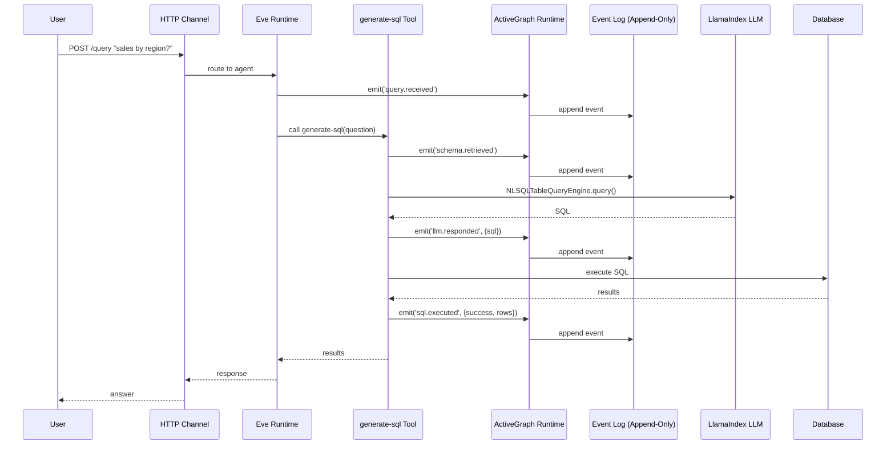

LlamaIndex 기반 Text-to-SQL 코드를 
Eve 프레임워크의 구조와 ActiveGraph의 이벤트 소싱 개념에 맞게 재구성하는 설계 (Python 100%, No *.ts)
- CLI for TUI
- TDD

---

## 1. 설계 방향: 두 프레임워크의 통합

| 계층 | Eve Framework | ActiveGraph | Text-to-SQL 변환 적용 |
| :--- | :--- | :--- | :--- |
| **정의 계층** | `agent/` 디렉토리 구조 | Behavior 함수 | SQL 생성 로직을 `tools/`로 분리 |
| **실행 계층** | 채널 → 도구 호출 → 응답 | 이벤트 → 그래프 업데이트 → 행동 | 각 SQL 생성 단계를 이벤트로 기록 |
| **기록 계층** | Vercel Runs / OpenTelemetry | Append-Only Event Log | 모든 LLM 호출과 SQL 실행을 이벤트로 저장 |
| **감사 계층** | Evals / Traces | Causal Chain / Replay | SQL 오류 추적 및 재현 가능한 평가 |

---

## 2. Eve 프레임워크 디렉토리 구조로 재구성

Eve는 **파일시스템-퍼스트(filesystem-first)** 프레임워크로, 디렉토리 구조 자체가 에이전트의 명세입니다. 다음과 같이 기존 LlamaIndex 코드를 재배치합니다:

```
text-to-sql-agent/
└── agent/
    ├── agent.ts                    # 모델 설정 (LlamaIndex LLM 초기화)
    ├── instructions.md             # Text-to-SQL 역할 정의 + 스키마 설명
    ├── tools/
    │   ├── generate-sql.ts         # 자연어 → SQL 생성 (LlamaIndex NLSQLTableQueryEngine 래핑)
    │   ├── execute-sql.ts          # SQL 실행 및 결과 반환
    │   └── validate-schema.ts      # 스키마 검증 도구
    ├── skills/
    │   └── schema-context.md       # DB 스키마 상세 설명 (필요시 동적 로드)
    ├── channels/
    │   └── http.ts                 # HTTP API 엔드포인트
    └── evals/                      # (선택) 평가 케이스
        └── text-to-sql-benchmark/
            ├── q001.yaml           # 질문 + 기대 SQL
            └── ...
```

### 각 디렉토리의 역할

| 디렉토리/파일 | 역할 | LlamaIndex 코드 이전 대상 |
| :--- | :--- | :--- |
| `agent/agent.ts` | 모델 및 런타임 설정 | `Settings.llm`, `ServiceContext` 초기화 |
| `agent/instructions.md` | 시스템 프롬프트 (역할, 제약, 스키마 개요) | 기존 프롬프트 템플릿에서 이관 |
| `agent/tools/generate-sql.ts` | 자연어 → SQL 생성 | `NLSQLTableQueryEngine` 래핑 |
| `agent/tools/execute-sql.ts` | SQL 실행 및 결과 반환 | DB 커넥션 및 `cursor.execute()` 로직 |
| `agent/tools/validate-schema.ts` | 스키마 존재 여부/컬럼 검증 | LlamaIndex의 `SQLDatabase` 스키마 추출 로직 |
| `agent/skills/schema-context.md` | DB 스키마 상세 (테이블/컬럼/관계) | 기존 스키마 설명 문서 |
| `agent/channels/http.ts` | HTTP API 엔드포인트 | FastAPI/Flask 핸들러 대체 |

---

## 3. ActiveGraph 이벤트 소싱 개념 통합

ActiveGraph의 핵심은 **"로그가 유일한 진실의 원천(append-only event log is the source of truth)"** 이며, 모든 행동은 이벤트에 반응하여 발생하고 새로운 이벤트를 생성합니다.

### 3.1. 이벤트 타입 정의

ActiveGraph의 `events.md` 컨셉에 따라, Text-to-SQL 에이전트의 각 단계를 이벤트로 정의합니다:

```typescript
// agent/lib/events.ts
type TextToSQLEvent = 
  | { type: 'query.received'; payload: { question: string; session_id: string } }
  | { type: 'schema.retrieved'; payload: { tables: string[]; columns: Record<string, string[]> } }
  | { type: 'llm.requested'; payload: { prompt: string; model: string } }
  | { type: 'llm.responded'; payload: { sql: string; tokens: number; latency_ms: number } }
  | { type: 'sql.validated'; payload: { valid: boolean; errors?: string[] } }
  | { type: 'sql.executed'; payload: { success: boolean; rows?: number; error?: string } }
  | { type: 'answer.delivered'; payload: { answer: string; confidence: number } }
  | { type: 'behavior.failed'; payload: { error: string; stage: string } }
```

### 3.2. 행동(Behavior)을 이벤트 기반으로 재구성

ActiveGraph의 `@behavior` 데코레이터 패턴을 참고하여, 각 도구가 이벤트를 발행하고 구독하도록 설계합니다:

```typescript
// agent/tools/generate-sql.ts
import { publish, subscribe } from 'activegraph';

export const generateSQL = async (question: string) => {
  // 1. 이벤트 발행: 쿼리 수신
  publish({ type: 'query.received', payload: { question } });
  
  // 2. 스키마 조회 (이벤트 트리거)
  const schema = await retrieveSchema();
  publish({ type: 'schema.retrieved', payload: schema });
  
  // 3. LLM 호출 (이벤트 기록)
  const start = Date.now();
  publish({ type: 'llm.requested', payload: { prompt: buildPrompt(question, schema) } });
  
  const sql = await llamaIndexQueryEngine.query(question);
  
  publish({ 
    type: 'llm.responded', 
    payload: { sql, tokens: usage.total_tokens, latency_ms: Date.now() - start }
  });
  
  return sql;
};
```

### 3.3. 인과 관계(Causal Chain) 추적

ActiveGraph의 `causal_chain` 쿼리를 활용하면, SQL 오류 발생 시 **"어떤 LLM 호출이 어떤 스키마 정보를 바탕으로 어떤 SQL을 생성했는지"** 를 추적할 수 있습니다:

```typescript
// 오류 발생 시 원인 추적
const chain = await causalChain(errorEvent.id);
// chain = [
//   { event: 'sql.executed', error: 'column not found' },
//   { event: 'llm.responded', sql: 'SELECT wrong_col FROM ...' },
//   { event: 'schema.retrieved', tables: ['users', 'orders'] },
//   { event: 'query.received', question: '...' }
// ]
```

---

## 4. 통합 아키텍처: 실행 흐름



**핵심:** 모든 단계가 이벤트로 기록되므로, 전체 실행을 **재현(Replay)** 하거나 **분기(Fork)** 할 수 있습니다.

---

## 5. 평가(Evals) 체계 통합

기존 `evals/` 디렉토리에 ActiveGraph 이벤트 로그를 활용한 평가를 추가합니다:

```
agent/evals/
├── text-to-sql/
│   ├── benchmarks/
│   │   ├── q001.yaml
│   │   └── q002.yaml
│   ├── evaluator.ts          # 이벤트 로그 기반 점수 산출
│   └── replay.test.ts        # 저장된 이벤트 로그 재생으로 평가
```

### 평가 방식

1. **벤치마크 실행** → 모든 이벤트를 `event_log.jsonl`에 저장
2. **오프라인 평가**: 저장된 이벤트 로그를 재생(Replay)하여 SQL 정확성, 토큰 사용량, 오류율 측정
3. **인과 관계 분석**: 실패한 케이스의 `causal_chain`을 추적하여 **어느 단계에서 문제가 발생했는지** 식별

---

## 6. 구현 로드맵

| 단계 | 작업 | 우선순위 |
| :--- | :--- | :--- |
| **1** | Eve 디렉토리 구조로 기존 코드 재배치 (`agent/`, `tools/`, `instructions.md`) | 높음 |
| **2** | `NLSQLTableQueryEngine`을 `agent/tools/generate-sql.ts`로 래핑 | 높음 |
| **3** | ActiveGraph 런타임 통합 (이벤트 발행/구독 설정) | 중간 |
| **4** | 각 도구에 이벤트 발행 로직 추가 (`query.received`, `llm.requested`, `sql.executed` 등) | 중간 |
| **5** | `evals/` 디렉토리에 벤치마크 케이스 및 평가자 구현 | 중간 |
| **6** | `causal_chain` 쿼리를 활용한 디버깅/분석 도구 추가 | 낮음 |

---

## 7. 참고할 예제 코드

- **ActiveGraph LLM 예제**: `activegraph/examples/llm_claim_extraction.py`에서 `@llm_behavior`와 이벤트 발행 패턴 참고
- **Eve 공식 문서**: `vercel.com`의 eve 개념 페이지에서 디렉토리 구조와 도구 정의 방식 확인
- **LlamaIndex Text-to-SQL**: `NLSQLTableQueryEngine` 기본 사용법 및 SQL 실행 로직

이 설계를 따르면, 기존 LlamaIndex 코드의 기능을 유지하면서 **Eve의 파일시스템 기반 구조**와 **ActiveGraph의 감사 가능한 이벤트 소싱**을 모두 활용할 수 있습니다.