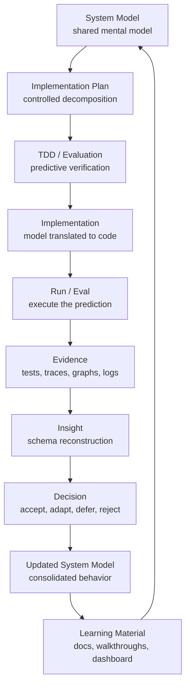
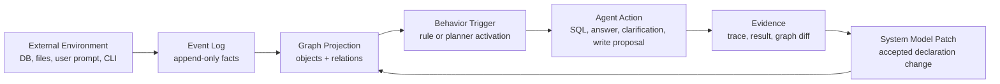
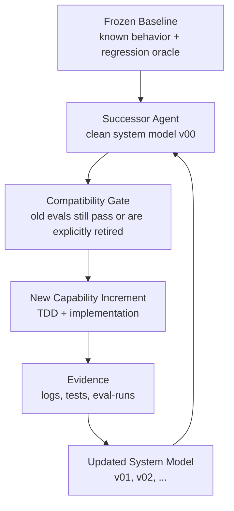

# Cognitive Dev-Loop for Coding Agent Development

This document describes a general process for using a Coding Agent to perform incremental software development while also producing updated system models and learning materials. It is reusable across projects, but the ActiveGraph Text-to-Query migration is used as the concrete reference example.

The core idea is simple: every development increment should leave behind more than changed source code. It should also leave executable verification, inspectable evidence, an updated declaration of how the system behaves, and learning artifacts that help the next human or agent resume with less context loss.

## Primary Loop



The loop is epistemic as much as it is technical. The system model states what the agent is believed to do. Tests and evals turn that belief into predictions. Runtime evidence shows whether the belief is true. Insight and decision update the model so the next increment starts from a better shared understanding.

## Concepts

| Concept | Meaning | Typical Artifact |
| :--- | :--- | :--- |
| System Model | The declared model of objects, relations, events, behaviors, packs, memory boundaries, and runtime phases. | `system-model.vNN.yaml` |
| Implementation Plan | The smallest coherent development path from current model to target behavior. | `plan.md`, refactoring plan, issue note |
| TDD/Evaluation | Executable prediction of the desired behavior before or alongside implementation. | unit test, CLI regression, eval JSONL |
| Evidence | Raw observable result from the environment. | event log, `trace.jsonl`, `graph.json`, CLI output, screenshot, eval-run bundle |
| Insight | Explanation of what the evidence proves about the model. | design note, adaptation analysis, decision record |
| Decision | Human/agent choice about whether to accept, defer, repair, or branch the behavior. | roadmap update, accepted proposal, freeze note |
| Updated System Model | Consolidated declaration after the decision. | next `system-model.vNN.yaml` or roadmap section |
| Learning Material | Human-facing representation that teaches the process and result. | `cognitive_dev_process/*.md`, `cognitive_dev_process.html` |

## Operational Protocol

### Before The Task

- Read the current system model and the newest roadmap/design notes.
- Identify the active pack, runtime boundary, and behavior surface.
- Read nearby source and existing tests/evals before writing code.
- Check event logs or inspect output when the request is based on a failure.
- State the current hypothesis in plain language.

### During The Task

- Work in one small increment.
- Add or update a failing test/eval first when behavior is changing.
- Implement the minimum runtime or pack change that makes the prediction true.
- Keep runtime-general logic separate from agent-pack configuration.
- Record assumptions as graph/event artifacts or system-model fields.
- Avoid using an LLM fallback to hide missing deterministic behavior.

### After The Task

- Run focused validation and broader validation when the change touches shared behavior.
- Capture evidence: command summary, run ID, trace path, graph snapshot, eval-run ID, or inspect transcript.
- Update the relevant `system-model*.yaml` and process docs.
- Add or update learning material so the development path can be studied later.
- Log memory/reflection when the task is significant.

## ActiveGraph Projection Loop

For ActiveGraph-style agents, runtime behavior should be explainable through event projection and graph-triggered behavior:



This loop deliberately separates the external world from the agent's internal graph. The graph is a projection and can be wrong or incomplete. That is why evidence, replay, inspect, and adaptation proposals must remain visible. A behavior change is accepted only when the graph projection, action, and validation evidence agree.

## Baseline And Successor Loop

When an architecture shift is large enough, freeze the old agent and create a successor baseline instead of continuing to mutate the same mental model.



A freeze is not abandonment. It is a stable reference point. The successor agent can evolve faster because regressions are judged against a named baseline rather than against a vague conversation history.

## Learning Artifact Types

| Artifact | Purpose |
| :--- | :--- |
| `system-model.vNN.yaml` | Canonical declaration of the current agent behavior and roadmap state. |
| Implementation plan | Human-readable task decomposition and sequencing rationale. |
| Eval cases | Portable behavior expectations for pack or runtime validation. |
| `trace.jsonl` | Ordered runtime events for one run. |
| `graph.json` | Projected world model after replay or eval. |
| `scoring-input.json` | Third-party or external evaluator input bundle. |
| Inspect transcript | Human-readable before/after graph and event summary. |
| Dashboard HTML | Visual learning material for review, teaching, or onboarding. |
| Freeze doc | Baseline contract for an older agent version. |
| Decision record | Explanation of why a behavior, boundary, or architecture path was accepted. |

## Example: ActiveGraph Text-to-Query Migration

The current repository applies this process to the transition from a deterministic Text-to-SQL agent to a broader Text-to-Query baseline.

Relevant artifacts:

- `activegraph/text-to-sql-agent/FREEZE.md`: freezes the v11.5 DB-only baseline as a regression oracle.
- `activegraph/text-to-query-agent/agent/system-model.v00.yaml`: declares the successor baseline before OKF/RAG features are added.
- `artifacts/activegraph_text_to_query_refactoring_plan.md`: captures the architecture plan for separating reusable runtime from pack-specific query agents.
- `cognitive_dev_process/activegraph-text-to-query/`: stores the staged learning narrative.
- `cognitive_dev_process.html`: provides a visual learning dashboard for the baseline and migration path.

The next increments should continue the same pattern: define the model, write evals, implement behavior, inspect event/graph evidence, update the model, and refresh the learning materials.

## Quality Bar

A development increment is complete only when these are true:

- The implemented behavior is visible through tests, evals, CLI output, or inspectable runtime evidence.
- The system model names the behavior and its trigger boundary.
- The graph/event evidence can explain success or failure after the fact.
- Pack-specific knowledge remains outside generic runtime code.
- LLM use, if any, is optional, explicit, bounded, and logged.
- The learning artifact explains what changed without requiring the reader to replay the whole chat.

## Anti-Patterns

Avoid these failure modes:

- Jumping to implementation without first naming the system model delta.
- Treating a passing ad hoc CLI run as enough evidence when a regression test or eval is feasible.
- Using an LLM fallback to mask missing rule, planner, schema, or validation behavior.
- Changing generic runtime code to satisfy one pack when a pack-level declaration is sufficient.
- Writing external KB content without the agreed approval gate.
- Updating code but leaving `system-model*.yaml`, evals, and learning artifacts stale.
- Letting adaptation proposals silently mutate behavior without recorded evidence and acceptance.

## Minimal Increment Checklist

For each followup, leave this trail:

```text
1. Current model read
2. Target behavior stated
3. Test/eval added or selected
4. Code/config changed
5. Validation run
6. Evidence captured
7. Insight/decision written
8. System model updated
9. Learning artifact updated when useful
```

This checklist makes the Coding Agent's work teachable. It converts a sequence of edits into a durable development process that another agent, evaluator, or developer can inspect and continue.
