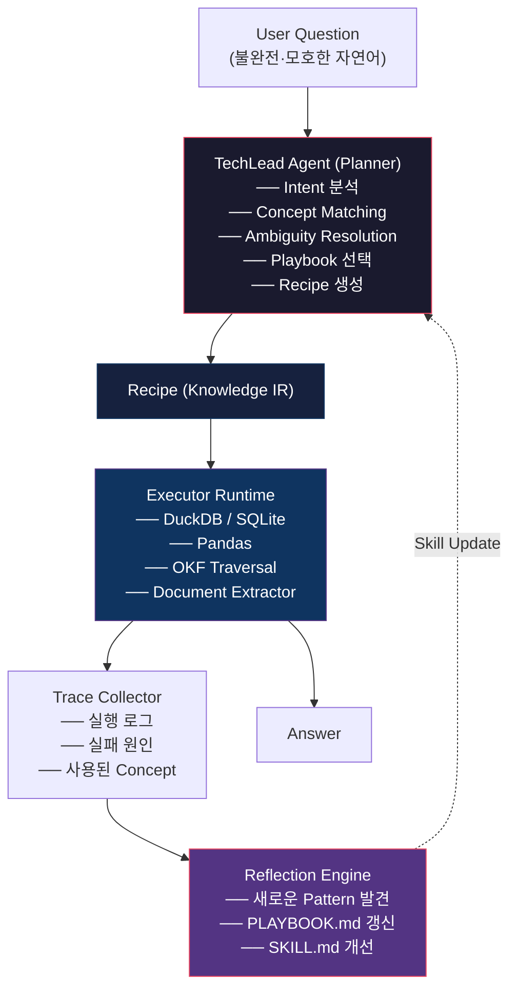
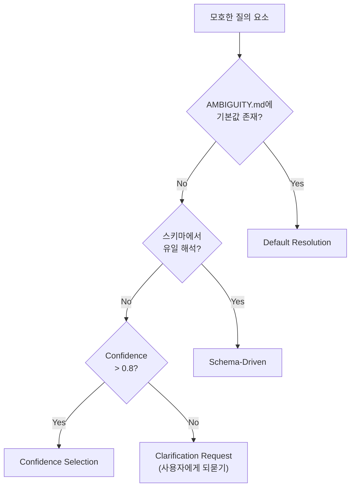
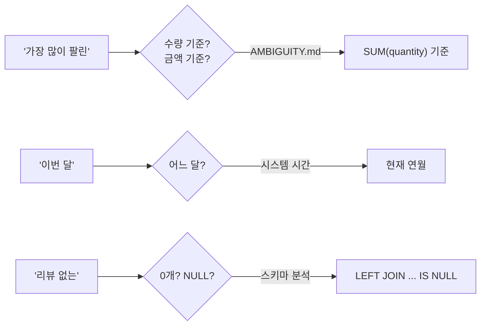
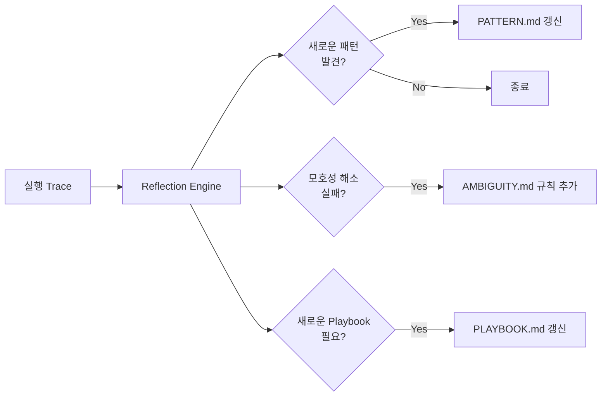

# KnowledgeChef Cognitive Planner — 설계 · 구현 · 평가 문서

> **Author**: TechLead Agent  
> **Date**: 2026-06-29  
> **Status**: RFC (Request for Comments)  
> **Scope**: 자연어 기반 불완전 질의 → Knowledge IR 변환 체계 전반

---

## 목차

1. [문제 정의](#1-문제-정의)
2. [핵심 설계 원칙](#2-핵심-설계-원칙)
3. [아키텍처 개요](#3-아키텍처-개요)
4. [Planner 내부 파이프라인](#4-planner-내부-파이프라인)
5. [모호한 질의 처리 전략](#5-모호한-질의-처리-전략)
6. [Knowledge IR 스키마](#6-knowledge-ir-스키마)
7. [구현 방안](#7-구현-방안)
8. [평가 체계](#8-평가-체계)
9. [점진적 개선 루프](#9-점진적-개선-루프)
10. [로드맵](#10-로드맵)

---

## 1. 문제 정의

### 1.1 해결해야 할 핵심 문제

사용자의 질의는 **완전한 명세가 아니다**. 실제 질의에는 다음과 같은 불완전성이 내재한다:

| 불완전성 유형 | 예시 | 문제 |
|-------------|------|------|
| **생략(Ellipsis)** | "VIP 몇 명?" | "VIP 등급 **고객**이 몇 명인지" 생략됨 |
| **중의성(Ambiguity)** | "가장 많이 팔린 거" | "거"가 상품인지 브랜드인지, "많이"가 수량인지 금액인지 불명확 |
| **암묵적 제약(Implicit Constraint)** | "이번 달 매출" | "이번 달"의 기준일, "매출"은 confirmed 주문만인지 전체인지 |
| **개념 불일치(Concept Mismatch)** | "학생 수" | DB에는 `participants`, `members`, `student_id` 등 다양한 표현 |
| **복합 의도(Multi-intent)** | "VIP 고객은 몇 명이고, 누구야?" | COUNT + LIST 두 가지 의도 동시 |

> [!IMPORTANT]
> 기존 Agent 프레임워크는 Planning을 Prompt 안에 숨겨놓아 독립 테스트가 불가능하다.
> 우리의 접근은 **Planning을 Compiler Front-end로 완전 분리**하여 Executor 없이도
> 계획 능력만 정량적으로 검증할 수 있게 만드는 것이다.

### 1.2 스포츠 감독 비유

```
감독 (Coach)          = Planner Agent (Cognitive Compiler)
선수 (Player)         = Executor (Knowledge VM)
작전판 (Playbook)     = PLAYBOOK.md + PATTERN.md
멘탈 리허설            = Dry-run Validation (Type Checking)
경기 운영              = Agent Loop (Compile → Execute → Reflect)
```

감독은 선수에게 "왼쪽으로 뛰어"라고 즉흥 지시하지 않는다.  
**가용 전력을 분석하고, 여러 전술을 머릿속에서 시뮬레이션한 뒤, 검증된 Playbook을 지시한다.**

---

## 2. 핵심 설계 원칙

### P1. Planner는 실행하지 않는다

Planner는 **Knowledge IR만 생성**한다. SQL 생성 안 함. Python 실행 안 함. DuckDB 호출 안 함.  
이것이 "Compiler Front-end"와 "Back-end"의 분리이다.

### P2. Agent 하나, Skill 다수

Agent를 늘리지 않는다. **Agent는 하나이고, SKILL.md와 PLAYBOOK.md가 진화하는 구조**를 취한다.

### P3. 모호함은 명시적으로 해결한다

중의적·생략형 질의를 LLM의 암묵적 추론에 맡기지 않고, **파이프라인의 각 단계에서 명시적 해소 전략**을 적용한다.

### P4. Planning Benchmark로 정량 평가

Executor 없이도 Planner의 출력(Knowledge IR)만으로 **Planning Accuracy를 측정**할 수 있어야 한다.

### P5. Trace → Reflection → Skill Update

매 실행 후 Trace를 수집하고, Reflection Engine이 **PATTERN.md, PLAYBOOK.md를 자동 갱신**한다.

---

## 3. 아키텍처 개요

### 3.1 5-Component Architecture



### 3.2 데이터 흐름 요약

```
User Question  ──→  [Planner]  ──→  Knowledge IR  ──→  [Executor]  ──→  Answer
                       ↑                                    │
                       │                                    ↓
                  SKILL.md                            Trace Collector
                  PLAYBOOK.md                               │
                  PATTERN.md                                 ↓
                       ↑                            Reflection Engine
                       └────────────────────────────────────┘
```

### 3.3 Re-planning Loop

Executor 실행 중 오류 발생 시, Planner에게 오류 정보와 함께 재계획을 요청한다:

```
Planner → Recipe → Executor → Error!
                                │
                                ▼
                   Planner (+ error context) → Recipe v2 → Executor → Answer
```

최대 재시도: **2회**. 2회 실패 시 사용자에게 명확화 요청.

---

## 4. Planner 내부 파이프라인

Planner는 단일 Agent이지만, 내부는 **7개 모듈의 파이프라인**으로 구성된다.

```
User Question
      │
      ▼
┌─────────────────────────────────────────────┐
│              PLANNER PIPELINE                │
│                                             │
│  ① Intent Recognizer                        │
│       ↓                                     │
│  ② Concept Matcher                          │
│       ↓                                     │
│  ③ Ambiguity Resolver  ← (NEW: 핵심 모듈)    │
│       ↓                                     │
│  ④ Goal Decomposer                         │
│       ↓                                     │
│  ⑤ Strategy Search (Playbook Selection)     │
│       ↓                                     │
│  ⑥ Mental Simulator (Dry-run Validation)    │
│       ↓                                     │
│  ⑦ Recipe Compiler (Knowledge IR 생성)       │
└─────────────────────────────────────────────┘
      │
      ▼
Knowledge IR (Recipe)
```

### 4.1 ① Intent Recognizer

사용자 질의의 **의도(Intent)**를 분류한다.

| Intent | 트리거 키워드 (한국어) | 예시 |
|--------|---------------------|------|
| `COUNT` | 몇 명, 몇 개, 총합, 수 | "VIP 고객은 몇 명?" |
| `LIST` | 누구, 알려줘, 목록, 보여줘 | "가장 비싼 상품 3개 알려줘" |
| `AGGREGATE` | 총, 평균, 합계, 금액 | "총 주문 금액은?" |
| `TOPK` | 가장, 최고, 최다, 제일 | "가장 많이 팔린 상품은?" |
| `EXISTENCE` | 있나, 있어, 존재 | "리뷰가 없는 상품이 있나?" |
| `COMPARE` | 대비, 비교, 차이 | "작년 대비 올해 매출" |
| `TREND` | 추세, 증가, 감소 | "월별 매출 추세" |
| `SUMMARIZE` | 요약, 성과, 정리 | "AI 캡스톤 성과를 요약해줘" |
| `COMPOUND` | A이고 B (복합) | "몇 명이고, 누구야?" |

> **복합 의도** (COMPOUND)의 경우, 하위 Intent 리스트를 생성한다.
> 예: "VIP 고객은 몇 명이고, 누구야?" → `[COUNT, LIST]`

### 4.2 ② Concept Matcher

질의에서 언급된 **도메인 개념(Concept)**을 KB/DB 스키마의 엔터티에 매핑한다.

```
"VIP 고객"     → Concept: Customer  (table: customers)
"비싼 상품"     → Concept: Product   (table: products)
"주문 금액"     → Concept: Order     (table: orders, field: total_amount)
"팔린"          → Concept: OrderItem (table: order_items, field: quantity)
```

매핑 방법 (우선순위):
1. **규칙 기반**: SKILL.md에 정의된 키워드-Concept 매핑
2. **시맨틱 유사도**: Embedding 기반 (동의어·유의어 처리)
3. **LLM 추론**: 위 두 방법이 실패 시 LLM fallback

### 4.3 ③ Ambiguity Resolver (핵심 신규 모듈)

모호한 질의의 **불확실성을 명시적으로 해소**하는 모듈이다.

#### 해소 전략 4가지

| 전략 | 설명 | 적용 조건 |
|------|------|----------|
| **Default Resolution** | 비즈니스 규칙에 따른 기본값 적용 | `AMBIGUITY.md`에 기본값 정의됨 |
| **Schema-Driven Inference** | 스키마 구조에서 유일한 해석 도출 | 후보가 1개일 때 |
| **Confidence-Based Selection** | 후보 중 confidence가 높은 것 선택 | 후보 ≥ 2, 최고 confidence > 0.8 |
| **Clarification Request** | 사용자에게 되묻기 | 후보 ≥ 2, 최고 confidence < 0.8 |

#### AMBIGUITY.md (비즈니스 규칙 기반 기본값)

```markdown
# 모호성 해소 규칙

## 시간 표현
- "이번 달" → 현재 연월 (YYYY-MM)
- "올해" → 현재 연도
- "최근" → 최근 7일

## 주문 상태
- "매출" → status = 'confirmed' OR status = 'delivered' (취소 제외)
- "주문" (단독) → 모든 status
- "주문 금액" → status != 'cancelled'

## 집계 기준
- "가장 많이 팔린" → SUM(quantity) 기준 (금액이 아닌 수량)
- "인기 상품" → SUM(quantity) DESC

## 엔터티 해석
- "고객" → customers 테이블
- "상품", "제품" → products 테이블
- "비싼" → price DESC
```

#### 모호성 해소 흐름



#### 예시: "가장 많이 팔린 거"

```
① Intent: TOPK
② Concept 후보: Product? Brand? Category?
③ Ambiguity Resolver:
   - "팔린 거" → AMBIGUITY.md에 "팔린" → Product 매핑 존재
   - "많이" → AMBIGUITY.md에 SUM(quantity) 기준으로 정의
   - 해소 결과: Product, SUM(quantity) DESC, LIMIT 1
   - resolution_method: "default"
   - confidence: 0.92
```

### 4.4 ④ Goal Decomposer

복합 질의를 **원자적 하위 목표(Sub-goal)**로 분해한다.

```
"VIP 고객은 몇 명이고, 누구야?"
  ↓
SubGoal 1: COUNT customers WHERE grade='VIP'
SubGoal 2: LIST  customers WHERE grade='VIP' → [id, name, email, point_balance]
```

### 4.5 ⑤ Strategy Search (Playbook Selection)

Intent + Concepts 조합으로 **Playbook 라이브러리**에서 최적 전략을 선택한다.

```
Intent: COUNT + Concept: Customer + Filter: grade
  ↓
Playbook Match: "FILTER_AND_COUNT"
  ↓
후보 전략:
  Plan A: SQLite  (cost=2, 정확도=high)
  Plan B: DuckDB  (cost=2, 정확도=high)
  Plan C: Pandas  (cost=3, 정확도=high)
  Plan D: Summary (cost=1, 정확도=medium) ← 기존 요약이 있을 경우
  ↓
선택: Plan A (cost 최소 + 정확도 high)
```

### 4.6 ⑥ Mental Simulator (Dry-run Validation)

Recipe 생성 전, **실행하지 않고 시뮬레이션**한다:

- [ ] 모든 참조 테이블이 스키마에 존재하는가?
- [ ] 필터에 사용된 컬럼이 해당 테이블에 있는가?
- [ ] JOIN 키가 양쪽 테이블에 존재하는가?
- [ ] 선행 Step의 Output이 후행 Step의 Input과 호환되는가?
- [ ] Aggregation 대상 컬럼의 데이터 타입이 적합한가?

```python
# 의사코드
for step in planned_steps:
    for dependency in step.inputs:
        if dependency.source_step not in completed_steps:
            FAIL("의존성 미해결")
        if dependency.output_type != step.expected_input_type:
            FAIL("타입 불일치")
    completed_steps.add(step)
PASS("Mental Rehearsal 통과")
```

### 4.7 ⑦ Recipe Compiler (Knowledge IR 생성)

검증을 통과한 계획을 **Knowledge IR JSON**으로 직렬화한다.

---

## 5. 모호한 질의 처리 전략

### 5.1 생략형 표현 처리

| 생략 유형 | 원문 | 복원 | 방법 |
|----------|------|------|------|
| 주어 생략 | "몇 명?" | "**고객**이 몇 명?" | 직전 컨텍스트 또는 스키마 기반 추론 |
| 목적어 생략 | "가장 비싼 거" | "가장 비싼 **상품**" | `AMBIGUITY.md` 기본값 |
| 시간 생략 | "매출은?" | "**전체 기간** 매출" | 명시 없으면 전체 기간 |
| 조건 생략 | "주문 금액" | "**취소 제외** 주문 금액" | 비즈니스 규칙 |

### 5.2 중의적 표현 처리



### 5.3 대화 컨텍스트 활용 (Multi-turn)

연속 질의에서 이전 컨텍스트를 활용하여 생략을 복원한다:

```
Turn 1: "VIP 고객 몇 명이야?"
  → context: { concept: Customer, filter: grade=VIP }

Turn 2: "그 중에 가장 많이 주문한 사람은?"
  → "그 중에" → 이전 context의 VIP 고객
  → 복원: "VIP 고객 중 가장 많이 주문한 고객은?"
```

---

## 6. Knowledge IR 스키마

### 6.1 Pydantic 모델

```python
# ir_schema.py
from pydantic import BaseModel, Field
from typing import List, Dict, Optional, Union, Literal
from enum import Enum

class IntentType(str, Enum):
    COUNT = "COUNT"
    LIST = "LIST"
    AGGREGATE = "AGGREGATE"
    TOPK = "TOPK"
    EXISTENCE = "EXISTENCE"
    COMPARE = "COMPARE"
    TREND = "TREND"
    SUMMARIZE = "SUMMARIZE"
    COMPOUND = "COMPOUND"

class FilterOperator(str, Enum):
    EQ = "="
    GT = ">"
    LT = "<"
    GTE = ">="
    LTE = "<="
    IN = "IN"
    LIKE = "LIKE"
    IS_NULL = "IS_NULL"
    IS_NOT_NULL = "IS_NOT_NULL"

class Filter(BaseModel):
    field: str
    operator: FilterOperator
    value: Union[str, int, float, List[str], None] = None

class JoinSpec(BaseModel):
    with_resource: str
    on: str                                  # e.g. "customers.id=orders.customer_id"
    type: Literal["INNER", "LEFT", "RIGHT"] = "INNER"

class SortSpec(BaseModel):
    field: str
    direction: Literal["ASC", "DESC"] = "ASC"

class AggregationSpec(BaseModel):
    function: Literal["COUNT", "SUM", "AVG", "MIN", "MAX", "COUNT_DISTINCT"]
    field: str

class DataStep(BaseModel):
    type: Literal["data"] = "data"
    source: str                              # 테이블 또는 파일 경로
    filters: Optional[List[Filter]] = None
    join: Optional[JoinSpec] = None
    group_by: Optional[List[str]] = None
    order_by: Optional[List[SortSpec]] = None
    limit: Optional[int] = None
    projections: Optional[List[str]] = None
    aggregation: Optional[AggregationSpec] = None

class DocumentStep(BaseModel):
    type: Literal["document"] = "document"
    source: str                              # 문서 경로
    operation: Literal["extract", "summarize", "find"] = "extract"
    query: Optional[str] = None              # 문서 내 검색/요약 질의
    extract_sections: Optional[List[str]] = None
    output_format: Literal["text", "bullet_points", "table"] = "text"

class AmbiguityResolution(BaseModel):
    """모호성 해소 과정의 기록"""
    element: str                             # 모호했던 요소
    candidates: List[str]                    # 후보 해석들
    selected: str                            # 선택된 해석
    method: Literal["default", "schema_driven", "confidence", "clarification"]
    confidence: float                        # 해소 신뢰도 (0.0 ~ 1.0)
    rationale: str                           # 선택 이유

class KnowledgeIR(BaseModel):
    """Planner가 생성하는 Knowledge Intermediate Representation"""
    intent: IntentType
    sub_intents: Optional[List[IntentType]] = None    # COMPOUND인 경우
    description: str                                   # 사람이 읽을 수 있는 계획 설명
    concepts: List[str]                                # 관련 도메인 Concepts
    steps: List[Union[DataStep, DocumentStep]]         # 실행 단계
    output_structure: Dict[str, str]                   # 결과 구조
    ambiguity_resolutions: Optional[List[AmbiguityResolution]] = None
    confidence: float = Field(ge=0.0, le=1.0)          # 전체 계획 신뢰도
    playbook_used: Optional[str] = None                # 사용된 Playbook ID
```

### 6.2 예시: Q01 "VIP 고객은 몇 명이고, 누구야?"

```json
{
  "intent": "COMPOUND",
  "sub_intents": ["COUNT", "LIST"],
  "description": "VIP 등급 고객의 수를 세고, 목록을 조회한다",
  "concepts": ["Customer", "Grade"],
  "steps": [
    {
      "type": "data",
      "source": "customers",
      "filters": [
        {"field": "grade", "operator": "=", "value": "VIP"}
      ],
      "projections": ["id", "name", "email", "point_balance"],
      "aggregation": null
    }
  ],
  "output_structure": {
    "count": "integer",
    "list": "array<{id, name, email, point_balance}>"
  },
  "ambiguity_resolutions": [],
  "confidence": 0.98,
  "playbook_used": "FILTER_AND_LIST"
}
```

### 6.3 예시: Q05 "이번 달 매출은 얼마야?" (모호성 포함)

```json
{
  "intent": "AGGREGATE",
  "sub_intents": null,
  "description": "2026년 6월의 확정 주문 총 매출을 계산한다",
  "concepts": ["Order", "Revenue"],
  "steps": [
    {
      "type": "data",
      "source": "orders",
      "filters": [
        {"field": "ordered_at", "operator": "LIKE", "value": "2026-06%"},
        {"field": "status", "operator": "IN", "value": ["confirmed", "delivered", "shipped"]}
      ],
      "aggregation": {"function": "SUM", "field": "total_amount"}
    }
  ],
  "output_structure": {
    "total_revenue": "number",
    "period": "string"
  },
  "ambiguity_resolutions": [
    {
      "element": "이번 달",
      "candidates": ["2026-06", "최근 30일"],
      "selected": "2026-06",
      "method": "default",
      "confidence": 0.95,
      "rationale": "AMBIGUITY.md 규칙: '이번 달' → 현재 연월"
    },
    {
      "element": "매출",
      "candidates": ["전체 주문 금액", "취소 제외 금액"],
      "selected": "취소 제외 금액",
      "method": "default",
      "confidence": 0.93,
      "rationale": "AMBIGUITY.md 규칙: '매출' → status != 'cancelled'"
    }
  ],
  "confidence": 0.91,
  "playbook_used": "TEMPORAL_AGGREGATE"
}
```

---

## 7. 구현 방안

### 7.1 디렉토리 구조

```
kchef/
├── planner/
│   ├── __init__.py
│   ├── pipeline.py          # Planner 메인 파이프라인
│   ├── intent.py            # ① Intent Recognizer
│   ├── concept_matcher.py   # ② Concept Matcher
│   ├── ambiguity.py         # ③ Ambiguity Resolver
│   ├── decomposer.py        # ④ Goal Decomposer
│   ├── playbook.py          # ⑤ Strategy Search
│   ├── simulator.py         # ⑥ Mental Simulator
│   └── compiler.py          # ⑦ Recipe Compiler
├── schema/
│   ├── ir_schema.py         # Knowledge IR Pydantic Models
│   └── system_model.py      # 데이터 스키마 로더
├── executor/
│   ├── __init__.py
│   ├── runtime.py           # Executor 메인
│   ├── sql_backend.py       # SQLite/DuckDB 백엔드
│   └── doc_backend.py       # 문서 처리 백엔드
├── skills/
│   ├── PLAN.md              # Planning Skill
│   ├── PATTERN.md           # Intent 패턴 정의
│   ├── PLAYBOOK.md          # 전략 Playbook
│   └── AMBIGUITY.md         # 모호성 해소 규칙
├── eval/
│   ├── benchmark/           # Planning Benchmark 데이터셋
│   │   ├── q001.yaml
│   │   ├── q002.yaml
│   │   └── ...
│   ├── ir_diff.py           # IR 구조 비교
│   ├── scorer.py            # 다차원 점수 계산
│   └── test_planner.py      # pytest 기반 평가
├── traces/                  # 실행 Trace 저장
└── planner.py          # Agent Loop
```

### 7.2 핵심 Python Skeleton

#### 7.2.1 Planner Pipeline

```python
# kchef/planner/pipeline.py
from schema.ir_schema import KnowledgeIR
from planner.intent import IntentRecognizer
from planner.concept_matcher import ConceptMatcher
from planner.ambiguity import AmbiguityResolver
from planner.decomposer import GoalDecomposer
from planner.playbook import PlaybookEngine
from planner.simulator import MentalSimulator
from planner.compiler import RecipeCompiler

class PlannerPipeline:
    """
    Cognitive Planner: 자연어 질의 → Knowledge IR 변환 파이프라인.
    SQL을 생성하지 않는다. Knowledge IR만 생성한다.
    """
    def __init__(self, system_model: dict, skills_dir: str, llm_client=None):
        self.system_model = system_model     # 스키마 + 비즈니스 규칙
        self.intent_recognizer = IntentRecognizer(skills_dir)
        self.concept_matcher = ConceptMatcher(system_model)
        self.ambiguity_resolver = AmbiguityResolver(skills_dir)
        self.decomposer = GoalDecomposer()
        self.playbook_engine = PlaybookEngine(skills_dir)
        self.simulator = MentalSimulator(system_model)
        self.compiler = RecipeCompiler()
        self.llm = llm_client                # Optional: LLM fallback

    def plan(self, question: str, context: dict = None) -> KnowledgeIR:
        """
        메인 진입점: 질문을 Knowledge IR로 변환한다.

        Args:
            question: 사용자의 자연어 질의 (불완전·모호 가능)
            context: 대화 컨텍스트 (multi-turn 지원)

        Returns:
            KnowledgeIR: 검증된 실행 계획
        """
        # ① Intent 분석
        intent_result = self.intent_recognizer.recognize(question)

        # ② Concept Matching
        concepts = self.concept_matcher.match(question, intent_result)

        # ③ 모호성 해소 (핵심)
        resolved = self.ambiguity_resolver.resolve(
            question=question,
            intent=intent_result,
            concepts=concepts,
            context=context
        )

        # ④ Goal 분해 (복합 의도인 경우)
        sub_goals = self.decomposer.decompose(
            intent=resolved.intent,
            concepts=resolved.concepts,
            constraints=resolved.constraints
        )

        # ⑤ Playbook 선택
        playbook = self.playbook_engine.select(
            intent=resolved.intent,
            concepts=resolved.concepts
        )

        # ⑥ Mental Simulation (Dry-run)
        draft_ir = self.compiler.compile(
            resolved=resolved,
            sub_goals=sub_goals,
            playbook=playbook
        )
        validation = self.simulator.validate(draft_ir)

        if not validation.passed:
            # 검증 실패 시 대안 Playbook으로 재시도
            alt_playbook = self.playbook_engine.select_alternative(
                intent=resolved.intent,
                concepts=resolved.concepts,
                exclude=[playbook.id]
            )
            draft_ir = self.compiler.compile(
                resolved=resolved,
                sub_goals=sub_goals,
                playbook=alt_playbook
            )
            validation = self.simulator.validate(draft_ir)
            if not validation.passed:
                raise PlanningError(f"Mental Rehearsal 실패: {validation.errors}")

        # ⑦ Knowledge IR 최종 출력
        return draft_ir
```

#### 7.2.2 Intent Recognizer

```python
# kchef/planner/intent.py
import re
from dataclasses import dataclass
from typing import List, Optional

@dataclass
class IntentResult:
    primary: str              # 주 Intent (COUNT, LIST, AGGREGATE, ...)
    sub_intents: List[str]    # 복합 의도의 하위 Intent
    confidence: float
    evidence: List[str]       # 판단 근거 키워드

class IntentRecognizer:
    """규칙 기반 + LLM fallback Intent 인식기"""

    # PATTERN.md에서 로드되는 규칙
    PATTERNS = {
        "COUNT":     [r"몇\s*명", r"몇\s*개", r"수는?", r"총\s*수"],
        "LIST":      [r"누구", r"알려줘", r"목록", r"보여줘", r"어떤"],
        "AGGREGATE": [r"총\s*금액", r"평균", r"합계", r"합산", r"얼마"],
        "TOPK":      [r"가장", r"최고", r"최다", r"제일", r"1위"],
        "EXISTENCE": [r"있나", r"있어", r"없는", r"없나"],
        "COMPARE":   [r"대비", r"비교", r"차이"],
        "TREND":     [r"추세", r"증가", r"감소", r"변화"],
        "SUMMARIZE": [r"요약", r"성과", r"정리해"],
    }

    def __init__(self, skills_dir: str):
        # TODO: PATTERN.md 파싱하여 동적 로딩
        pass

    def recognize(self, question: str) -> IntentResult:
        matched = {}
        for intent, patterns in self.PATTERNS.items():
            for pat in patterns:
                if re.search(pat, question):
                    matched.setdefault(intent, []).append(pat)

        if len(matched) == 0:
            # LLM fallback
            return self._llm_fallback(question)
        elif len(matched) == 1:
            intent = list(matched.keys())[0]
            return IntentResult(
                primary=intent,
                sub_intents=[],
                confidence=0.95,
                evidence=matched[intent]
            )
        else:
            # 복합 의도
            intents = list(matched.keys())
            return IntentResult(
                primary="COMPOUND",
                sub_intents=intents,
                confidence=0.90,
                evidence=[v for vs in matched.values() for v in vs]
            )

    def _llm_fallback(self, question: str) -> IntentResult:
        # LLM을 활용한 fallback 로직
        raise NotImplementedError("LLM fallback 미구현")
```

#### 7.2.3 Ambiguity Resolver

```python
# kchef/planner/ambiguity.py
from dataclasses import dataclass, field
from typing import List, Dict, Optional
from schema.ir_schema import AmbiguityResolution

@dataclass
class ResolvedQuery:
    """모호성이 해소된 질의 구조"""
    intent: str
    concepts: List[str]
    constraints: Dict[str, str]
    projections: List[str]
    ambiguity_log: List[AmbiguityResolution] = field(default_factory=list)

class AmbiguityResolver:
    """
    생략형·중의적 표현을 명시적으로 해소한다.

    해소 우선순위:
    1. AMBIGUITY.md 규칙 (기본값)
    2. 스키마 기반 추론 (유일 후보)
    3. Confidence 기반 선택 (복수 후보, 최고 > 0.8)
    4. 사용자 되묻기 (복수 후보, 최고 < 0.8)
    """

    # AMBIGUITY.md에서 로드되는 규칙
    DEFAULT_RULES = {
        # 시간 표현
        "이번 달": {"resolve_to": "current_month", "method": "default"},
        "올해":    {"resolve_to": "current_year",  "method": "default"},
        "최근":    {"resolve_to": "last_7_days",   "method": "default"},

        # 비즈니스 용어
        "매출":    {"resolve_to": "status_not_cancelled", "method": "default"},
        "팔린":    {"resolve_to": "SUM(quantity)",        "method": "default"},
        "비싼":    {"resolve_to": "price_DESC",           "method": "default"},

        # 엔터티 기본 매핑
        "거":      {"resolve_to": "Product", "method": "default"},  # "비싼 거" → 상품
    }

    def __init__(self, skills_dir: str):
        # TODO: AMBIGUITY.md 파싱하여 동적 로딩
        pass

    def resolve(self, question: str, intent, concepts, context=None) -> ResolvedQuery:
        ambiguity_log = []

        # 1. 시간 표현 해소
        constraints = {}
        for temporal_key in ["이번 달", "올해", "최근"]:
            if temporal_key in question:
                rule = self.DEFAULT_RULES[temporal_key]
                constraints["temporal"] = rule["resolve_to"]
                ambiguity_log.append(AmbiguityResolution(
                    element=temporal_key,
                    candidates=[rule["resolve_to"], "전체 기간"],
                    selected=rule["resolve_to"],
                    method="default",
                    confidence=0.95,
                    rationale=f"AMBIGUITY.md 규칙: '{temporal_key}' → {rule['resolve_to']}"
                ))

        # 2. 생략된 목적어 복원
        # TODO: "가장 비싼 거" → "가장 비싼 상품"

        # 3. 중의적 비즈니스 용어 해소
        for term, rule in self.DEFAULT_RULES.items():
            if term in question and term not in ["이번 달", "올해", "최근"]:
                ambiguity_log.append(AmbiguityResolution(
                    element=term,
                    candidates=[rule["resolve_to"], "alternative"],
                    selected=rule["resolve_to"],
                    method=rule["method"],
                    confidence=0.90,
                    rationale=f"AMBIGUITY.md 규칙 적용"
                ))

        return ResolvedQuery(
            intent=intent.primary,
            concepts=[c.name for c in concepts] if hasattr(concepts[0], 'name') else concepts,
            constraints=constraints,
            projections=[],  # 이후 Playbook에서 결정
            ambiguity_log=ambiguity_log
        )
```

#### 7.2.4 planner ( Orchestrator Agent Loop)

```python
# kchef/planner-agent.py
from planner.pipeline import PlannerPipeline
from executor.runtime import ExecutorRuntime
from schema.ir_schema import KnowledgeIR

class CognitiveOS:
    """
    Knowledge-Chef의 메인 Agent Loop.
    
    Planner → Recipe → Executor → (Trace → Reflection)
    """
    MAX_RETRIES = 2

    def __init__(self, system_model, skills_dir, llm_client=None):
        self.planner = PlannerPipeline(system_model, skills_dir, llm_client)
        self.executor = ExecutorRuntime(system_model)
        self.traces = []

    def ask(self, question: str, context: dict = None) -> dict:
        # Phase 1: Planning (Mental Rehearsal)
        ir = self.planner.plan(question, context)
        print(f"[Planner] Generated IR: {ir.intent} / {ir.description}")
        print(f"[Planner] Confidence: {ir.confidence}")
        if ir.ambiguity_resolutions:
            for ar in ir.ambiguity_resolutions:
                print(f"  ⚡ Resolved '{ar.element}' → '{ar.selected}' ({ar.method})")

        # Phase 2: Execution
        for attempt in range(self.MAX_RETRIES + 1):
            try:
                result = self.executor.execute(ir)
                self._collect_trace(question, ir, result, success=True)
                return result
            except Exception as e:
                print(f"[Executor] Error (attempt {attempt+1}): {e}")
                if attempt < self.MAX_RETRIES:
                    # Re-planning with error context
                    ir = self.planner.plan(
                        question,
                        context={**(context or {}), "error": str(e), "failed_ir": ir.dict()}
                    )
                else:
                    self._collect_trace(question, ir, None, success=False, error=str(e))
                    return {"error": f"실행 실패: {e}", "ir": ir.dict()}

    def _collect_trace(self, question, ir, result, success, error=None):
        self.traces.append({
            "question": question,
            "ir": ir.dict(),
            "result": result,
            "success": success,
            "error": error
        })
```

---

## 8. 평가 체계

### 8.1 평가 원칙

> [!TIP]
> **Executor 없이 Planner만 평가한다.**
> Compiler Front-end가 올바른 AST(= Knowledge IR)를 생성하는지 검증하는 것이
> Back-end(코드 생성)와 독립적인 것과 같은 이치이다.

### 8.2 평가 데이터셋 구조

각 테스트 케이스는 `question + schema_context + expected_ir` 삼중체(triple)로 구성된다.

```yaml
# eval/benchmark/q001.yaml
id: Q001
question: "VIP 고객은 몇 명이고, 누구야?"
difficulty: easy
ambiguity_type: null  # none | ellipsis | polysemy | implicit_constraint

schema_context: |
  customers(id, name, email, phone, grade, point_balance, is_active, created_at)
  products(id, name, brand, sku, price, cost_price, stock_qty, is_active, created_at)
  orders(id, order_number, customer_id, status, total_amount, ordered_at)
  order_items(id, order_id, product_id, quantity, unit_price, subtotal)

expected_ir:
  intent: COMPOUND
  sub_intents: [COUNT, LIST]
  concepts: [Customer, Grade]
  steps:
    - type: data
      source: customers
      filters:
        - field: grade
          operator: "="
          value: VIP
      projections: [id, name, email, point_balance]
  output_structure:
    count: integer
    list: "array<{id, name, email, point_balance}>"
  confidence_min: 0.90
```

```yaml
# eval/benchmark/q005.yaml
id: Q005
question: "이번 달 매출은 얼마야?"
difficulty: medium
ambiguity_type: implicit_constraint

schema_context: |
  (동일)

expected_ir:
  intent: AGGREGATE
  concepts: [Order, Revenue]
  steps:
    - type: data
      source: orders
      filters:
        - field: ordered_at
          operator: LIKE
          value: "2026-06%"
        - field: status
          operator: "!="
          value: cancelled
      aggregation:
        function: SUM
        field: total_amount
  ambiguity_resolutions_expected:
    - element: "이번 달"
      selected: "2026-06"
    - element: "매출"
      selected: "status != cancelled"
```

### 8.3 평가 지표 (다차원 Scoring)

| 차원 | 지표 | 설명 | 산출 방법 |
|------|------|------|----------|
| **Syntax** | Schema Validity | IR이 Pydantic 스키마를 준수하는가? | JSON parse + validation (0/1) |
| **Intent** | Intent Accuracy | 의도 분류가 정확한가? | exact match (0/1) |
| **Concept** | Concept F1 | 올바른 Concept을 식별했는가? | set-based precision/recall |
| **Source** | Source Accuracy | 올바른 테이블/문서를 선택했는가? | exact match per step (0/1) |
| **Filter** | Filter F1 | 필터 조건이 동등한가? | (field, op, value) triple set 비교 |
| **Projection** | Projection F1 | 출력 필드가 일치하는가? | set comparison |
| **Aggregation** | Aggregation Accuracy | 집계 함수와 대상이 맞는가? | exact match (0/1) |
| **Join** | Join Accuracy | 조인 관계가 올바른가? | exact match (0/1) |
| **Ambiguity** | Ambiguity Resolution Rate | 모호성을 올바르게 해소했는가? | 해소 건 중 정답 비율 |
| **Overall** | Planning F1 | 위 지표의 매크로 평균 | weighted average |

### 8.4 평가 스크립트

```python
# kchef/eval/scorer.py
from dataclasses import dataclass
from typing import Dict, List, Set, Tuple

@dataclass
class PlanningScore:
    schema_valid: bool
    intent_correct: bool
    concept_precision: float
    concept_recall: float
    concept_f1: float
    source_correct: bool
    filter_f1: float
    projection_f1: float
    aggregation_correct: bool
    join_correct: bool
    ambiguity_resolution_rate: float
    overall_f1: float

class PlanningScorer:
    """Knowledge IR의 다차원 구조 비교 점수 산출"""

    def score(self, actual_ir: dict, expected_ir: dict) -> PlanningScore:
        # 1. Schema Validity
        schema_valid = self._validate_schema(actual_ir)

        # 2. Intent Accuracy
        intent_correct = actual_ir.get("intent") == expected_ir.get("intent")

        # 3. Concept F1
        actual_concepts = set(actual_ir.get("concepts", []))
        expected_concepts = set(expected_ir.get("concepts", []))
        cp, cr, cf = self._set_f1(actual_concepts, expected_concepts)

        # 4. Source Accuracy
        actual_sources = {s.get("source") for s in actual_ir.get("steps", [])}
        expected_sources = {s.get("source") for s in expected_ir.get("steps", [])}
        source_correct = actual_sources == expected_sources

        # 5. Filter F1
        actual_filters = self._extract_filter_set(actual_ir)
        expected_filters = self._extract_filter_set(expected_ir)
        _, _, filter_f1 = self._set_f1(actual_filters, expected_filters)

        # 6. Projection F1
        actual_proj = self._extract_projections(actual_ir)
        expected_proj = self._extract_projections(expected_ir)
        _, _, proj_f1 = self._set_f1(actual_proj, expected_proj)

        # 7. Aggregation Accuracy
        agg_correct = self._compare_aggregation(actual_ir, expected_ir)

        # 8. Join Accuracy
        join_correct = self._compare_joins(actual_ir, expected_ir)

        # 9. Ambiguity Resolution Rate
        amb_rate = self._ambiguity_score(actual_ir, expected_ir)

        # Overall F1 (weighted average)
        scores = [
            1.0 if intent_correct else 0.0,
            cf,
            1.0 if source_correct else 0.0,
            filter_f1,
            proj_f1,
            1.0 if agg_correct else 0.0,
            1.0 if join_correct else 0.0,
            amb_rate
        ]
        overall = sum(scores) / len(scores)

        return PlanningScore(
            schema_valid=schema_valid,
            intent_correct=intent_correct,
            concept_precision=cp, concept_recall=cr, concept_f1=cf,
            source_correct=source_correct,
            filter_f1=filter_f1,
            projection_f1=proj_f1,
            aggregation_correct=agg_correct,
            join_correct=join_correct,
            ambiguity_resolution_rate=amb_rate,
            overall_f1=overall
        )

    def _set_f1(self, actual: Set, expected: Set) -> Tuple[float, float, float]:
        if not expected and not actual:
            return 1.0, 1.0, 1.0
        if not expected or not actual:
            return 0.0, 0.0, 0.0
        tp = len(actual & expected)
        precision = tp / len(actual) if actual else 0
        recall = tp / len(expected) if expected else 0
        f1 = 2 * precision * recall / (precision + recall) if (precision + recall) else 0
        return precision, recall, f1

    def _extract_filter_set(self, ir: dict) -> Set[Tuple]:
        filters = set()
        for step in ir.get("steps", []):
            for f in step.get("filters", []) or []:
                filters.add((f["field"], f["operator"], str(f["value"])))
        return filters

    def _extract_projections(self, ir: dict) -> Set[str]:
        proj = set()
        for step in ir.get("steps", []):
            for p in step.get("projections", []) or []:
                proj.add(p)
        return proj

    def _compare_aggregation(self, actual: dict, expected: dict) -> bool:
        for a_step, e_step in zip(actual.get("steps", []), expected.get("steps", [])):
            a_agg = a_step.get("aggregation")
            e_agg = e_step.get("aggregation")
            if a_agg != e_agg:
                return False
        return True

    def _compare_joins(self, actual: dict, expected: dict) -> bool:
        for a_step, e_step in zip(actual.get("steps", []), expected.get("steps", [])):
            if a_step.get("join") != e_step.get("join"):
                return False
        return True

    def _ambiguity_score(self, actual: dict, expected: dict) -> float:
        expected_ambs = expected.get("ambiguity_resolutions_expected", [])
        if not expected_ambs:
            return 1.0
        actual_ambs = actual.get("ambiguity_resolutions", [])
        if not actual_ambs:
            return 0.0
        correct = 0
        for ea in expected_ambs:
            for aa in actual_ambs:
                if aa.get("element") == ea.get("element") and \
                   aa.get("selected") == ea.get("selected"):
                    correct += 1
                    break
        return correct / len(expected_ambs)

    def _validate_schema(self, ir: dict) -> bool:
        try:
            from schema.ir_schema import KnowledgeIR
            KnowledgeIR(**ir)
            return True
        except Exception:
            return False
```

### 8.5 pytest 통합

```python
# kchef/eval/test_planner.py
import pytest
import yaml
import glob
from planner.pipeline import PlannerPipeline
from eval.scorer import PlanningScorer

# 벤치마크 로딩
BENCHMARKS = []
for path in sorted(glob.glob("eval/benchmark/q*.yaml")):
    with open(path) as f:
        BENCHMARKS.append(yaml.safe_load(f))

scorer = PlanningScorer()

@pytest.fixture
def planner():
    system_model = load_system_model()  # 스키마 로드
    return PlannerPipeline(system_model, "skills/")

@pytest.mark.parametrize("case", BENCHMARKS, ids=[b["id"] for b in BENCHMARKS])
def test_planner_ir_quality(planner, case):
    """각 벤치마크 질의에 대해 Planner IR 품질을 검증한다."""
    actual_ir = planner.plan(case["question"])
    score = scorer.score(actual_ir.dict(), case["expected_ir"])

    # 최소 기준
    assert score.schema_valid, f"[{case['id']}] IR이 스키마를 위반"
    assert score.intent_correct, f"[{case['id']}] Intent 불일치"
    assert score.source_correct, f"[{case['id']}] Source 불일치"
    assert score.overall_f1 >= 0.7, f"[{case['id']}] Overall F1 {score.overall_f1:.2f} < 0.70"

@pytest.mark.parametrize("case",
    [b for b in BENCHMARKS if b.get("ambiguity_type")],
    ids=[b["id"] for b in BENCHMARKS if b.get("ambiguity_type")]
)
def test_ambiguity_resolution(planner, case):
    """모호성이 있는 질의에 대해 해소 능력을 검증한다."""
    actual_ir = planner.plan(case["question"])
    score = scorer.score(actual_ir.dict(), case["expected_ir"])

    assert score.ambiguity_resolution_rate >= 0.8, \
        f"[{case['id']}] 모호성 해소율 {score.ambiguity_resolution_rate:.2f} < 0.80"
```

### 8.6 테스트 레벨 체계

| Level | 이름 | 범위 | Executor 필요? |
|-------|------|------|---------------|
| **L1** | Unit Test | Intent, Concept, Ambiguity 개별 모듈 | ❌ |
| **L2** | Contract Test | Planner 전체 → IR 구조 검증 | ❌ |
| **L3** | Integration Test | Planner + Mock Executor → 최종 응답 | ⚠️ Mock |
| **L4** | E2E Test | Full Pipeline → 실제 DB 응답 정확도 | ✅ |

> [!NOTE]
> L1~L2는 **Executor 없이 0.1초 이내** 완료되며 CI에 통합 가능.
> LLM 교체 시에도 동일한 테스트 케이스와 기대 IR로 새 모델의 Planning 능력을 즉시 측정한다.

---

## 9. 점진적 개선 루프

### 9.1 Trace → Reflection → Skill Update



### 9.2 Planning Gym 구조

```
planning-gym/
├── datasets/
│   ├── retail/          # TechShop (현재 도메인)
│   │   ├── schema.yaml
│   │   ├── concepts.yaml
│   │   ├── questions.yaml
│   │   └── expected_ir/
│   ├── university/      # 학사 관리 도메인
│   ├── finance/         # 금융 도메인
│   └── healthcare/      # 의료 도메인
│
├── skills/              # 도메인 공유 Skills
│   ├── intent.md
│   ├── aggregation.md
│   ├── join.md
│   ├── temporal.md
│   └── ranking.md
│
├── planner/             # 도메인 무관 Planner 엔진
│   ├── parser.py
│   ├── concept_matcher.py
│   ├── playbook.py
│   ├── recipe.py
│   └── validator.py
│
├── evaluator/           # 범용 평가 도구
│   ├── ir_diff.py
│   ├── score.py
│   └── benchmark.py
│
└── traces/              # 실행 이력
```

> [!TIP]
> **Knowledge IR은 도메인에 독립적**이다.
> Retail → University → Finance 도메인을 바꿔도 IR 스키마는 동일하며,
> Executor만 SQL/DuckDB/Pandas/OKF Traversal 등으로 교체하면 된다.
> 이것이 "Compiler Front-end의 이식성(Portability)"이다.

---

## 10. 로드맵

### Phase 1: Foundation (Week 1-2)

- [ ] `ir_schema.py` 확정 (KnowledgeIR Pydantic 모델)
- [ ] `AMBIGUITY.md` 작성 (TechShop 도메인 기본 규칙 20개)
- [ ] `PATTERN.md` 작성 (Intent 패턴 8개 유형)
- [ ] `PLAYBOOK.md` 작성 (전략 Playbook 10개)
- [ ] Benchmark 데이터셋 10개 작성 (Q001~Q010)

### Phase 2: Planner Core (Week 3-4)

- [ ] Intent Recognizer 구현 (규칙 기반)
- [ ] Concept Matcher 구현 (키워드 + 유사도)
- [ ] Ambiguity Resolver 구현 (4-strategy 해소)
- [ ] Mental Simulator 구현 (Dry-run validation)
- [ ] Recipe Compiler 구현 (IR 직렬화)
- [ ] L1/L2 테스트 통과율 **80%** 달성

### Phase 3: Execution + Eval (Week 5-6)

- [ ] Executor Runtime 구현 (SQLite 백엔드)
- [ ] Scoring 파이프라인 완성
- [ ] 모호성 포함 벤치마크 10개 추가 (Q011~Q020)
- [ ] L2 Contract Test 통과율 **90%** 달성

### Phase 4: Reflection + Gym (Week 7-8)

- [ ] Trace Collector 구현
- [ ] Reflection Engine 프로토타입
- [ ] Planning Gym 멀티 도메인 확장 (university)
- [ ] L4 E2E 테스트 통과율 **85%** 달성

---

> [!IMPORTANT]
> **핵심 차별점**: 기존 Agent는 Planning을 Prompt에 숨겨 블랙박스이지만,
> 우리는 **Planning을 Compiler Front-end로 분리**하여:
> 1. Executor 없이 독립 평가 가능
> 2. LLM 교체 시 동일 벤치마크로 즉시 비교 가능
> 3. SKILL.md, PLAYBOOK.md, AMBIGUITY.md가 **정량적 개선의 레버**가 됨
> 4. 모호한 질의의 해소 과정이 **추적 가능(Traceable)**하고 **감사 가능(Auditable)**함
