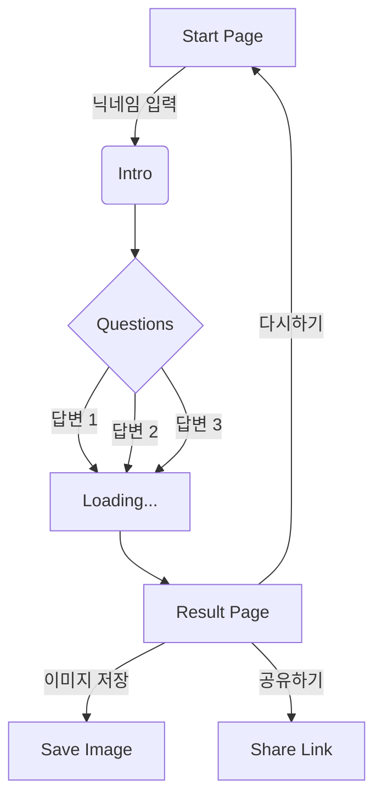

# 개발자 성향 테스트 기획서 (Ver 2.0 - 바이럴 에디션)

## 1. 개요
**"개발자 단톡방 공유각 1위 목표"**
단순한 성향 분석을 넘어, 개발자라면 누구나 '피식'할 수 있는 **B급 감성**과 **찐 개발 문화(Meme)**를 녹여낸 콘텐츠입니다. 100만 트래픽을 위한 '공감'과 '공유'에 초점을 맞췄습니다.

## 2. 개발자 유형 (8가지) - 바이럴 페르소나 적용
기존의 딱딱한 유형을 버리고, 개발자 커뮤니티에서 통하는 '밈(Meme)'스러운 네이밍으로 변경했습니다.

1.  **div 태그 조물주 (프론트엔드)**: "이거 1px 틀어졌는데요?" 모니터에 자를 대고 다니는 픽셀 변태. 사용자가 못 느껴도 나는 느낀다.
2.  **연금술사형 흑마법사 (스파게티 코드)**: "어? 이게 왜 돌아가지?" 본인도 해석 불가능한 코드로 기적을 행함. 유지보수 담당자에겐 재앙 그 자체.
3.  **JSON 깎는 노인 (백엔드)**: "화면은 장식일 뿐." 터미널의 검은 화면과 흰 글씨에서 마음의 안정을 찾음. API 명세서가 그들의 성경.
4.  **천수관음 풀스택 예비군 (풀스택)**: "프론트? 백엔드? 그냥 제가 다 할게요." 다 할 줄 알아서 모든 똥을 치우게 되는 비운의 실력자.
5.  **스크립트 자동화 빌런 (DevOps)**: "3번 이상 반복하면 죄악." 커피 타는 것도 쉘 스크립트로 짤 기세. 마우스 쓰는 걸 혐오함.
6.  **잔디심기 조경사 (커뮤니티형)**: "1일 1커밋 안 하면 금단현상 옴." 코딩보다 깃허브 초록색 잔디 관리에 더 진심임.
7.  **찍먹 전문 힙스터 (얼리어답터)**: "아직도 React 써요? 요즘은 OOO가 대세인데." 프로젝트 완성보다 기술 스택 정하는 게 더 즐거움.
8.  **돌다리도 두드려 깨는 선비 (안정지향형)**: "버전 올리지 마세요." 검증되지 않은 라이브러리는 절대 `npm install` 하지 않음.
9.  **0과 1의 망령 (임베디드/C언어)**: "가비지 컬렉터? 나약한 소리." 메모 주소를 직접 따야 잠이 옴. 포인터와 썸 타는 중.

## 3. User Flow (화면 흐름)
1.  **시작 화면 (Intro)**
    *   메인 카피: **"너, 코딩 그렇게 하는거 아니야."**
    *   서브 카피: "100만 라인 스파게티 코드 속에서 나의 '개발 본캐' 찾기"
    *   **닉네임 입력**: "git config user.name 입력 (닉네임)"
    *   '빌드 시작하기(Start)' 버튼
    *   참여자 수: "현재 404,111명의 코더가 자신의 정체를 깨달았습니다." (404 에러코드 활용)
2.  **질문 화면 (Question)**
    *   총 12문항 (개발자 밈 적극 활용)
    *   진행률: '컴파일 진행률'로 표기
    *   답변 선택지: 3개 (확실한 성향 차이 + B급 드립)
3.  **로딩 화면 (Loading)**
    *   문구 로테이션:
        *   "Stack Overflow에서 복붙할 코드를 찾는 중..."
        *   "node_modules 폴더의 블랙홀을 탐사하는 중..."
        *   "원인 모를 에러와 협상하는 중..."
        *   "커피를 코드로 변환하는 중..."
4.  **결과 화면 (Result)**
    *   유형 타이틀 ("당신은... 0과 1의 망령입니다")
    *   핵심 밈 이미지 (짤방 스타일의 고퀄 일러스트)
    *   **팩트 폭력 설명**: 겉멋 든 설명 대신 뼈 때리는 특징 나열.
    *   **환상의 짝꿍 (Merge 가능)** / **환장의 짝꿍 (Conflict 발생)**
    *   **이미지 저장**: "명예의 전당(또는 현상수배서) 저장"
    *   공유하기: "나만 당할 수 없다. 단톡방에 던지기"



## 4. 콘텐츠 데이터 (JSON 구조 예시)

`src/data/content.json`

```json
{
  "meta": {
    "title": "개발자 본캐 찾기 테스트",
    "description": "당신의 코딩 습관으로 알아보는 소름돋는 개발자 유형 분석"
  },
  "questions": [
    {
      "id": 1,
      "question": "프로젝트 시작! 폴더 구조를 어떻게 잡을까?",
      "options": [
        {
          "text": "폴더링은 예술이다. src/components/atoms... 아토믹 디자인 패턴으로 완벽하게 설계한다.",
          "score": { "FE": 1, "BE": 0, "LOW": 0 }
        },
        {
          "text": "일단 main.js 하나 만들고 코드를 때려 박는다. 나중에 나누면 됨.",
          "score": { "FE": 0, "BE": 0, "LOW": 0, "CHAOS": 1 }
        },
        {
          "text": "DB 스키마부터 짠다. 데이터가 곧 법이다.",
          "score": { "FE": 0, "BE": 1, "LOW": 0 }
        }
      ]
    },
    {
      "id": 2,
      "question": "치명적인 버그 발생! 로그를 확인해보니 'undefined'가 떴다.",
      "options": [
        {
          "text": "침착하게 크롬 개발자 도구(F12)를 켜고 네트워크 탭과 콘솔을 분석한다.",
          "score": { "FE": 1, "PRACTICAL": 1 }
        },
        {
          "text": "console.log('aaaa'), console.log('1111') 도배해서 어디까지 실행됐는지 본다.",
          "score": { "CHAOS": 1, "PRACTICAL": 1 }
        },
        {
          "text": "GDB나 디버거를 연결해서 어셈블리 단까지 까본다. undefined의 근원을 찾아서...",
          "score": { "LOW": 1, "THEORETICAL": 1 }
        }
      ]
    },
    {
      "id": 3,
      "question": "동료가 코드 리뷰 요청(PR)을 보냈다. 나는?",
      "options": [
        {
          "text": "변수명이 마음에 안 든다. 띄어쓰기, 줄바꿈, 컨벤션 하나하나 지적한다.",
          "score": { "FE": 0, "STRICT": 1 }
        },
        {
          "text": "\"LGTM! (Looks Good To Me)\" 일단 승인하고 칼퇴한다.",
          "score": { "CHAOS": 1, "FLEXIBLE": 1 }
        },
        {
          "text": "로직의 허점을 발견했다. '이 부분 동시성 이슈 발생할 것 같은데요?'",
          "score": { "BE": 1, "THEORETICAL": 1 }
        }
      ]
    },
    {
      "id": 4,
      "question": "키보드를 산다면?",
      "options": [
        {
          "text": "알록달록 RGB LED가 번쩍이는 게이밍 키보드. 코딩은 기세다.",
          "score": { "FE": 1, "SENSORY": 1 }
        },
        {
          "text": "해피해킹(HHKB) 무각. 키캡에 글자가 없어야 진정한 고수.",
          "score": { "LOW": 1, "INTUITIVE": 1 }
        },
        {
          "text": "회사에서 주는 기본 멤브레인 키보드. 장비 탓 하지 않는다.",
          "score": { "BE": 1, "PRACTICAL": 1 }
        }
      ]
    },
    {
      "id": 5,
      "question": "새로운 기술 스택 도입을 고민할 때?",
      "options": [
        {
          "text": "Github Star 수 1위, 트렌디한 기술! 일단 써보자! (Beta 버전도 환영)",
          "score": { "HIPSTER": 1, "NEW": 1 }
        },
        {
          "text": "10년 전부터 쓰던 거 씁시다. 안정성이 최고.",
          "score": { "STABLE": 1, "OLD": 1 }
        },
        {
          "text": "내가 라이브러리를 직접 만든다. 남의 코드는 믿을 수 없다.",
          "score": { "LOW": 1, "DEVOPS": 1 }
        }
      ]
    },
    {
      "id": 6,
      "question": "단순 반복 작업이 생겼다. (엑셀 1000줄 수정 등)",
      "options": [
        {
          "text": "노동요(BGM) 틀고 무지성으로 빠르게 ctrl+c, ctrl+v 한다.",
          "score": { "MANUAL": 1 }
        },
        {
          "text": "파이썬이나 쉘 스크립트를 짠다. 스크립트 짜는데 1시간 걸려도 손으로 하기 싫다.",
          "score": { "DEVOPS": 1, "AUTO": 1 }
        },
        {
          "text": "인턴이나 후배를 부른다. \"이거 좋은 경험이 될 거야.\"",
          "score": { "BE": 0, "FE": 0, "BOSS": 1 }
        }
      ]
    }
  ],
  "results": [
    {
      "id": "fe_god",
      "name": "div 태그 조물주",
      "image": "/images/result_fe_meme.png",
      "subtitle": "픽셀 강박증 환자",
      "description": "당신은 모니터의 픽셀 하나하나를 제어하는 조물주입니다. UI가 1px이라도 어긋나면 호흡곤란이 오며, 디자이너와 영혼의 파트너(혹은 원수)가 됩니다. '사용자 경험'이라는 단어를 입에 달고 삽니다.",
      "traits": ["#1px의_집착", "#CSS는_예술", "#반응형_성애자"],
      "match": {
        "best": "be_ghost",
        "worst": "chaos_magician"
      }
    },
    {
      "id": "be_ghost",
      "name": "JSON 깎는 노인",
      "image": "/images/result_be_meme.png",
      "subtitle": "서버실의 유령",
      "description": "화려한 화면 따위는 관심 없습니다. 오직 데이터의 흐름과 서버의 안정성만이 당신을 미소 짓게 합니다. 당신의 코드는 보이지 않는 곳에서 세상을 움직입니다. 프론트엔드 개발자가 '데이터 이상한데요?'라고 하면 화가 납니다.",
      "traits": ["#API명세서가_법", "#트래픽_방어", "#쿼리_최적화"],
      "match": {
        "best": "fe_god",
        "worst": "chaos_magician"
      }
    },
    {
      "id": "chaos_magician",
      "name": "연금술사형 흑마법사",
      "image": "/images/result_chaos_meme.png",
      "subtitle": "돌아가면 장땡",
      "description": "당신의 코드는 아무도 이해할 수 없지만, 기적처럼 돌아갑니다. 에러가 나면 try-catch로 감싸버리고, 버그를 기능(Feature)이라고 우깁니다. 천재거나 미치광이 둘 중 하나입니다.",
      "traits": ["#스파게티_장인", "#배포가_곧_테스트", "#나만_아는_변수명"],
      "match": {
        "best": "fullstack_slave",
        "worst": "strict_scholar"
      }
    },
    {
      "id": "script_villain",
      "name": "스크립트 자동화 빌런",
      "image": "/images/result_devops_meme.png",
      "subtitle": "효율성 변태",
      "description": "단순 반복 작업을 죽기보다 싫어합니다. 5분 걸릴 일을 자동화하겠다고 5시간 동안 스크립트를 짜는 기행을 벌입니다. 마우스를 뽑아버리고 터미널만 쓰고 싶어 합니다.",
      "traits": ["#Bash_Master", "#모든걸_자동화", "#CI/CD_중독"],
      "match": {
        "best": "fullstack_slave",
        "worst": "manual_worker"
      }
    },
    {
      "id": "low_level_ghost",
      "name": "0과 1의 망령",
      "image": "/images/result_low_meme.png",
      "subtitle": "메모리 집착남",
      "description": "요즘 것들이 쓰는 '편리한 언어'는 나약하다고 생각합니다. 직접 메모리를 할당하고 해제해야 살아있음을 느낍니다. 최적화되지 않은 코드를 보면 두드러기가 납니다.",
      "traits": ["#C언어_네이티브", "#포인터_연산", "#임베디드"],
      "match": {
        "best": "be_ghost",
        "worst": "fe_god"
      }
    }
  ]
}
```
