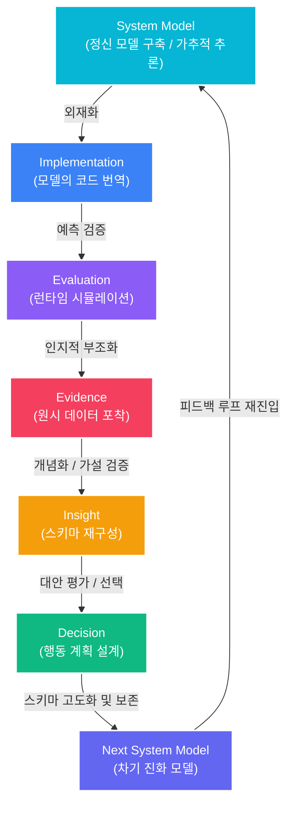

# 인지적 개발 과정 분석 보고서: Cognitive Dev-Loop

본 보고서는 `01-hello-antigravity` 실습 과정을 개발자의 인지 과학적 사고 흐름(Cognitive Process) 및 인식론적 루프(Epistemic Loop) 관점에서 분석한 결과입니다. 안티그래비티 개발 루프는 단순한 태스크 실행 단계를 넘어, 개발자와 AI 에이전트의 **정신 모델(Mental Model) 동기화와 인지 부하 분산**을 극대화하는 프레임워크로 작동합니다.

---

## 1. 인지적 개발 루프의 구조적 도식 (Mermaid)

---

## 2. 각 단계별 인지 작용 및 hello-antigravity 실습 매핑

### Step 1: System Model (시스템 모델)
- **인지 작용**: **추상적 표상 형성 (Mental Representation) & 가추적 추론 (Abductive Reasoning)**
  - 개발자가 해결할 문제의 요건을 바탕으로 이상적인 시스템의 작동 모델을 두뇌 속 메타 스키마로 설계합니다.
- **인지 부하 및 AI 지원**:
  - 초기 기획 시 발생할 수 있는 막대한 설계 자유도로 인한 혼란을 줄이기 위해, AI 에이전트와 `Implementation_Plan.md`를 협의함으로써 정신 모델을 명시적 텍스트로 **동기화(Synchronization)**합니다.
- **실습 사례**: 타이머 구조 설계서 기획 프롬프트 발송 및 아키텍처 제약 설정.

### Step 2: Implementation (코드 구현)
- **인지 작용**: **모델의 외재화 (Externalization)**
  - 내면화된 정신 모델을 프로그래밍 언어의 엄격한 구문 규칙(Syntax Rules)에 따라 물리적인 코드로 번역하여 파일에 투사합니다. 작동 기억(Working Memory) 사용량이 최고조에 달합니다.
- **인지 부하 및 AI 지원**:
  - 구문 작성 오류와 보일러플레이트 작성으로 인한 인지적 피로를 방지하기 위해, AI 에이전트가 변수 선언 및 인터랙션 리스너를 자동 구현하여 인지 부하를 분산시킵니다.
- **실습 사례**: `hello.py` 생성 및 `script.js` 내 `Timer` 클래스 생성.

### Step 3: Evaluation (평가 및 검증)
- **인지 작용**: **예측 모델 검증 (Predictive Verification)**
  - "만약 타이머를 작동시키면, 내 정신 모델에 따라 초당 1초씩 줄어들어야 한다"는 내부 예측을 실행 결과와 대조하여 유효성을 판별합니다.
- **인지 부하 및 AI 지원**:
  - 브라우저 실행 및 파스타 타이머 8분 트리거 등 직접적인 동적 인터랙션을 수행해 봄으로써 머릿속 가설을 실시간으로 피드백 받습니다.
- **실습 사례**: 파스타 버튼 클릭 및 다크 모드 토글 테스트를 통한 작동 검증.

### Step 4: Evidence (객관적 증거)
- **인지 작용**: **인지적 부조화 포착 (Cognitive Dissonance Capture)**
  - 예측(정신 모델)과 실제 런타임 결과의 불일치를 보여주는 객관적인 수치, 컴파일 에러, 스타일 깨짐 등의 '날것의 데이터'를 수집합니다.
- **인지 부하 및 AI 지원**:
  - 개발자가 직접 디버거를 뜯지 않고도 터미널의 에러 콜스택(@Terminal)이나 브라우저 렌더링의 레이아웃 어긋남을 가시화하여 에이전트에게 그대로 맥락(Context)으로 제공합니다.
- **실습 사례**: 터미널 에러 트레이스 분석 요구 프롬프트.

### Step 5: Insight (통찰)
- **인지 작용**: **스키마 재구성 (Schema Reconstruction)**
  - 수집된 에러 데이터(Evidence)를 바탕으로 초기 정신 모델의 결함 부위를 식별하고, 시스템이 오작동한 논리적 인과관계를 밝혀내어 기존 지식을 확장합니다.
- **인지 부하 및 AI 지원**:
  - 규칙 파일(`.antigravityrules`)과 실제 구현 코드의 불일치를 분석하고, 코드 문맥 설명 요구(`@script.js#L39-54 설명해 줘`)를 통해 에이전트와 공동으로 인과 모델을 해독합니다.
- **실습 사례**: 주석 누락 및 클리어 인터벌 오동작 등의 문제점 원인 간파.

### Step 6: Decision (의사결정)
- **인지 작용**: **대안 평가 및 가치 판단 (Alternative Value Judgment)**
  - 문제 해결을 위한 여러 변경 경로(CSS 수정, 룰북 업데이트, 라이브러리 교체 등) 중, 리소스 제약(시간, 가독성, 코딩 룰)을 극대화하여 충족할 최적의 경로를 결정합니다.
- **인지 부하 및 AI 지원**:
  - 머터리얼 UI 레퍼런스(`material_design_3.md`)와 프로젝트 글로벌 룰 컨벤션을 토대로 코드를 완전히 리팩토링하기로 최종적인 방향성을 타결합니다.
- **실습 사례**: 머터리얼 디자인 변경 결정 및 규칙 일체화 확정.

### Step 7: Next System Model (차기 시스템 모델)
- **인지 작용**: **스키마 안착 및 보존 (Schema Consolidation)**
  - 의사결정이 통합 적용되어 버그가 교정되고 새로운 규칙에 동기화된, 한 차원 높은 완성도를 가진 차세대 정신 모델을 확립합니다.
- **인지 부하 및 AI 지원**:
  - 이 성숙해진 지식을 요약 정리하여 에이전트에 기록으로 보관함으로써, 다음 협업 세션 진입 시 동일한 인지 부조화를 겪지 않도록 기억(State Memory)을 고정합니다.
- **실습 사례**: 작업 내역 총요약 정리 요구 프롬프트.

---

## 3. 안티그래비티 도구(AGY)와의 인지적 협업 매커니즘

대시보드와 코드 실습 전반에서 확인된 안티그래비티의 인지적 가치는 다음과 같습니다.

| 인지적 영역 | 기존 개발 방식 | 안티그래비티 협업 방식 | 인지 과학적 효과 |
| :--- | :--- | :--- | :--- |
| **작동 기억 (Working Memory)** | 소스 코드 구문, 파일 경로, 문법 규칙을 동시에 기억해야 함. | `@script.js`와 같은 문맥 지정으로 필요한 구문만 포커스. | **인지 부하 감소 (Cognitive Load Reduction)**: 핵심 로직에 집중 가능. |
| **장기 기억 (Long-term Memory)** | 룰 가이드라인과 디자인 사양을 매번 공식 사이트에서 검색 및 환기. | `.antigravityrules`와 `material_design_3.md` 파일 참조로 상시 활성화. | **지식 외재화 (Knowledge Externalization)**: 기억 회상 노력 최소화. |
| **에러 분석 (Error Attribution)** | 컴파일 에러 메시지를 일일이 구글링하고 스택 트레이스 추적. | `@Terminal` 참조를 통한 에이전트의 즉각적인 원인 인과 요약. | **가설 탐색 시간 단축**: 가추적 추론의 신속한 전개 가능. |

---

## 4. 인지 대시보드 ([development_process.html](file:///D:/code/metaprogramming/doit_antigravity_book/01-hello-antigravity/development_process.html)) 고도화 방향

- **단계별 인지 모드 가시화**: 웹 대시보드 화면 내에 각 단계의 인지 과학적 명칭(예: Abductive Reasoning, Externalization 등) 및 작동 기억 활성 그래프(Working Memory Gauge Mockup)를 추가합니다.
- **룰북 준수 및 인지 동기화 모듈**: `.antigravityrules`를 분석하는 에이전트의 내부 사고 과정을 시각적으로 재현하여 이해도를 돕습니다.
